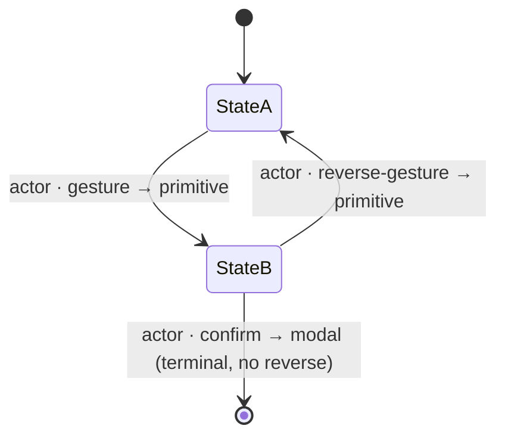

# Workflow Design: Foundation

> Phase G foundation spec — the **"picker.md of Phase G."** It is to the workflow specs what [`picker.md`](../03-primitives/picker.md) is to the primitives and [`00-ia-foundation.md`](../08-information-architecture/00-ia-foundation.md) is to the screen specs: the worked example that sets the depth bar, plus the cross-cutting conventions every workflow spec inherits so none re-derives them.
> Authored at the depth of [`picker.md`](../03-primitives/picker.md) / [`00-ia-foundation.md`](../08-information-architecture/00-ia-foundation.md).
> Source: [`v4-master-plan.md`](../../../../.claude/plans/v4-master-plan.md) §IV Phase G + epic [#135](https://github.com/Vergo402/paratech-struts/issues/135); [`00-ia-foundation.md`](../08-information-architecture/00-ia-foundation.md) (the four-surface framework + persistent-chrome contract this builds on); [`02-principles.md`](../02-principles.md) Principles 2, 4, 6, 7, 9, 10, 11; [`11-decisions/ADR-010-status-commit-model.md`](../11-decisions/ADR-010-status-commit-model.md) (reversibility doctrine); [`07-design-system/accessibility.md`](../07-design-system/accessibility.md) (the screen-reader script registry); [`07-design-system/motion.md`](../07-design-system/motion.md) (timing tokens).

---

## Purpose

Phase F produced a **per-screen blueprint** — where every screen lives, what it composes, how it adapts across four surfaces. A blueprint is a still photograph: it says what the Operations board *is*, not what *happens* when a team officer sets a strut and the IC, two floors down on a tablet, watches the lane move. Phase G is that motion. It turns the screen specs into **per-workflow flow specs** — a sequence of states, the action that commits each transition, and the choreography of that change across the devices and people in the operation.

A workflow spec answers four questions a screen spec cannot:

1. **In what order** does the operator move through screens to accomplish a goal?
2. **What commits each step**, and **how is each step reversed** (ADR-010)?
3. **What does the app do in response** — what changes, where, and for whom?
4. **Who sees the change on which device, when** — the cross-surface, multi-actor story.

This document owns the **shared format and conventions** for answering those four questions: the state-diagram notation, the wireframe convention, the cross-surface-story structure, and the reversibility and accessibility doctrine every workflow inherits. A workflow spec that re-argued "how do we draw a state diagram?" or "is status reversible?" would re-litigate a settled question; instead it **cites this file** and spends its words on the sequence that is genuinely particular to that workflow.

This is the same discipline the primitive cascade and the screen specs already enforce — [`accessibility.md`](../07-design-system/accessibility.md) consolidated every primitive's a11y *by reference, not restatement*; [`00-ia-foundation.md`](../08-information-architecture/00-ia-foundation.md) consolidated the tab map, nav model, and modal-vs-sheet rule once. Phase G consolidates the workflow grammar once, here.

### How a workflow spec uses this file

Every spec authored from [`_TEMPLATE.md`](_TEMPLATE.md) cites this file for, and does **not** restate:

1. the **state-diagram notation** (§State-diagram notation),
2. the **wireframe convention** (§Wireframe convention),
3. the **cross-surface story structure** (§The cross-surface story),
4. the **reversibility / undo doctrine** (§Reversibility),
5. the **cite-vs-own contract** (§What a workflow owns vs. cites),
6. the **screen-reader script reuse** (§Accessibility — reuse, don't restate).

It cites the **Phase F screen specs** ([`08-information-architecture/`](../08-information-architecture/)) for layout and the **Phase E primitives** ([`03-primitives/`](../03-primitives/)) for the controls. It does not redraw a screen or re-specify a primitive — a workflow is the *verb*; the screen and the primitive are the *nouns* it already has.

---

## What a workflow is vs. what a screen is

| | A **screen spec** (Phase F) owns… | A **workflow spec** (Phase G) owns… |
|---|---|---|
| **Subject** | one place | one goal, across many places |
| **Axis** | space — what is above/below the fold on each surface | **time** — what happens first, next, on reversal |
| **Unit** | the screen + its composed primitives | the **step** — a state, the action that leaves it, the resulting state |
| **Actors** | the role(s) who use this screen | the role(s) **and the hand-offs between them** across devices |
| **Output** | layout, hierarchy, the four-surface table | a **state diagram**, **step wireframes**, a **cross-surface story** |

The boundary is firm: **a workflow never redraws a screen.** If a workflow needs the Operations board, it cites [`20-operations.md`](../08-information-architecture/20-operations.md) and shows only the *one element the step acts on* (the slide control, the Add-Shore-Point button), not the whole board. If a step needs a primitive, it cites the primitive file. The workflow's words go to **sequence, transition, reversal, and choreography** — the four things no screen or primitive spec can hold, because they only exist across time and across devices.

> **The litmus test.** If a sentence in a workflow spec could be moved verbatim into a screen spec or a primitive spec without losing meaning, it belongs there, not here. Cite it and delete it.

---

## State-diagram notation

Every workflow opens with a **state diagram** drawn in **[Mermaid `stateDiagram-v2`](https://mermaid.js.org/syntax/stateDiagram.html)** inside a fenced ` ```mermaid ` block. Mermaid is the locked notation because it **renders natively on GitHub**, is **plain diffable text** (no binary, no external tool, survives branch churn), and reads as a labeled graph even unrendered.

### The vocabulary (locked)

- **States** are the lifecycle stops the workflow moves through — named with the **v4 display label** ([`voice-and-tone.md`](../07-design-system/voice-and-tone.md)), never a v3 internal string (`Strut Set`, not `strutplaced`).
- **Transitions** are labeled with **`actor · gesture → primitive`** — *who* commits it, *how*, and *which primitive* carries the commit. Examples: `team officer · slide → ShorePointCard`, `Logistics · tap → Add Apparatus sheet`, `IC · confirm → End-Operation modal`.
- **Forward transitions** are the normal arc; **reverse transitions** are drawn explicitly (ADR-010 — status is always reversible). A forward arrow with no drawn reverse is a claim that the step is *not* reversible — which is true only for destructive/terminal commits (End Operation, an inventory-decrementing return) and must be justified in prose.
- **Guards** (a transition that can be blocked) are noted in the label with the gate — `: import · orphan check → modal` — and the blocked path is drawn.
- **Entry / exit** use Mermaid `[*]`.

### The canonical skeleton



(Mermaid comments, if used, must sit on their own line beginning `%%` — never inline after a transition, which breaks rendering.)

**One diagram per workflow** is the floor. A long workflow may add a second *focused* diagram for a sub-loop (e.g. the cutting per-piece cycle), but the top-of-file diagram must show the whole arc. Diagrams stay legible: if a diagram needs more than ~12 states it is probably two workflows, or one workflow citing another.

### Rendering check

Before commit, confirm the block renders on GitHub (paste-preview or push-and-view). A diagram that errors is a broken spec; the text must validate.

---

## Wireframe convention

Each step is shown as a **text wireframe** of the **phone** surface (the floor — [`00-ia-foundation.md`](../08-information-architecture/00-ia-foundation.md) §Four surfaces), in a fenced plain-text block, using the locked frame below. Phone first because every workflow must be fully usable phone-only; tablet/laptop/broadcast deltas are described in the cross-surface story (§The cross-surface story), not redrawn frame-by-frame.

### The locked frame

```
┌─────────────────────────────┐
│ ‹ Back        Screen   ⋮     │  ← persistent chrome (cite 00-ia-foundation §Persistent chrome)
├─────────────────────────────┤
│                             │
│   [ the one thing this      │  ← the single canonical action of THIS step (Principle 4)
│     step asks for ]         │
│                             │
│   secondary, disclosed      │  ← below the primary; never competing
│                             │
├─────────────────────────────┤
│  ▓ primary action ▓         │  ← the commit affordance (button / slide / Apply)
└─────────────────────────────┘
   ⇩ commits → next state
```

### Wireframe rules

1. **One canonical action per frame** (Principle 4). If a step shows two co-equal primary actions, it is two steps.
2. **Name the primitive, don't redraw it.** A frame says `[ Assign Equipment sheet ]` and cites [`sheet.md`](../03-primitives/sheet.md); it does not re-draw the sheet's handle/scrim/rows — that is the primitive's spec.
3. **Show the commit affordance and the resulting transition.** Each frame ends with `⇩ commits → [state]` (or `⇧ reverses → [state]`), tying the wireframe to the state diagram.
4. **Persistent chrome is indicated, not redrawn.** The header band cites [`00-ia-foundation.md`](../08-information-architecture/00-ia-foundation.md) §Persistent chrome (Safety Officer + OP header, sync indicator); a workflow only draws it when the step *acts on* it.
5. **ASCII is the medium; Figma is optional later.** Text wireframes are diffable and sufficient for the gate; a Figma pass is a Phase-G-late or Phase-H enhancement, never a blocker (epic #135).

---

## The cross-surface story

This is **Phase G's distinct job** — the dimension Phase F's four-surface table framed *statically* (what each surface renders) but could not animate (*who is doing what, on which device, when*). A workflow crosses devices and often crosses people: a team officer commits on a phone in the void; the Operations board on the CP tablet re-lanes the card; the broadcast wall refreshes on its poll. The screen specs own each of those renderings; the workflow owns the **choreography that connects them**.

Every workflow spec carries a **cross-surface story** with this structure:

### The actor-surface matrix (the locked shape)

| Step | Actor · surface (acts) | Phone | Tablet (CP) | Laptop | Broadcast |
|---|---|---|---|---|---|
| 1 | who commits, on what device | what the team-officer phone shows | what the CP board adds / reflects | what the dense/keyboard view adds | what the wall shows (read-only) |

- **The "acts" column names the single device the commit happens on.** Every other column is **reflection** — what that surface shows in response, read-only or not. Broadcast is **always** reflection (it renders no interactive primitive — [`00-ia-foundation.md`](../08-information-architecture/00-ia-foundation.md) / ADR-016).
- **Propagation is via the event log, not a push** (Principle 10; [ADR-009](../11-decisions/ADR-009-database-firebase-rtdb.md)). A commit appends an event; other surfaces reflect it when they sync. The story says **what reflects and roughly when** ("the CP board re-lanes on next sync; broadcast on its refresh poll"), never "a notification fires" — there are no operational push notifications.
- **Phone is the floor in the story too.** If a step's commit can *only* happen above the phone (Cutting Station drag-reorder; the laptop command palette), the story must name the **phone-equivalent** path (slide-to-advance; tap navigation). A workflow with a phone gap is a workflow that fails Principle 2.
- **Single-actor workflows still tell a cross-surface story** — but as *one role across devices* (set up inventory gloved on the apparatus floor vs. the same role at a laptop running the Excel import), not multi-role hand-offs. The matrix shape is the same; the honesty is in not inventing choreography that isn't there.

---

## Reversibility — the undo doctrine (cite, don't re-decide)

Every workflow's transitions obey **[ADR-010](../11-decisions/ADR-010-status-commit-model.md)** (status commit model), which a workflow spec **cites, never re-argues**:

- **Status advances by a deliberate slide and is reversible from the card at any time** — spatial reversibility, not a timed window. The reverse is permanent (5 seconds or 5 minutes later), so every status transition in a state diagram draws its reverse arrow.
- **No timed-undo toast.** The 5-second "Undo" toast is **retired** ([ADR-010](../11-decisions/ADR-010-status-commit-model.md); [`toast.md`](../03-primitives/toast.md)); a workflow that reaches for one is wrong. The toast primitive carries confirmations/notifications only.
- **Heavy confirmation is reserved for destructive/terminal commits only** — End Operation, a return that decrements inventory, a delete. These raise a [`modal`](../03-primitives/modal.md) ([`00-ia-foundation.md`](../08-information-architecture/00-ia-foundation.md) §Modal-vs-sheet) and are drawn in the state diagram as forward-only (no reverse) with the consequence named in prose.
- **No silent removal.** A card that leaves an active queue shows a **visible red-slash state** ([`card.md`](../03-primitives/card.md)), never a disappearance (Principle 10). A workflow that removes something from view says where it went.
- **Reversal is an event, not a special buffer.** A step-back appends a new event to the log (audit-true). A workflow spec does not design an undo stack; reversibility is intrinsic to the event-sourced model.

The exact slide/swipe mechanics (threshold, full-card vs. control) are **affordance geometry**, finalized in the Phase H vertical slice — a workflow spec names the *gesture and its reverse*, not the pixel threshold ([ADR-010](../11-decisions/ADR-010-status-commit-model.md) §Open questions; carried in [`99-open-questions.md`](../99-open-questions.md)).

---

## Accessibility — reuse, don't restate

A workflow spec **cites [`accessibility.md`](../07-design-system/accessibility.md)**; it does not restate the conformance floor, the focus rules, or the per-primitive scripts.

- **"Assistive tech cannot slide"** ([`accessibility.md`](../07-design-system/accessibility.md) §Assistive tech cannot slide): every status slide in a workflow has focusable **Advance / Step-back** button equivalents committing the **same event**. A workflow confirms this holds for its slides; it does not re-derive the rule.
- **The screen-reader script registry** ([`accessibility.md`](../07-design-system/accessibility.md) §Screen-reader scripts) already covers every primitive's announcement (sheet, modal, list, input, segmented, determinate progress, busy control, nested-checklist leaf, etc.). A workflow **extends the registry only with a genuinely new, step-level announcement** — e.g. a multi-step flow's step-indicator progress that no single primitive owns. If a step composes only existing primitives, there is nothing new to register; the spec says so and cites the rows.
- **Power Select** (native `<select>` fallback under VoiceOver/TalkBack-or-Native-Controls) and **focus-trap on overlays** apply per the primitive specs; a workflow notes applicability, not mechanism.
- **Numbers speak as the field says them** — eighths as spoken fractions, per [ADR-012](../11-decisions/ADR-012-measurement-precision-eighth-inch.md) and the registry grammar (*Role · Name · State · Action-hint*).

---

## What a workflow owns vs. what it cites

**Owns** (spend your words here):
- the **sequence** of steps and the **state diagram**;
- the **action that commits** each transition and the **reverse**;
- the **cross-surface, multi-actor choreography**;
- the **per-step copy** that is particular to this flow (a step's prompt, a confirm's consequence sentence);
- **workflow-specific empty/error/loading moments** that arise *between* screens (e.g. "import is the one legitimate loader in this flow").

**Cites** (never restate):
- the **screen** each step happens on → the Phase F spec;
- the **primitive** each control is → the Phase E spec;
- the **tab map / nav model / modal-vs-sheet rule / four-surface framework / persistent chrome** → [`00-ia-foundation.md`](../08-information-architecture/00-ia-foundation.md);
- the **status/reversibility model** → [ADR-010](../11-decisions/ADR-010-status-commit-model.md);
- the **NIMS terminology / titles** → [ADR-008](../11-decisions/ADR-008-nims-org-structure.md), [`voice-and-tone.md`](../07-design-system/voice-and-tone.md);
- the **a11y floor, scripts, focus rules** → [`accessibility.md`](../07-design-system/accessibility.md).

---

## File naming & sequencing

Workflow specs are numbered `NN-workflow-name.md` in **operational-arc order** — setup → operation lifecycle → command & checklists → admin/auth — assigned per file as authored. The [INDEX](../00-INDEX.md) is the source of truth for status; this scheme is for readable ordering, not a contract.

| Band | Workflows (epic [#135](https://github.com/Vergo402/paratech-struts/issues/135)) | Rough range |
|---|---|---|
| **Setup (pre-incident)** | Setting up inventory (this file's worked example, [#218](https://github.com/Vergo402/paratech-struts/issues/218)); first-run / department setup ([#231](https://github.com/Vergo402/paratech-struts/issues/231)); onboarding via invite code ([#232](https://github.com/Vergo402/paratech-struts/issues/232)); sign-in / sign-out ([#234](https://github.com/Vergo402/paratech-struts/issues/234)) | 05–09 |
| **Operation lifecycle** | Starting an operation ([#219](https://github.com/Vergo402/paratech-struts/issues/219)); adding a shore point ([#220](https://github.com/Vergo402/paratech-struts/issues/220)); deploying a strut ([#221](https://github.com/Vergo402/paratech-struts/issues/221)); cutting ([#222](https://github.com/Vergo402/paratech-struts/issues/222)); runner ([#223](https://github.com/Vergo402/paratech-struts/issues/223)); secured / returned ([#224](https://github.com/Vergo402/paratech-struts/issues/224)); end of operation / after-action ([#238](https://github.com/Vergo402/paratech-struts/issues/238)) | 10–19 |
| **Command & checklists** | Role assignment & command transfer ([#225](https://github.com/Vergo402/paratech-struts/issues/225)); hazard log ([#226](https://github.com/Vergo402/paratech-struts/issues/226)); IC Command Checklist ([#227](https://github.com/Vergo402/paratech-struts/issues/227)); Task Level Checklist ([#228](https://github.com/Vergo402/paratech-struts/issues/228)); TCRM briefing ([#229](https://github.com/Vergo402/paratech-struts/issues/229)); checklist customization ([#230](https://github.com/Vergo402/paratech-struts/issues/230)) | 20–29 |
| **Admin / mutual aid** | User management ([#233](https://github.com/Vergo402/paratech-struts/issues/233)); audit log review ([#236](https://github.com/Vergo402/paratech-struts/issues/236)); mutual-aid invite + accept ([#235](https://github.com/Vergo402/paratech-struts/issues/235), v4.5) | 30–39 |

(The constitution's "Demo mode" workflow [#237] is **dropped** — demo mode was cut entirely at the Phase D gate, [`99-open-questions.md`](../99-open-questions.md) #18.)

The **slice-critical first run** for Phase H is **Setting up inventory → Starting an operation → Adding a shore point → Deploying a strut**; spec'ing them early de-risks the vertical slice.

---

## Anti-patterns (do not do these)

- **Redrawing a screen.** A workflow cites the Phase F spec and shows only the element the step acts on. (The litmus test, §What a workflow is vs. a screen.)
- **Re-specifying a primitive.** Cite [`03-primitives/`](../03-primitives/); never re-draw a sheet's anatomy or re-argue a slide's mechanics.
- **Re-deriving the four-surface table, tab map, nav model, or modal-vs-sheet rule.** Cite [`00-ia-foundation.md`](../08-information-architecture/00-ia-foundation.md).
- **Inventing a primitive.** A control not among the 15 is a **gate escalation** (the side-drawer's path — ADR-019), not a workflow decision.
- **Reaching for a timed-undo toast.** Retired (ADR-010); reversibility is the card's permanent Step-back.
- **A "notification fires" step.** No operational push, no in-app comms (Principle 10); surfaces reflect the event log on sync.
- **A status overlay.** Status advances by a slide on the card, never a sheet or modal (ADR-010).
- **An auth wall mid-workflow.** Guest-first; auth is reached forward, never gates the work (Principle 11; ADR-015).
- **A phone gap.** If a step works only on tablet/laptop, the workflow must name the phone-equivalent path (Principle 2).
- **A state diagram with no reverse arrows** on a reversible flow — every non-terminal status transition draws its reverse.

---

## Open questions for downstream

1. **Exact slide / swipe mechanics** (threshold, full-card vs. control) — affordance geometry, finalized in the Phase H vertical slice ([ADR-010](../11-decisions/ADR-010-status-commit-model.md); [`99-open-questions.md`](../99-open-questions.md)). Workflows name the gesture + reverse, not the pixel threshold.
2. **Figma wireframe pass** — whether text wireframes are promoted to Figma is a Phase-G-late / Phase-H enhancement, never a gate blocker (epic #135). The text frame is the diffable source of record.
3. **Event-propagation latency wording** — how precisely a cross-surface story states "when" a reflection appears (sync-interval-dependent) bottoms out in the Phase H sync implementation ([ADR-009](../11-decisions/ADR-009-database-firebase-rtdb.md)); workflows describe *order and trigger* (on next sync / on refresh poll), not milliseconds.
