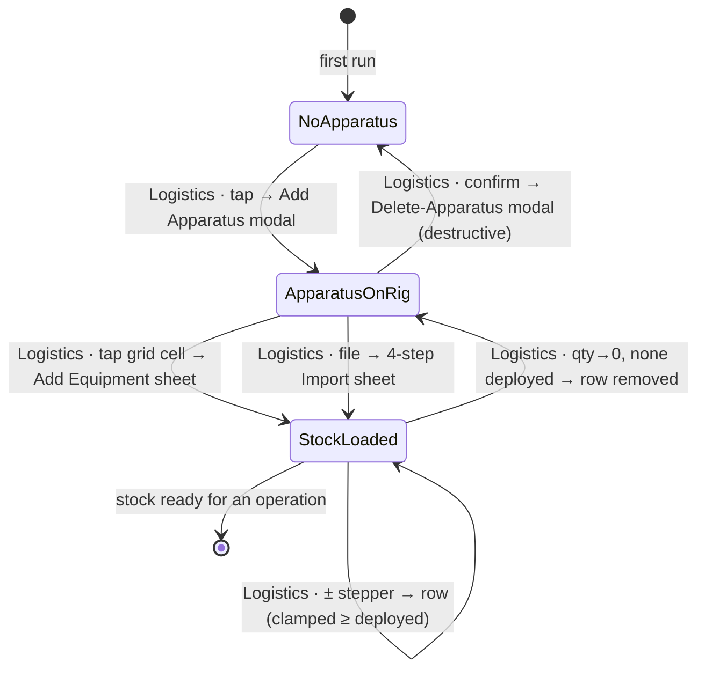
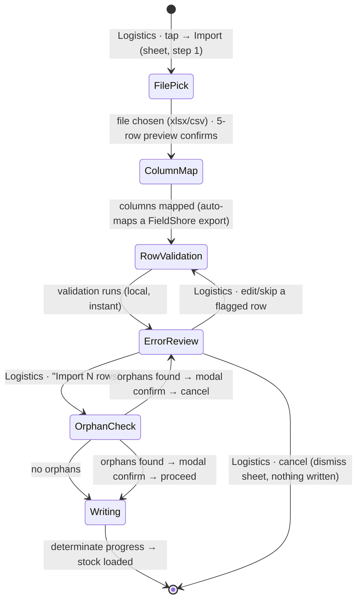

# Workflow: Setting up inventory

> Phase G workflow spec. Cites [`00-workflow-foundation.md`](00-workflow-foundation.md) for all cross-cutting conventions (state-diagram notation, wireframe frame, cross-surface story, reversibility, accessibility reuse) and does not re-derive them.
> **The Phase G worked example** — the picker.md pattern: foundation + first instance authored together, so the format is proven against a real workflow before the cascade.
> Source: GitHub [#218](https://github.com/Vergo402/paratech-struts/issues/218); the screen spec [`40-inventory.md`](../08-information-architecture/40-inventory.md) ([#200](https://github.com/Vergo402/paratech-struts/issues/200)) — this workflow is its *verb*; [`06-synthesis.md`](../06-synthesis.md) §1.2, rec F-24 (Excel round-trip); [ADR-016](../11-decisions/ADR-016-modal-vs-sheet-rules.md) (modal-vs-sheet), [ADR-008](../11-decisions/ADR-008-nims-org-structure.md) (apparatus terms). Grounded — via the screen spec — in v3 `renderApparatusTabs()` (app.js:3091), `updateQty()` (3536), `quickAdd()` (3657), `exportInventory()` (7906), `handleImport()` (7992).

---

## Purpose & goal

Load a department's real equipment cache into the app **before an incident** — which apparatus carries how many of which struts, extensions, and connector plates — so that when an operation starts, a deploy has stock to decrement and a return has stock to restore. **Done** = each rig that carries shoring equipment has its stock entered (one rig by hand, or the whole department by file), and the counts match the physical cache.

This is a **setup** workflow, not an operation-lifecycle one: it has **no shore-point status slide**. Its commits are taps, a `±` stepper, an **Apply**, and a file import — never a status advance. (That is why the "assistive tech cannot slide" rule has nothing to bind here; see §Accessibility.)

## Actors & surfaces

- **Actor:** the **Logistics role** — or any member stocking a rig pre-incident ([`40-inventory.md`](../08-information-architecture/40-inventory.md) §Primary roles). **Single-actor**: the cross-surface story is *one role across devices*, not a multi-role hand-off.
- **Floor surface:** **phone** — a member stocks a rig gloved on the apparatus floor. Laptop/tablet are enhancements (keyboard qty, foregrounded Excel); broadcast may project a read-only stock summary.
- **Precondition / entry:** none — works **guest-first**, before any auth or operation (Principle 11; [ADR-015](../11-decisions/ADR-015-navigation-pattern.md)). Reached by the **Inventory** bottom-nav tab ([tab map](../08-information-architecture/00-ia-foundation.md#the-tab-map--where-every-screen-lives)).
- **Screens spanned:** [`40-inventory.md`](../08-information-architecture/40-inventory.md) only. The workflow never leaves the Inventory tab; every step is a sheet/modal raised over it.

## State diagram

Per [`00-workflow-foundation.md`](00-workflow-foundation.md#state-diagram-notation): states are the stock-setup lifecycle; transitions are `actor · gesture → primitive`; reversible transitions draw their reverse (ADR-010); the **Delete apparatus** transition is destructive (forward-only, consequence in prose).



A second, focused diagram for the **4-step import** sub-flow (the one part of this workflow with real branching and a guard):



## Step-by-step

### Path A — Add an apparatus

#### Step A1 — the cold start (first-run empty)

```
┌─────────────────────────────┐
│  Inventory                ⋮  │
├─────────────────────────────┤
│                             │
│         ⛟  (set glyph)      │
│      No apparatus yet        │
│   Add a rig to start its     │
│   equipment cache.           │
│                             │
├─────────────────────────────┤
│   ▓  Add Apparatus  ▓        │
└─────────────────────────────┘
   ⇩ commits → ApparatusOnRig
```

- **Commits via:** the first-run [`empty-state`](../03-primitives/empty-state.md) variant's single primary button → opens the Add Apparatus surface.
- **On the screen:** Inventory ([`40-inventory.md`](../08-information-architecture/40-inventory.md) §Empty states — "No apparatus yet").
- **Reverses via:** n/a (no commit yet).
- **App response:** none until A2 commits.

#### Step A2 — name + type

```
┌─────────────────────────────┐
│  Add Apparatus           ✕   │
├─────────────────────────────┤
│  Name                       │
│  [ Engine 270            ]   │
│                             │
│  Type                       │
│  [ Engine            ▾ ]     │  ← apparatus-type picker (ADR-008 terms)
│                             │
├─────────────────────────────┤
│   ▓  Add  ▓                  │
└─────────────────────────────┘
   ⇩ commits → ApparatusOnRig
```

- **Commits via:** **Add** (one primary — Principle 4). The surface is a [`modal`](../03-primitives/modal.md) when it carries the manage/edit/delete apparatus list, otherwise a [`sheet`](../03-primitives/sheet.md) ([`40-inventory.md`](../08-information-architecture/40-inventory.md) Add Apparatus row; [ADR-016](../11-decisions/ADR-016-modal-vs-sheet-rules.md)). The **Type** field is a [`picker`](../03-primitives/picker.md)/[`sheet`](../03-primitives/sheet.md) over the apparatus-type set (titles spelled out — [ADR-008](../11-decisions/ADR-008-nims-org-structure.md)).
- **Reverses via:** dismiss (✕ / backdrop / Esc) before **Add** — nothing committed (Principle 6; a non-destructive sheet never asks "Are you sure?"). After **Add**, the apparatus is removable via the destructive **Delete-Apparatus** modal (the only path that confirms).
- **App response:** the rig appears as a new scope tab; the empty state is replaced by the (still-empty) equipment list for it.

### Path B — Add equipment by hand (the gloved path)

#### Step B1 — pick the rig (scope)

```
┌─────────────────────────────┐
│  Inventory                ⋮  │
├─────────────────────────────┤
│ ⟨ Eng 270 · Lad 35 · Resc 1 ⟩│  ← apparatus scope (segmented, scroll)
├─────────────────────────────┤
│  No equipment on Engine 270  │
│  Add the struts, extensions, │
│  and plates this rig carries.│
├─────────────────────────────┤
│   ▓  Add Equipment  ▓        │
└─────────────────────────────┘
   ⇩ commits → Add Equipment sheet
```

- **Commits via:** the apparatus **scope** is the [`segmented`](../03-primitives/segmented.md) scope-tabs variant (the v3 `.apparatus-tabs`); selecting filters the list. **Add Equipment** opens the quick-add sheet.
- **On the screen:** Inventory ([`40-inventory.md`](../08-information-architecture/40-inventory.md) §The equipment list / §Empty — "No equipment on [apparatus]").
- **Reverses via:** switching scope is free and non-committing.

#### Step B2 — quick-add grids (struts · extensions · plates)

```
┌─────────────────────────────┐
│  Add Equipment — Engine 270 ✕│
├─────────────────────────────┤
│  ⟨ Struts · Extensions · Plates ⟩  ← system/type tabs
│  Gold (LongShore)            │
│  [S54-96] [S70-126] [S90-…]  │  ← tap a cell → +1 for this rig
│  Grey (AcmeThread)           │
│  [ … ]                       │
│  Plates →  [ visual grid ]   │  ← PRESERVED v3 plate picker (images)
├─────────────────────────────┤
│            Done              │
└─────────────────────────────┘
   ⇩ each tap commits +1 → StockLoaded
```

- **Commits via:** tapping a grid cell increments that item by one for the selected rig (faithful to v3 `quickAdd()`), inside a [`sheet`](../03-primitives/sheet.md). The **plate grid is the preserved visual-grid picker** — image thumbnails, v3.5.1 iOS hardening intact ([`picker.md`](../03-primitives/picker.md) §Explicit Preservation; [`sheet.md`](../03-primitives/sheet.md) "visual-grid picker sheet" variant). **Done** dismisses; there is no "Save" — each tap already committed (Principle 6).
- **On the screen:** Inventory ([`40-inventory.md`](../08-information-architecture/40-inventory.md) §Add flows).
- **Reverses via:** the `±` stepper on the row (Step B3) decrements; dropping to 0 with nothing deployed removes the row.
- **App response:** the rig's equipment list grows; each item shows available/quantity.

#### Step B3 — fine-tune quantity (the clamp)

```
┌─────────────────────────────┐
│  Engine 270                  │
├─────────────────────────────┤
│  Gold · LongShore            │
│  S54-96      [ − ] 4 [ + ]   │  ← available / quantity
│  S70-126     [ − ] 2 [ + ]   │
│  Plates                      │
│  8×8 round   [ − ] 6 [ + ]   │
├─────────────────────────────┤
└─────────────────────────────┘
   ⇩ ± commits → StockLoaded (clamped)
```

- **Commits via:** the **± quantity stepper** ([`input.md`](../03-primitives/input.md), the `±` routed here per [`button.md`](../03-primitives/button.md)); commits in place, no confirm.
- **Reverses via:** the stepper itself (symmetric). **The clamp is the safety rule** — available never exceeds quantity, and quantity can't drop below the count currently **deployed** in an active operation (the v3.5.2 transaction-sanity rule; [`40-inventory.md`](../08-information-architecture/40-inventory.md)). Attempting to is silently clamped, not an error.
- **App response:** the count updates; a **deployed-count [`badge`](../03-primitives/badge.md)** shows on the row if an operation is active and any are out.

### Path C — Bulk import (the whole department, by file)

The faster path for a real cache. A **4-step validated import** ([Flatfile-style](../08-information-architecture/40-inventory.md#validated-import-flow-flatfile-style--4-steps-in-a-sheet)) in one [`sheet`](../03-primitives/sheet.md) with a **step-indicator** at the top.

#### Step C1 — file pick + preview

```
┌─────────────────────────────┐
│  Import inventory     1 / 4 ✕│  ← step indicator
├─────────────────────────────┤
│  Drop or choose a file       │
│  [  Choose .xlsx / .csv  ]   │
│                             │
│  Preview (first 5 rows)      │
│  ┌─────────────────────────┐ │
│  │ Apparatus │ Type │ Model │ │
│  │ Eng 270   │Strut │S54-96 │ │
│  └─────────────────────────┘ │
├─────────────────────────────┤
│              Next →          │
└─────────────────────────────┘
   ⇩ → ColumnMap
```

- **Commits via:** picking an xlsx or csv; an instant 5-row preview confirms "that's my file" before proceeding. A downloadable **template** (headers + labeled example rows, + an xlsx Reference sheet of valid Models/Plate IDs) is offered here ([`40-inventory.md`](../08-information-architecture/40-inventory.md) §The downloadable template).
- **Reverses via:** ✕ / **Back** — dismiss, nothing written.
- **Error:** a parse failure surfaces as a **blocking-alert [`modal`](../03-primitives/modal.md)** with the reason — never a bare `alert()`.

#### Step C2 — column mapping

```
┌─────────────────────────────┐
│  Import inventory     2 / 4 ✕│
├─────────────────────────────┤
│  Your column  →  FieldShore  │
│  "Rig"        →  Apparatus ✓ │
│  "Item Type"  →  Type      ✓ │
│  "Qty"        →  Quantity  ✓ │
│  "Notes"      →  Ignore      │
│  ⚠ "Mdl"      →  Model    ▾  │  ← highlighted mismatch to fix
├─────────────────────────────┤
│  ‹ Back              Next →  │
└─────────────────────────────┘
   ⇩ → RowValidation
```

- **Commits via:** the app auto-detects standard headers; a file exported from FieldShore **auto-maps with zero mismatches**. Mismatches are highlighted; the operator remaps via a [`picker`](../03-primitives/picker.md). Extra columns → **Ignore**.
- **Reverses via:** **Back** to C1; remapping is free until **Next**.

#### Step C3 — row validation (local, instant)

```
┌─────────────────────────────┐
│  Import inventory     3 / 4 ✕│
├─────────────────────────────┤
│  142 rows · 3 warnings       │
│  ⚠ Row 88: Model "S99-x"     │
│     unknown — will import as  │
│     entered (warning)         │
│  ⚠ Row 91: new apparatus     │
│     "Squad 7" will be created │
├─────────────────────────────┤
│  ‹ Back              Next →  │
└─────────────────────────────┘
   ⇩ → ErrorReview
```

- **Commits via:** validation runs instantly and locally ([`40-inventory.md`](../08-information-architecture/40-inventory.md) §Step 3): `Type` ∈ {Strut, Extension, Plate}; unknown `Model`/`Plate ID` → **warning, not block** (future models); `Extension Length`/`Quantity` positive; blank `Apparatus ID` → new apparatus (info note); cross-apparatus ID collisions flagged; an **active-operation banner** warns that deployed items won't be touched.
- **Reverses via:** **Back**; no write yet.

#### Step C4 — error review + commit gate (+ orphan guard, loader)

```
┌─────────────────────────────┐
│  Import inventory     4 / 4 ✕│
├─────────────────────────────┤
│  139 import · 3 warnings ·   │
│  0 skipped                   │
│  [ scroll to a flagged row ] │
│  [ skip individual rows    ] │
├─────────────────────────────┤
│   ▓  Import 139 rows  ▓      │
└─────────────────────────────┘
   ⇩ orphan check → Writing → StockLoaded
```

- **Commits via:** **Import N rows** is the final confirm → an **orphan-detection** pre-write check; if replaced/removed rows reference IDs used by **deployed** shore points in an active op, a [`modal`](../03-primitives/modal.md) confirms the consequence before proceeding ([`40-inventory.md`](../08-information-architecture/40-inventory.md) §Orphan-detection). The write then shows a **determinate [`loading-state`](../03-primitives/loading-state.md) progress bar** — one of the few legitimate loaders (local-first reads are instant; a bulk write is a genuine wait).
- **Reverses via:** **Cancel** at any point before the write dismisses the sheet with nothing written. Once written, rows are normal stock — adjustable by the ± stepper, removable at 0.
- **App response:** apparatus and item rows appear/merge by `ID`; `Available` is set by the app (deploys decrement it later), never read from the file.

## Cross-surface story

Single-actor — *one role across devices*, not a multi-role hand-off ([`00-workflow-foundation.md`](00-workflow-foundation.md#the-cross-surface-story)). Propagation is via the event log on sync (Principle 10), never a push.

| Step | Actor · surface (acts) | Phone (floor) | Tablet (CP) | Laptop | Broadcast |
|---|---|---|---|---|---|
| A1–A2 Add Apparatus | Logistics · any device | empty-state → Add Apparatus sheet | same, in the left-rail context | same; keyboard name entry | read-only — new rig appears in a stock summary on next refresh |
| B1–B3 Add Equipment | Logistics · **phone** (gloved, apparatus floor) | the canonical path: scope tabs → quick-add grids → ± stepper | denser multi-column grid; grids as a popover | foregrounded; keyboard ± entry | read-only stock summary updates on poll |
| C1–C4 Import | Logistics · **laptop** (keyboard, file) | **works phone-only** — the 4-step sheet is full-screen-height per step (phone-equivalent path; Principle 2) | step 3 map + validation stacked | **the natural home** — file pick + step 3 column-map and row-validation **side by side** | read-only; counts reflect after the write syncs |

- **The phone-equivalent path is real.** Import is *easier* on a laptop, but the phone is the floor: each of the 4 steps is full-screen-height on phone, so a member can import from a rig with only a phone ([`40-inventory.md`](../08-information-architecture/40-inventory.md) §Validated import flow). No step is laptop-only.
- **Broadcast is always reflection** — an optional read-only stock summary (available counts per system) at ≥ 32pt; it renders **no** qty controls, add flows, or overlays ([`40-inventory.md`](../08-information-architecture/40-inventory.md) §Broadcast).

## Composed screens & primitives

- **Screens (Phase F):** [`40-inventory.md`](../08-information-architecture/40-inventory.md) ([#200](https://github.com/Vergo402/paratech-struts/issues/200)) — the only screen spanned.
- **Primitives (Phase E):** [segmented](../03-primitives/segmented.md) (apparatus scope) · [list](../03-primitives/list.md) (equipment, sectioned) · [input](../03-primitives/input.md) (± stepper) · [badge](../03-primitives/badge.md) (deployed count) · [sheet](../03-primitives/sheet.md) (Add Equipment, quick-add grids, the **preserved visual-grid plate picker**, import) · [picker](../03-primitives/picker.md) (apparatus type, column remap; visual-grid plate) · [modal](../03-primitives/modal.md) (Add Apparatus if large, delete, import-orphan, parse-failure alert) · [button](../03-primitives/button.md) · [empty-state](../03-primitives/empty-state.md) (first-run) · [loading-state](../03-primitives/loading-state.md) (the import determinate bar). **Not used:** card · toggle · slider · toast · warning-gate · nested-checklist · side-drawer.

## Locked rules this workflow honors

- [x] **Phone is the floor** — Add Apparatus, Add Equipment, and the 4-step Import all work phone-only; the laptop side-by-side import is an enhancement.
- [x] **Status = slide-to-advance** — **n/a** here: a setup workflow has no shore-point status transition, so there is no slide and no Step-back to provide. (Stated, not skipped — the honest reading of [ADR-010](../11-decisions/ADR-010-status-commit-model.md) for a non-lifecycle flow.)
- [x] **No timed-undo toast** — reversibility is the ± stepper and remove-at-0; nothing here uses a transient undo.
- [x] **Heavy confirm reserved for destructive/terminal** — only **Delete apparatus** and the **import-orphan** check raise a [`modal`](../03-primitives/modal.md); every everyday add is a sheet/tap/stepper.
- [x] **No silent data loss** — the ± clamp protects deployed references; the orphan guard protects an active op's struts (Principle 10; v3.5.2 transaction-sanity lessons; [`LESSONS.md`](../LESSONS.md)).
- [x] **No push / no in-app comms** — surfaces reflect the event log on sync.
- [x] **NIMS terminology** — apparatus types spelled out ([ADR-008](../11-decisions/ADR-008-nims-org-structure.md)).
- [x] **Measurements** — collapsed/extended dimensions are resolved from `STRUTS[]` by the app, not entered; the file carries Model, not inches ([`40-inventory.md`](../08-information-architecture/40-inventory.md) §The column contract).
- [x] **Guest-first** — no auth wall; inventory can be loaded before any sign-in ([ADR-015](../11-decisions/ADR-015-navigation-pattern.md)).
- [x] **Visual-grid plate picker preserved** verbatim ([`picker.md`](../03-primitives/picker.md) §Explicit Preservation).

## Empty / error / loading within the flow

- **Empty:** first-run [`empty-state`](../03-primitives/empty-state.md) — "No apparatus yet" (A1), then scoped "No equipment on [apparatus]" (B1). Settle-before-empty: never flash empty during the first Firebase hydration.
- **Error:** import **parse failure** → blocking-alert [`modal`](../03-primitives/modal.md) with the reason (never `alert()`); row-level problems are **inline warnings** in steps C3–C4, not blocks (unknown future Models import as entered).
- **Loading:** instant for all local stock reads (show nothing); **determinate progress** only during the import write (C4) and an Excel export — the legitimate-loader exception ([`loading-state.md`](../03-primitives/loading-state.md)).

## Accessibility script extensions

**Cite [`accessibility.md`](../07-design-system/accessibility.md), do not restate.**

- **No slide in this workflow** → the "assistive tech cannot slide" contract has nothing to bind to here; every commit (tap a grid cell, ± stepper, **Apply/Import**) is already a focusable control with a registry script ([`accessibility.md`](../07-design-system/accessibility.md) §Assistive tech cannot slide is satisfied vacuously).
- **Existing registry rows cover almost everything:** segmented scope ("Tab, Engine 270, 1 of 3, selected"), the ± stepper / measurement-adjacent numeric field, sheet/modal on-open ("[Title], dialog"), determinate progress ("Importing, 142 of 500"), busy control, empty state. The workflow composes only these — nothing to invent.
- **One genuinely new, step-level announcement** to register (no single primitive owns a multi-step wizard's position): the **import step-indicator** —
  > **Import step-indicator** — "Import inventory, step 2 of 4, Column mapping." Announced politely on each step change; the count spoken as words, not "2/4."

  **Registered** in [`accessibility.md`](../07-design-system/accessibility.md) §Screen-reader scripts (the one registry extension this worked example produces; reusable by any later multi-step flow).
- **Power Select** gives the apparatus-type and column-remap pickers a native `<select>` under VoiceOver/TalkBack-or-Native-Controls; the import sheet and Add-Apparatus modal **trap focus** and return it on dismiss ([`accessibility.md`](../07-design-system/accessibility.md) §Focus & keyboard).

## Open questions (per-workflow)

1. **Quick View entry point** — whether the available-stock Quick View is raised from Inventory or is a persistent shell affordance reachable from deploy contexts is affordance geometry, finalized in the Phase H slice / the **Deploying a strut** workflow ([#221](https://github.com/Vergo402/paratech-struts/issues/221)); carries [`40-inventory.md`](../08-information-architecture/40-inventory.md) OQ1.
2. **Column-mapping UI library** — the Flatfile-style mapper (step C2) is a nontrivial component; build bespoke vs. open-source headless vs. license is a **Phase H tooling decision** ([`99-open-questions.md`](../99-open-questions.md) #36). The workflow's *steps* are identical regardless.
3. **Add Apparatus surface — sheet vs. modal threshold** — the screen spec makes it a modal only when it carries the manage/edit/delete list; the exact field-count that tips a sheet into a full-screen-form modal is the general [`modal.md`](../03-primitives/modal.md) OQ2, resolved in the slice.
