# Workflow: Signing in and out (incl. the offline auth window)

> Phase G workflow spec — [#234](https://github.com/Vergo402/paratech-struts/issues/234). Sub-issue of epic [#135](https://github.com/Vergo402/paratech-struts/issues/135).
> Cites [`00-workflow-foundation.md`](00-workflow-foundation.md) for all shared conventions.
> Source: [`70-login-register.md`](../08-information-architecture/70-login-register.md) (the pre-shell sign-in / create-account route — segmented mode, email+password, magic-link, Continue-as-guest, inline errors); [`input.md`](../03-primitives/input.md) (email / password fields, show/hide); [`button.md`](../03-primitives/button.md) (sign-in / create / magic-link / forgot / guest); [`segmented.md`](../03-primitives/segmented.md) (Sign In ↔ Create Account); [`loading-state.md`](../03-primitives/loading-state.md) (busy submit); [ADR-015](../11-decisions/ADR-015-navigation-pattern.md) (guest-first cold-open — never an auth wall); [ADR-009](../11-decisions/ADR-009-database-firebase-rtdb.md) (per-device UID, local-first).
> **Precondition:** none. The app cold-opens to **guest mode** on Quick Find (ADR-015). This workflow is reached *forward* — never as a gate.

---

## Purpose and goal

Let a firefighter sign in to sync their work to a department — or keep working as a guest and sign in
later. **Signing in is always optional and always forward.** The app never blocks the cold-open behind an
auth wall (Principle 11 / ADR-015).

**Goal:** the user reaches the sign-in route from a dismissible banner or from Settings, signs in (or
creates an account), and the shell now syncs under their per-device UID. Or they Continue as guest and the
route dismisses with no account. Signing out returns to guest mode; local work persists.

**Net-new in v4** — v3 used anonymous auth only with a hardcoded department. v4 adds per-user accounts and
per-device UIDs (ADR-009).

---

## Actors and surfaces

| Actor | Surface | When |
|---|---|---|
| **Any firefighter** | Phone (floor) / tablet / laptop | Wants their work to sync to a department, or to claim a guest session |

**No role gate** — anyone may sign in or create an account. Roles (Admin / Default / custom) are assigned
*after* a department exists (workflows [#231](07-department-setup.md) / [#232](08-joining-by-invite-code.md)),
never on this screen.

**48pt non-operational targets** (this is a back-office screen, not the 56pt operational floor).
**No broadcast render** — auth never appears on a wall board.

---

## State diagram

```mermaid
stateDiagram-v2
    [*] --> GuestMode

    GuestMode --> SignInRoute : user · tap "Sign in to sync" banner / Settings → Department → route
    SignInRoute --> GuestMode : user · tap Continue as guest → button (first-class; dismisses, no account)

    SignInRoute --> SignInRoute : user · toggle Sign In ↔ Create Account → segmented
    SignInRoute --> Submitting : user · tap Sign In / Create / Email me a link → button
    Submitting --> SignedIn : auth succeeds → loading-state (shell now syncs under UID)
    Submitting --> SignInRoute : auth fails → inline aria-invalid error (never alert)
    Submitting --> QueuedOffline : offline → queues intent locally, tells user plainly

    SignedIn --> GuestMode : user · Settings → Sign out → button (returns to guest; local work persists)
    QueuedOffline --> SignedIn : on reconnect → auth completes from queued intent
```



There is **no destructive/terminal path** — signing out is reversible (sign back in) and never discards
local work. Guest is a first-class resting state, not a dead end.

---

## Step-by-step

### Step 1 — Reach the route (forward, never a gate)

The sign-in route is reached two ways, both forward:
- The dismissible **"Sign in to sync"** banner in the shell chrome.
- **Settings → Department**.

The app has already cold-opened to guest mode on Quick Find (ADR-015) — the user got to the strut
calculator with zero friction. Signing in is a choice they make when they want their work to sync.

---

### Step 2 — The sign-in route

```
┌─────────────────────────────────────┐
│  ‹ Back                             │  ← full-screen pre-shell route (not an overlay)
│                                     │
│        FieldShore                   │
│  ┌───────────────────────────────┐  │
│  │  Sign In   │  Create Account   │  │  ← segmented (value variant)
│  └───────────────────────────────┘  │
│  Email                              │
│  [ reyes@dept14.gov ____________ ]  │
│  Password                      ⊙    │  ← show/hide toggle
│  [ •••••••••••• _________________ ] │
│  ─────────────────────────────────  │
│  [ Sign In ]                        │  ← primary
│  [ Email me a sign-in link ]        │  ← magic-link (secondary, no-password path)
│  Forgot password?                   │  ← tertiary link
│  ─────────────────────────────────  │
│  [ Continue as guest ]              │  ← first-class; never a trap
└─────────────────────────────────────┘
```

A pre-shell full-screen route (cites [`70-login-register.md`](../08-information-architecture/70-login-register.md)
— not redrawn). The **Sign In ↔ Create Account** segmented control swaps the form mode. **Email + password**
is the default method; **"Email me a sign-in link"** (magic-link) is the no-password path. **Continue as
guest** is always present and first-class — the user can leave without an account.

**Display name is mandatory at account creation (v4.0 — locked, gate review M8).** In **Create Account**
mode the form adds a **required Display name** field (e.g. "Capt. T. Marchetti") — the form will not submit
without it. This is **not deferrable**: the v4.0 accountability layer — the audit log ([#236](31-audit-log-review.md)),
the per-device UID, and every **signed checklist attestation** (D7.5) — attributes each entry to this display
name. If the name weren't captured, the audit trail would credit actions to a device code ("FF · device-abc123")
instead of a person, gutting accountability. So the name is captured **up front, at identity creation**, before
any attributable action is possible. (A **guest** has no account, so their attribution is the **required unit
tag** they enter when they join an incident — "Engine 7, Westfield FD" — workflow [#235](32-mutual-aid-invite-accept.md);
same guarantee, different field.) Editing the display name later is allowed (Settings), but it can never be empty.

**Errors are inline** — `aria-invalid` + a specific message ("That email and password don't match"), never
an `alert()`, never color alone (cites [`input.md`](../03-primitives/input.md) §validation).

---

### Step 3 — Submit (with the offline window)

Tapping **Sign In** / **Create Account** / the magic-link runs the auth call, showing a busy state on the
control (cites [`loading-state.md`](../03-primitives/loading-state.md) §busy control):

- **Online, success →** the route dismisses; the shell now syncs under the user's per-device UID. If the
  user has no department yet, the natural next step is create ([#231](07-department-setup.md)) or join
  ([#232](08-joining-by-invite-code.md)) — but neither is forced.
- **Online, failure →** inline error; the form stays; nothing destructive.
- **Offline →** the **offline auth window**: the app **queues the sign-in intent locally and tells the user
  plainly** ("You're offline — you'll be signed in when you reconnect"). Guest work continues uninterrupted;
  the queued intent completes on reconnect. Local-first (ADR-009) means signing in is never a blocking
  operation — the firefighter is never stranded at a login screen in a basement with no signal.

---

### Step 4 — Sign out

Sign out lives in **Settings**, not on this route. It returns the app to **guest mode**:
- The per-device UID detaches from the department sync.
- **Local work persists** — guest state is local-first; signing out never discards the in-progress
  operation, inventory, or Quick Find history on the device.
- Signing back in re-attaches.

Sign-out is **not destructive** in the modal sense — it is reversible (sign back in). It does **not** get a
heavy confirm unless it would leave un-synced local work at risk; that copy nuance is a Phase H decision
(see open questions).

---

### Step 5 — Claim a guest mutual-aid record (creating an account later)

A **guest** can do more than use Quick Find: a walk-up crew can **join a host's incident as a guest** and work
it for the duration (typed unit tag, no account — workflow [#235](32-mutual-aid-invite-accept.md) /
[ADR-022](../11-decisions/ADR-022-mutual-aid-v40-qr-guest.md)). When that incident closes, the guest keeps a
**read-only record** of what their unit worked. Later, creating an account here (Step 2, **Create Account**)
**claims** that record under the new account — the guest's per-device anonymous UID is linked to the account,
so the after-action record they contributed to is theirs. A guest who never makes an account simply keeps the
local read-only record on the device; the host's incident record is unaffected (the in-app record is
authoritative — Principle 8, local-first). No account is ever *required* to have helped on the incident.

---

## Cross-surface story

Single-actor, single-device — auth is per-device:

| Device | Step | What it sees |
|---|---|---|
| The user's **phone** | 1–4 | Drives the whole flow; guest → signed-in → (optionally) guest again |
| The user's **other devices** | — | Each device authenticates independently (per-device UID); signing in on the phone does not sign in the tablet |
| **Broadcast** | — | Never renders auth |

No cross-surface propagation and no push (Principle 10) — auth is a per-device act, not an operational
event broadcast to the team.

---

## Reversibility

| Action | Reversible? | Mechanism |
|---|---|---|
| Sign in | Yes | Sign out (Settings) → returns to guest; local work persists |
| Create account | Yes (sign out) | The account persists, but the session is reversible to guest |
| Continue as guest | Yes | Sign in later from the banner / Settings |
| Sign out | Yes | Sign back in re-attaches the department sync |

No destructive/terminal path. No timed undo (none needed — nothing is destroyed).

---

## Composed screens and primitives

- [`70-login-register.md`](../08-information-architecture/70-login-register.md) — the route layout, mode
  segmented, guest action.
- [`input.md`](../03-primitives/input.md) — email / password fields, show/hide, inline validation.
- [`button.md`](../03-primitives/button.md) — Sign In / Create / magic-link / forgot / guest.
- [`segmented.md`](../03-primitives/segmented.md) — Sign In ↔ Create Account.
- [`loading-state.md`](../03-primitives/loading-state.md) — busy control on submit.

No new primitives.

---

## Accessibility

Cite [`accessibility.md`](../07-design-system/accessibility.md) §Focus & keyboard and
[`input.md`](../03-primitives/input.md) for field validation announcements.

Screen-reader behavior particular to this workflow:

- **Route opens:** **"Sign in or create account. Email and password, or continue as guest."**
- **Mode segmented:** announces **"Sign In, selected"** / **"Create Account, selected"** on toggle.
- **Password show/hide:** **"Show password"** / **"Hide password"** button.
- **Submit error:** the inline message is `aria-invalid` + read on focus — **"That email and password
  don't match."** (`aria-live="polite"`, not an alert).
- **Offline queue:** **"You're offline. You'll be signed in when you reconnect."** (`aria-live="polite"`).
- **Continue as guest:** **"Continue as guest. You can sign in later from Settings."**
- No new SR script row needed (input + button + segmented patterns already registered).

---

## Open questions

1. **Auth method confirmation** ([`99-open-questions.md`](../99-open-questions.md) #4b): email+password +
   magic-link is the D7.1 recommendation, pending final confirm. If magic-link is dropped, the route loses
   one secondary action; the rest is unchanged.
2. **Offline-auth token window:** how long a "trust this device" refresh token stays valid offline (so a
   previously-signed-in device keeps syncing through a multi-day operation with no signal) is a Phase H
   infrastructure decision. This spec names the queued-intent behavior; the token lifetime is plumbing.
3. **Display-name capture point — DECIDED (gate review M8, ships v4.0):** **mandatory at account creation**
   here (the required Display name field in Create Account mode), because the v4.0 audit log + signed
   attestations attribute to it. Guests are attributed by their required unit tag at incident join. No longer
   an open question — it is a locked v4.0 onboarding requirement (the name field can never be empty).
4. **Sign-out confirm copy:** whether sign-out warns about un-synced local work ("You have an operation
   that hasn't synced — sign out anyway?") is a Phase H copy decision; the action itself is non-destructive.
5. **v3 → v4 migration UI:** the one-time path from a v3 anonymous-auth device to a v4 per-user account
   (and the "Claim department" banner) is a Phase H/J migration concern.
