# Workflow: First-run / department setup

> Phase G workflow spec — [#231](https://github.com/Vergo402/paratech-struts/issues/231). Sub-issue of epic [#135](https://github.com/Vergo402/paratech-struts/issues/135).
> Cites [`00-workflow-foundation.md`](00-workflow-foundation.md) for all shared conventions.
> Source: [`71-dept-setup.md`](../08-information-architecture/71-dept-setup.md) (the pre-shell create-department route — one field, founding-Admin claim, generated invite code, deferrable); [`input.md`](../03-primitives/input.md) (department-name field); [`button.md`](../03-primitives/button.md) (Create / Claim / copy-code / guest); [`sheet.md`](../03-primitives/sheet.md) (the success surface with the invite code); [`badge.md`](../03-primitives/badge.md) (Admin role); [`loading-state.md`](../03-primitives/loading-state.md) (busy on create/claim); [ADR-017](../11-decisions/ADR-017-custom-department-roles.md) (creator → first Admin; the idempotent founding-Admin claim); [ADR-015](../11-decisions/ADR-015-navigation-pattern.md) (deferrable, never a gate).
> **Precondition:** the user is signed in (workflow [#234](06-signing-in-and-out.md)) — or signing in is part of the same forward flow. Reached when no department exists yet, or from Settings → Department → Create new department.

---

## Purpose and goal

Stand up a department in under two minutes, and make the person who creates it the first Admin — without a
configuration wizard.

**Goal:** the creator enters **one field** (department name), taps **Create department**, and becomes the
**first Admin** of a new department. The app generates the first invite code to share with the rest of the
crew. The whole thing is deferrable — a guest can keep working and create the department later.

**Net-new in v4** — v3 had no department-creation UI (the department ID was hardcoded). v4 adds founding a
department as a first-class, idempotent act (ADR-017).

---

## Actors and surfaces

| Actor | Surface | When |
|---|---|---|
| **The founding user** | Phone (floor) / tablet / laptop | Setting up their department for the first time |

**Role outcome:** the creator becomes the **first Admin** — the only built-in, mandated role (ADR-017).
The founding-Admin claim is **idempotent and write-once**: the security rule allows it only if the
department has no Admin yet (so two devices racing the claim can't both win).

**48pt non-operational targets. No broadcast render.**

---

## State diagram

```mermaid
stateDiagram-v2
    [*] --> NoDepartment

    NoDepartment --> CreateRoute : user · forward from sign-in / Settings → Create new department
    CreateRoute --> NoDepartment : user · tap Continue as guest → button (deferrable; no dept yet)

    CreateRoute --> Creating : user · enter name + tap Create department → button
    Creating --> CreateRoute : create fails (e.g. name invalid) → inline aria-invalid error
    Creating --> DepartmentCreated : create succeeds → loading-state (creator claimed as first Admin)

    DepartmentCreated --> InviteCodeSheet : auto → sheet (shows the generated first invite code)
    InviteCodeSheet --> Shell : user · copy code / Done → sheet (enters the app shell as Admin)

    NoDepartment --> ClaimRoute : post-v3-migration · "Claim department" banner (no Admin set)
    ClaimRoute --> DepartmentCreated : user · tap Claim → button (idempotent; only if no Admin yet)
```



Creation is **additive** and the founding-Admin claim is **write-once** — there is no destructive path.
The whole flow is deferrable: Continue as guest exits at any point with no department.

---

## Step-by-step

### Step 1 — Reach the create route (forward / deferrable)

Reached three ways, all forward:
- Forward from sign-in ([#234](06-signing-in-and-out.md)) when the signed-in user has no department.
- From **Settings → Department → Create new department**.
- Via a one-time **"Claim department"** banner after a v3 → v4 migration where no Admin is set yet.

The app is already usable in guest mode (ADR-015) — creating a department is the step that gives the work
a home to sync to, not a precondition for using the app.

---

### Step 2 — Enter the one field

```
┌─────────────────────────────────────┐
│  ‹ Back        Create department    │  ← pre-shell full-screen route
│                                     │
│  Department name                    │
│  [ Hamden Fire Rescue ___________ ] │  ← the ONLY required field (<2-min zero-config)
│                                     │
│  You'll be the first Admin. You can  │
│  invite the rest of your crew next.  │
│  ─────────────────────────────────  │
│  [ Create department ]              │  ← primary; disabled until name is valid
│  [ Continue as guest ]              │  ← deferrable
└─────────────────────────────────────┘
```

**One field — department name** (cites [`input.md`](../03-primitives/input.md); validated for length). This
is the entire required configuration — the <2-minute zero-config bar. Address / type / incident-Level are
**not** asked here (deferred; see open questions). **Create department** commits; **Continue as guest**
defers.

---

### Step 3 — Become the first Admin + get the invite code

```
┌─────────────────────────────────────┐
│  ━━━━━━━━━━━━━━━━━━━━━━━━━━━━━━━   │  ← success sheet
│  Hamden Fire Rescue is ready        │
│  ─────────────────────────────────  │
│  You're the Admin  [ Admin ]        │  ← role badge
│                                     │
│  Invite your crew with this code:   │
│  ┌───────────────────────────┐      │
│  │   HAMD-4F2K               │ [Copy]│  ← first invite code (one-time, 24h expiry)
│  └───────────────────────────┘      │
│  ─────────────────────────────────  │
│  [ Done ]                           │  ← enters the app shell
└─────────────────────────────────────┘
```

On a successful create, the app:
- **Claims the creator as the first Admin** (idempotent — only succeeds if the department has no Admin;
  cites [ADR-017](../11-decisions/ADR-017-custom-department-roles.md)). An **Admin** badge confirms it
  (cites [`badge.md`](../03-primitives/badge.md)).
- **Generates the first invite code** (one-time, 24h expiry) and surfaces it in a success **sheet** to copy
  and share (cites [`sheet.md`](../03-primitives/sheet.md)). This is the code the rest of the crew enter in
  workflow [#232](08-joining-by-invite-code.md).
- **Done** enters the app shell as Admin.

The **Claim department** path (post-migration banner) lands at the same created state — the idempotent
claim is what makes "claim an orphaned migrated department" and "create a new one" the same write.

---

## Cross-surface story

Single-actor, single-device for the founding act:

| Device | Step | What it sees |
|---|---|---|
| Founder's **device** | 1–3 | Drives the flow; becomes Admin; gets the invite code |
| Crew members' **devices** | — | Nothing yet — they join later with the invite code (workflow #232), reflected on their next sync |
| **Broadcast** | — | Never renders department setup |

No push (Principle 10) — creating a department is not an operational event. Crew join on their own when
they enter the code.

---

## Reversibility

| Action | Reversible? | Mechanism |
|---|---|---|
| Reach the route | Yes | Continue as guest (deferrable) |
| Create department | Additive (no un-create in v4.0) | The department persists; founding-Admin transfer is deferred v4.1+ |
| Founding-Admin claim | Write-once / idempotent | Only succeeds if no Admin exists; not "undone" — additional Admins are made via User Manager ([#233](30-user-management.md)) |

No destructive/terminal path in v4.0. There is no "delete department" in this workflow.

---

## Composed screens and primitives

- [`71-dept-setup.md`](../08-information-architecture/71-dept-setup.md) — the route, one-field form,
  founding-Admin claim, code surfacing.
- [`input.md`](../03-primitives/input.md) — the department-name field.
- [`button.md`](../03-primitives/button.md) — Create / Claim / Copy / guest.
- [`sheet.md`](../03-primitives/sheet.md) — the success sheet with the invite code.
- [`badge.md`](../03-primitives/badge.md) — the Admin role badge.
- [`loading-state.md`](../03-primitives/loading-state.md) — busy on create/claim.

No new primitives.

---

## Accessibility

Cite [`accessibility.md`](../07-design-system/accessibility.md) §Focus & keyboard and
[`sheet.md`](../03-primitives/sheet.md) for sheet focus management.

Screen-reader behavior particular to this workflow:

- **Route opens:** **"Create department. One field, department name. You'll be the first Admin."**
- **Name field invalid:** **"Department name is required."** (`aria-invalid`, inline).
- **Create commit:** focus moves into the success sheet — **"Hamden Fire Rescue is ready. You're the
  Admin. Invite code HAMD-4F2K."** (`aria-live="polite"`).
- **Copy code:** **"Invite code copied."**
- **Claim (migration path):** **"Department claimed. You're the Admin."**
- No new SR script row needed.

---

## Open questions

1. **Metadata beyond name** ([`71-dept-setup.md`](../08-information-architecture/71-dept-setup.md) OQ):
   whether to optionally capture address / department type / default incident Level at setup, or strictly
   name-only to hold the <2-minute bar. Working assumption: name-only at setup; the rest editable later in
   Settings. Phase H.
2. **Invite-code surfacing:** sheet (this spec) vs. a dedicated route vs. handing off to Settings. The
   success sheet is the working choice; Phase H confirms.
3. **Founding-Admin transfer ceremony:** how the founding Admin hands off (or adds co-Admins) is deferred
   v4.1+ — additional Admins are made via User Manager ([#233](30-user-management.md)); a formal "transfer
   ownership" ceremony is not in v4.0.
4. **Multi-department membership vs. switch:** whether a user can belong to more than one department (and
   how they switch) is a data-model question shared with the invite-code join ([#232](08-joining-by-invite-code.md))
   and escalated to [`99-open-questions.md`](../99-open-questions.md).
