# Workflow: Joining a department by invite code

> Phase G workflow spec — [#232](https://github.com/Vergo402/paratech-struts/issues/232). Sub-issue of epic [#135](https://github.com/Vergo402/paratech-struts/issues/135).
> Cites [`00-workflow-foundation.md`](00-workflow-foundation.md) for all shared conventions.
> Source: [`72-invite-code.md`](../08-information-architecture/72-invite-code.md) (the pre-shell join-by-code route — one field, paste convenience, Default-role outcome, calm errors, deferrable); [`input.md`](../03-primitives/input.md) (the code field); [`button.md`](../03-primitives/button.md) (Join / Paste / guest); [`loading-state.md`](../03-primitives/loading-state.md) (busy on validation/write); [`badge.md`](../03-primitives/badge.md) (Default role on success); [ADR-017](../11-decisions/ADR-017-custom-department-roles.md) (join → Default role); [ADR-015](../11-decisions/ADR-015-navigation-pattern.md) (deferrable, never a gate).
> **Precondition:** the user is signed in (workflow [#234](06-signing-in-and-out.md)) — or signing in is part of the same forward flow — and has an invite code from a department Admin (generated in workflow [#231](07-department-setup.md)). **Distinct from** the v4.5 cross-department *incident* invite ([#210](../08-information-architecture/52-cross-dept-invite.md)).

---

## Purpose and goal

Get a firefighter into their department's shared data by entering one code.

**Goal:** the user enters (or pastes) an invite code, taps **Join department**, and lands as a **Default-role**
member — able to read everything and run field work. An Admin can change their role later via User Manager
([#233](30-user-management.md)); this workflow just gets them in.

**Net-new in v4** — v3 had no concept of joining (the department was hardcoded).

---

## Actors and surfaces

| Actor | Surface | When |
|---|---|---|
| **The joining firefighter** | Phone (floor) / tablet / laptop | Has a code from their Admin; wants to join the department |

**Role outcome:** the joining user gets the **Default role** (ADR-017) — read everything + run field work.
This is a back-office role, **orthogonal to ICS position** — joining does not assign them an org-chart slot.

**48pt non-operational targets. No broadcast render.**

---

## State diagram

```mermaid
stateDiagram-v2
    [*] --> NoDepartment

    NoDepartment --> JoinRoute : user · forward from sign-in / Settings → Join department
    JoinRoute --> NoDepartment : user · tap Continue as guest → button (deferrable; not joined)

    JoinRoute --> Validating : user · enter/paste code + tap Join → button
    Validating --> JoinRoute : code invalid / expired / already-used → inline aria-invalid (calm error)
    Validating --> Joined : code valid → loading-state (added to dept with Default role)

    Joined --> Shell : auto → enters the app shell as a Default-role member
```



No destructive/terminal path. The whole flow is deferrable (Continue as guest exits without joining).

---

## Step-by-step

### Step 1 — Reach the join route (forward / deferrable)

Reached forward from sign-in ([#234](06-signing-in-and-out.md)) when the signed-in user has no department,
or from **Settings → Department → Join department**. Like all of the auth cluster, it is deferrable — a
guest can keep working and join later (ADR-015).

---

### Step 2 — Enter or paste the code

```
┌─────────────────────────────────────┐
│  ‹ Back        Join department      │  ← pre-shell full-screen route
│                                     │
│  Invite code                        │
│  [ HAMD-4F2K __________ ] [ Paste ] │  ← constrained field + paste-from-clipboard convenience
│                                     │
│  Ask your department Admin for a     │
│  code if you don't have one.        │
│  ─────────────────────────────────  │
│  [ Join department ]                │  ← primary; disabled until the code is well-formed
│  [ Continue as guest ]              │  ← deferrable
└─────────────────────────────────────┘
```

**One field — the invite code** (cites [`input.md`](../03-primitives/input.md); constrained format). A
**Paste** affordance handles the common case (the code arrived by text/email). **Join department** commits;
**Continue as guest** defers.

**Calm error states** — invalid / expired / already-used codes show an inline `aria-invalid` message, never
an `alert()`:
- Invalid → "That code isn't valid. Check it and try again."
- Expired → "That code has expired. Ask your Admin for a new one."
- Already used → "That code has already been used. Ask your Admin for a new one."

---

### Step 3 — Join as a Default-role member

```
┌─────────────────────────────────────┐
│  Joined Hamden Fire Rescue          │
│  Your role  [ Default ]             │  ← Default-role badge
│  You can read everything and run     │
│  field work. Your Admin can change   │
│  your role anytime.                 │
└─────────────────────────────────────┘
```

On a valid code, the user is added to the department with the **Default role** (cites
[`badge.md`](../03-primitives/badge.md)) and enters the app shell. Their work now syncs to the department.
An Admin can reassign their role later in User Manager ([#233](30-user-management.md)) — but they are
productive immediately.

**Offline:** the join queues locally and tells the user plainly; it completes on reconnect (local-first,
ADR-009).

---

## Cross-surface story

| Device | Step | What it sees |
|---|---|---|
| Joining user's **device** | 1–3 | Drives the flow; lands as a Default-role member |
| Admin's **device** (User Manager) | — | On next sync: the new member appears in the Members list (workflow #233) — no push, they just show up |
| Other members' **devices** | — | On next sync: the new member is visible in the roster |
| **Broadcast** | — | Never renders the join route |

No push (Principle 10). The Admin is not paged when someone joins — the member appears in the Members list
on the next sync.

---

## Reversibility

| Action | Reversible? | Mechanism |
|---|---|---|
| Reach the route | Yes | Continue as guest (deferrable) |
| Join department | Yes (leave) | Leaving a department is a Settings action (destructive modal there); not in this workflow |
| Default-role assignment | Yes | An Admin reassigns the role in User Manager ([#233](30-user-management.md)) |

No destructive/terminal path within this workflow. Leaving a department lives in Settings, not here.

---

## Composed screens and primitives

- [`72-invite-code.md`](../08-information-architecture/72-invite-code.md) — the route, one-field form,
  Default-role outcome, error states.
- [`input.md`](../03-primitives/input.md) — the code field + paste.
- [`button.md`](../03-primitives/button.md) — Join / Paste / guest.
- [`loading-state.md`](../03-primitives/loading-state.md) — busy on validation/write.
- [`badge.md`](../03-primitives/badge.md) — the Default role badge.

No new primitives.

---

## Accessibility

Cite [`accessibility.md`](../07-design-system/accessibility.md) §Focus & keyboard and
[`input.md`](../03-primitives/input.md) for field validation.

Screen-reader behavior particular to this workflow:

- **Route opens:** **"Join department. Enter your invite code, or continue as guest."**
- **Paste:** **"Paste invite code from clipboard."**
- **Invalid/expired/used:** the specific inline message read on the field — e.g. **"That code has expired.
  Ask your Admin for a new one."** (`aria-invalid`, `aria-live="polite"`, never an alert).
- **Join commit:** **"Joined Hamden Fire Rescue. Your role is Default."** (`aria-live="polite"`).
- No new SR script row needed.

---

## Open questions

1. **Code format / alphabet** ([`72-invite-code.md`](../08-information-architecture/72-invite-code.md) OQ):
   length, character set, and avoidance of ambiguous glyphs (0/O, 1/l) so a code read aloud over the radio
   or typed with gloves is unambiguous. Phase H.
2. **Display-name capture point:** whether the joining user's display name is set here, at sign-in
   ([#234](06-signing-in-and-out.md)), or in the shell — resolved across the auth cluster (working
   assumption: at account creation in #234).
3. **Multi-department membership vs. switch:** shared with department setup ([#231](07-department-setup.md))
   — can a user belong to more than one department, and how do they switch? Escalated to
   [`99-open-questions.md`](../99-open-questions.md).
4. **Paste UX detail:** auto-detecting and pre-filling a code from the clipboard on route open vs. an
   explicit Paste tap — a Phase H refinement.
