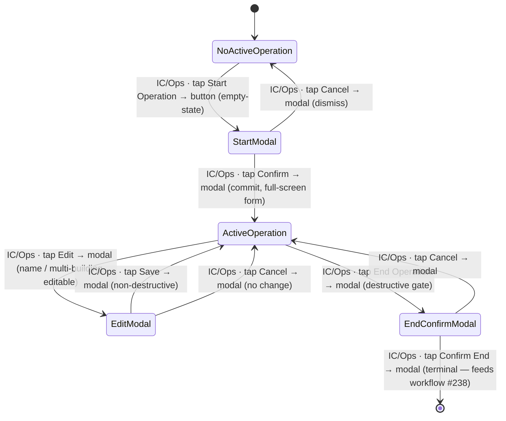

# Workflow: Starting an operation

> Phase G workflow spec — [#219](https://github.com/Vergo402/paratech-struts/issues/219). Sub-issue of epic [#135](https://github.com/Vergo402/paratech-struts/issues/135).
> Cites [`00-workflow-foundation.md`](00-workflow-foundation.md) for all shared conventions (state-diagram notation, wireframe convention, cross-surface story structure, reversibility doctrine, accessibility reuse) — does not re-derive them.
> Source: [`20-operations.md`](../08-information-architecture/20-operations.md) (the Operations screen, empty-state, Start/End Operation primitives); [`00-ia-foundation.md`](../08-information-architecture/00-ia-foundation.md) (tab map, persistent chrome contract, four-surface framework); [ADR-010](../11-decisions/ADR-010-status-commit-model.md) (reversibility); [ADR-014](../11-decisions/ADR-014-tab-structure.md) (Operations = tab-2); [ADR-015](../11-decisions/ADR-015-cold-open-guest-first.md) (guest-first, no auth wall); [ADR-016](../11-decisions/ADR-016-modal-vs-sheet-rules.md) (Start Operation = full-screen-form modal); [ADR-008](../11-decisions/ADR-008-nims-org-structure.md) (ICS titles spelled out).

---

## Purpose and goal

Get a named, active shoring operation into the app so that shore points can be added and
equipment can be deployed. This is the first action of every incident workflow — nothing
else in the operational arc is reachable until an operation exists.

**Goal:** IC or Operations Section Chief taps Start Operation, fills a two-field form,
and confirms. The app transitions from the empty "no active operation" state to a live
board ready for shore points.

---

## Actors and surfaces

| Actor | Surface | When |
|---|---|---|
| **Incident Commander** | Phone (primary) or tablet (CP) | At incident start; the person who formally opens the op in the app |
| **Operations Section Chief** | Phone or tablet | May start the op if IC delegates |

Phone is the floor (Principle 2): the IC may be walking the structure, not at a CP desk.
Every step is reachable one-handed, gloved.

---

## State diagram



`[ActiveOperation]` is the committed state this workflow produces. The End Operation arc
is shown for completeness — its full choreography lives in [workflow #238](../09-workflows/).

---

## Step-by-step

### Step 1 — Empty state: tap Start Operation

```
┌─────────────────────────────────────┐
│  FieldShore          [sync ●]       │  ← persistent chrome
│─────────────────────────────────────│
│                                     │
│         [set glyph]                 │
│                                     │
│      No active operation            │
│                                     │
│      [ Start Operation ]            │  ← primary button (empty-state)
│                                     │
│─────────────────────────────────────│
│  Archived operations (below fold)   │
└─────────────────────────────────────┘
```

**Element acted on:** the primary button inside the `empty-state` primitive on the
Operations tab. Cites [`20-operations.md`](../08-information-architecture/20-operations.md)
§Empty states — layout is owned there; this spec shows only the button that commits the
transition.

**Reverse:** no reverse needed — no state has been committed yet.

---

### Step 2 — Fill the Start Operation form

```
┌─────────────────────────────────────┐
│  ✕  Start Operation                 │  ← modal header; ✕ = dismiss
│─────────────────────────────────────│
│                                     │
│  Operation name *                   │
│  ┌─────────────────────────────┐    │
│  │ Cascade Building Fire       │    │  ← required text input
│  └─────────────────────────────┘    │
│                                     │
│  Multi-building                 ○── │  ← toggle, off by default
│                                     │
│  Location / address (optional)      │
│  ┌─────────────────────────────┐    │
│  │                             │    │
│  └─────────────────────────────┘    │
│                                     │
│  [ Start Operation ]                │  ← primary; disabled until name non-empty
└─────────────────────────────────────┘
```

**Full-screen-form `modal`** per [ADR-016](../11-decisions/ADR-016-modal-vs-sheet-rules.md)
Operations row — the form is full-screen because it is a named, non-trivial commit that
begins a structured workflow. Cites [`modal.md`](../03-primitives/modal.md) for anatomy;
this spec does not re-specify the primitive.

**Fields:**

| Field | Required | Default | Notes |
|---|---|---|---|
| Operation name | Yes | — | Free text; primary identifier throughout the op |
| Multi-building | No | Off | Enables the building-selection step when adding shore points; drives whether the building field appears in the Add Shore Point form (workflow [#220](11-adding-a-shore-point.md)) |
| Location / address | No | — | Free text; v4 addition; displayed in persistent chrome on tablet/laptop |

**Commit:** the **Start Operation** primary button is disabled until operation name is
non-empty (client-side guard, not a server round-trip — local-first).

**Dismiss:** ✕ or Cancel top-left → no state change → returns to the empty-state board.
The keyboard dismisses with the platform back gesture on phone; no state is lost.

⇩ commits → `[ActiveOperation]`

---

### Step 3 — App response: operation is active

```
┌─────────────────────────────────────┐
│  Cascade Building Fire  [sync ●]    │  ← persistent chrome: op name + live sync dot
│─────────────────────────────────────│
│  [ + Add Shore Point ]              │  ← primary action (replaces Start Op button)
│─────────────────────────────────────│
│  Pending                        (0) │  ← status lane — empty on open
│  In Process                     (0) │
│  …                                  │
│─────────────────────────────────────│
│  [ End Operation ]                  │  ← secondary; raises destructive modal (ADR-016)
└─────────────────────────────────────┘
```

The modal closes. The Operations tab now shows the active-operation board:

- Persistent chrome header: operation name replaces the "No active operation" placeholder;
  sync dot activates.
- Start Operation button → Add Shore Point (primary) + End Operation (secondary).
- All status lanes are visible and empty (count badges show 0).
- Cites [`20-operations.md`](../08-information-architecture/20-operations.md) for lane
  layout and the full four-surface adaptation — this spec shows only the elements that
  change as a result of this commit.

---

### Step 3-R — Edit operation (permanent reverse)

```
┌─────────────────────────────────────┐
│  ✕  Edit Operation                  │
│─────────────────────────────────────│
│                                     │
│  Operation name *                   │
│  ┌─────────────────────────────┐    │
│  │ Cascade Building Fire       │    │  ← pre-populated
│  └─────────────────────────────┘    │
│                                     │
│  Multi-building                 ●── │  ← pre-populated
│                                     │
│  Location / address (optional)      │
│  ┌─────────────────────────────┐    │
│  │ 123 Main St                 │    │  ← pre-populated
│  └─────────────────────────────┘    │
│                                     │
│  [ Save ]                           │  ← primary; non-destructive
└─────────────────────────────────────┘
```

Triggered by an **Edit** button in the active-operation header or the overflow menu (⋮).
Same form modal, pre-populated with current values. Save re-commits with updated values;
Cancel returns without change. No timed undo — this is the permanent reverse of Step 3's
name commit per [ADR-010](../11-decisions/ADR-010-status-commit-model.md).

Editing multi-building from off → on while shore points already exist: the building field
is set to a default "Building 1" on existing SPs and becomes editable. Editing from on →
off while multi-building SPs exist: the field is hidden but the data is preserved; a
non-blocking inline warning notes the change.

---

## Cross-surface story

Single-actor happy path (IC starts the op alone):

| Device | Step | What it sees |
|---|---|---|
| IC's **phone** | 1–3 | Drives the entire flow. Taps Start Operation, fills the form, confirms. |
| IC's **tablet** (if open at CP) | — | On next sync: Operations tab refreshes; empty-state → active-op board with operation name in chrome. |
| Any other **connected device** | — | On next sync: active-operation board appears; "No active operation" empty-state is replaced. |
| **Broadcast** display | — | On next sync: persistent chrome header updates with operation name; board is visible read-only. |

No push (Principle 10). Propagation is sync/event-log. Phase H sync implementation locks
the latency framing (ADR-009; [foundation §Open questions](00-workflow-foundation.md)).

---

## Reversibility

| Action | Reversible? | Mechanism |
|---|---|---|
| Start Operation (name, toggle, address) | Yes — edit | Step 3-R — Edit modal, same form, pre-populated |
| Multi-building toggle (post-start) | Yes — edit | Edit modal (with the non-blocking field-preservation note above) |
| End Operation | **Terminal** | Destructive modal gate ([ADR-016](../11-decisions/ADR-016-modal-vs-sheet-rules.md)); full choreography in workflow [#238](../09-workflows/) |

---

## Composed screens and primitives

- [`20-operations.md`](../08-information-architecture/20-operations.md) — the Operations
  board this workflow opens into; the empty-state variant with Start Operation; the active
  op board structure.
- [`modal`](../03-primitives/modal.md) — Start Operation form; Edit Operation form; End
  Operation destructive confirm.
- [`empty-state`](../03-primitives/empty-state.md) — the "No active operation" starting
  point.
- [`input`](../03-primitives/input.md) — operation name field; location/address field.
- [`toggle`](../03-primitives/toggle.md) — multi-building.
- [`button`](../03-primitives/button.md) — Start Operation (primary in empty-state +
  modal); Add Shore Point; End Operation.

No new primitives. All 15 are already in the registry.

---

## Empty / error / loading states

- **No active op (starting point):** the `empty-state` variant — glyph + label + one
  primary button. Cites `20-operations.md` §Empty states.
- **Name field empty:** Start Operation button stays disabled; no toast, no error banner —
  the affordance itself communicates the block.
- **Name field too long:** inline character-count indicator (design detail for Phase H);
  this spec names the constraint, not the pixel treatment.
- **Offline at form submit:** local-first — the op is created locally and queued for sync.
  The sync dot shows queued state per [`00-ia-foundation.md`](../08-information-architecture/00-ia-foundation.md)
  §Persistent chrome. No blocking error.
- **Loading:** local-first — the board renders from local state instantly on open; no
  loading state on the form submit path.

---

## Accessibility

Cite [`accessibility.md`](../07-design-system/accessibility.md) §Focus & keyboard and
[`modal.md`](../03-primitives/modal.md) for focus management — not restated here.

Screen-reader behavior particular to this workflow:

- Modal opens → VoiceOver / TalkBack announces: **"Start Operation, full-screen form"**
  (modal title as live region on open).
- Required field error (name empty on attempt): **"Operation name is required"** via
  `aria-live="assertive"` on the field's error slot.
- Successful commit: the Operations board becomes the focus target; VoiceOver reads the
  first landmark: **"Cascade Building Fire, Operations board, no shore points"** (operation
  name + screen title + Pending lane count).
- No new SR script row in [`accessibility.md`](../07-design-system/accessibility.md) —
  modal focus + form field labeling are covered by existing registry entries.

---

## Open questions

1. **Edit multi-building toggle with existing SPs** — the field-preservation behavior
   (setting existing SPs to "Building 1" on off→on, hiding but preserving on on→off) is
   a v4 Phase H detail; this spec names the intent, not the migration logic.
2. **Operation name character limit** — reasonable upper bound (e.g. 60 chars) for
   display in persistent chrome on phone; finalized in Phase H with the chrome layout.
3. **Who else can start/end an operation** — role gate for Start/End is IC + Operations
   Section Chief by convention; explicit permission-key mapping resolves with ADR-017
   (custom RBAC) in Phase H.
