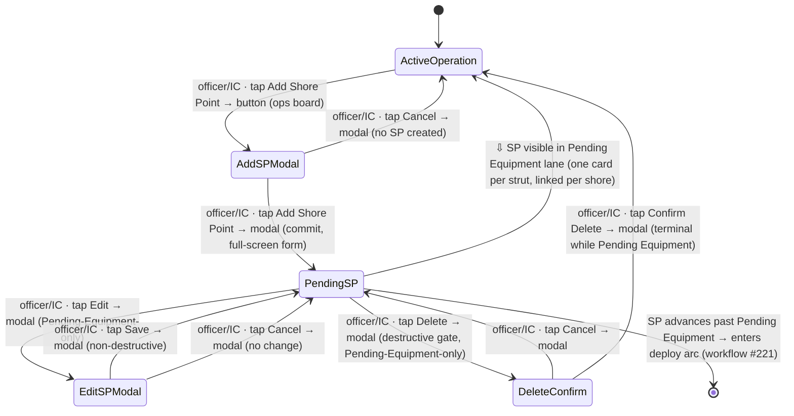

# Workflow: Adding a shore point

> Phase G workflow spec — [#220](https://github.com/Vergo402/paratech-struts/issues/220). Sub-issue of epic [#135](https://github.com/Vergo402/paratech-struts/issues/135).
> **Amended 2026-06-11 (Phase H S9 — KB-7, [#313](https://github.com/Vergo402/paratech-struts/issues/313)):** quantity = number of **shores**; the shore type drives **struts per shore** (T-Shore 1, Double-T 2, 3-Post 3); cards created = shores × struts/shore, with **one linked group per physical shore**. Replaces this spec's earlier conditional-qty model throughout.
> **Amended 2026-06-13 (Phase H re-drive — [ADR-027](../11-decisions/ADR-027-deploy-mode-and-v3-shore-point-entry.md), [#248](https://github.com/Vergo402/paratech-struts/issues/248)):** the field order returns to **v3** (Shore Type → Label → Building → Division · Area · **Group** → Measurement → Deductions → **Estimated Load** → Number of shores); **Group (`assignedResource`)** + **Estimated Load** are restored (Group = on-scene apparatus, crew accountability, reassignable through the op; Command roll-up is Phase I). **Strut-finding is now a per-operation mode** (`Operation.inlineDeploy`, set at Start/Edit Operation, default one-step): **one-step** carries Find Available Struts → Deploy → *Save as Pending Equipment* inline in this form; **two-step** keeps the describe-only → Pending Equipment → Assign Equipment flow specced below. The Assign Equipment sheet stays available in **both** modes. KB-3 keypad retained. Step 2's "engine runs after submit, not inline" applies to two-step only.
> Cites [`00-workflow-foundation.md`](00-workflow-foundation.md) for all shared conventions — does not re-derive them.
> Source: [`20-operations.md`](../08-information-architecture/20-operations.md) (Operations board, Add Shore Point modal, lane/card structure, grouped SP behavior, drilldown); [`10-quick-find.md`](../08-information-architecture/10-quick-find.md) (measurement input + deduction picker — same component reused here); [`00-ia-foundation.md`](../08-information-architecture/00-ia-foundation.md) (four-surface framework, persistent chrome); [`card.md`](../03-primitives/card.md) (ShorePointCard, group badge, field-lock post-Pending Equipment); [`sheet.md`](../03-primitives/sheet.md) (Assign Equipment sheet — referenced but not owned here); [ADR-008](../11-decisions/ADR-008-nims-org-structure.md) (assignedResource, ICS titles); [ADR-010](../11-decisions/ADR-010-status-commit-model.md) (reversibility); [ADR-016](../11-decisions/ADR-016-modal-vs-sheet-rules.md) (Add Shore Point = full-screen-form modal).
> **Precondition:** an active operation exists (see workflow [#219 — Starting an operation](10-starting-an-operation.md)).

---

## Purpose and goal

Give the team officer a fast, one-handed path from "we need a shore point here" to a
named Pending Equipment card on the board — with the right location, shore type, and measurement
captured — so the IC can see it immediately and equipment can be assigned.

**Goal:** team officer opens the Add Shore Point form, fills location + shore type +
measurement, and confirms. One or more Pending Equipment cards appear on the board. The recommendation
engine runs in the background; the actual strut assignment happens separately, in workflow
[#221 — Deploying a strut](../09-workflows/).

---

## Actors and surfaces

| Actor | Surface | When |
|---|---|---|
| **Team officer** (Entry / Rescue / Shoring Supervisor) | Phone (primary) | In or near the structure; one-handed, gloved |
| **Incident Commander** | Tablet (CP) or phone | May add SPs from the CP when directing remotely |
| **Operations Section Chief** | Tablet or phone | Same as IC — either actor can add SPs at any time during an active op |

Phone is the floor (Principle 2). The form must be completable one-handed; measurement
entry is the critical field and uses the same fraction picker as Quick Find.

---

## State diagram



`[PendingSP]` is the committed state this workflow produces. Once the SP advances past
Pending Equipment (→ Equipment Assigned), it exits this workflow and enters the deploy arc in
[workflow #221](../09-workflows/).

---

## Step-by-step

### Step 1 — Tap Add Shore Point

```
┌─────────────────────────────────────┐
│  Cascade Building Fire  [sync ●]    │  ← persistent chrome (cites 00-ia-foundation.md)
│─────────────────────────────────────│
│  [ + Add Shore Point ]              │  ← primary button; always visible during active op
│─────────────────────────────────────│
│  Pending Equipment              (2) │
│  ┌─────────────────────────────┐    │
│  │ SP: Div 1 · Area A          │    │  ← existing ShorePointCards (cites card.md)
│  └─────────────────────────────┘    │
│  Equipment Assigned             (1) │
│  …                                  │
└─────────────────────────────────────┘
```

**Element acted on:** the **+ Add Shore Point** primary button on the active-operation
board. The button is always visible regardless of SP count — never hidden, never scrolled
below the fold.

Cites [`20-operations.md`](../08-information-architecture/20-operations.md) §Primary /
secondary actions for button placement per surface; this spec shows only the element that
commits the transition.

---

### Step 2 — Fill the Add Shore Point form

```
┌─────────────────────────────────────┐
│  ✕  Add Shore Point                 │
│─────────────────────────────────────│
│  Location                           │
│  Division  [ Div 1 (Ground) ▾ ]    │  ← floor picker (cites 20-operations.md §Divisions)
│  Area      [ _________________ ]   │  ← optional free text
│                                     │
│  Shore type                         │
│  ┌──────────┬──────────┬──────────┐ │
│  │ T-Shore  │ Double-T │ 3-Post   │ │  ← SHORE_TYPES segmented; type drives struts/shore (KB-7)
│  └──────────┴──────────┴──────────┘ │
│                                     │
│  Number of shores  [ 3 ]            │  ← always visible (create mode); whole number ≥ 1
│  3 × 3-Post = 9 struts              │  ← helper pre-states the math
│                                     │
│  Measurement *                      │
│  ┌─────────────────────────────┐    │
│  │  48  ─  1/2 "               │    │  ← fraction input; cites 10-quick-find.md §Input
│  └─────────────────────────────┘    │
│  Deductions  ▶ (collapsed)          │  ← same picker sheet as Quick Find; cite, not redraw
│                                     │
│  Label (optional)                   │
│  ┌─────────────────────────────┐    │
│  │                             │    │
│  └─────────────────────────────┘    │
│                                     │
│  [ Add Shore Point ]                │  ← primary; disabled until measurement is valid
└─────────────────────────────────────┘
```

**Full-screen-form `modal`** per [ADR-016](../11-decisions/ADR-016-modal-vs-sheet-rules.md)
Operations row. Cites [`modal.md`](../03-primitives/modal.md) for anatomy — not re-specced
here.

**Fields:**

| Field | Required | Default | Notes |
|---|---|---|---|
| Division | Yes | Last-used or Div 1 | Floor-based vertical picker per `20-operations.md §Divisions`; phone = scroll wheel, tablet = segmented or dropdown |
| Building | Yes (if multi-building op) | Last-used | Only shown when multi-building was enabled at operation start (workflow #219 Step 2) |
| Area | No | — | Free text; e.g. "Northwest corner", "Stairwell B" |
| Shore type | Yes | Last-used | Picker from `SHORE_TYPES`; drives **struts per shore** — T-Shore 1, Double-T 2, 3-Post 3 (KB-7) |
| Number of shores | Yes (create only) | 1 | Whole number ≥ 1; **cards created = shores × struts/shore**; helper pre-states the math ("3 × 3-Post = 9 struts"); warns — never blocks — when total cards exceed 10 |
| Measurement | Yes | — | Same fraction input as Quick Find (`10-quick-find.md §Input flow`); 1/8″ digit-pair; same validation, same component |
| Deductions | No | All zero | Collapsed by default; same visual-grid picker `sheet` as Quick Find; cite `10-quick-find.md §Deductions` and `sheet.md` — not redrawn here |
| Label / description | No | — | Short free text; appears on the card and in the drilldown |

**Measurement + deduction reuse note:** the fraction measurement input and the deduction
picker sheet are the same components used in Quick Find. The recommendation engine
(`findForShorePoint()`) runs **after** this form is submitted — it is not inline in this
modal. The results appear on the Pending Equipment card's **Assign Equipment** sheet
([`sheet.md`](../03-primitives/sheet.md)), not here. This workflow ends at Pending Equipment;
[workflow #221](../09-workflows/) owns assignment and deployment.

**Commit:** **Add Shore Point** primary button; disabled until measurement field is
non-empty and valid (client-side, local-first — no server round-trip before commit).

**Dismiss:** ✕ or Cancel → no SP created → returns to the ops board at current scroll.

⇩ commits → `[PendingSP]`

---

### Step 3 — App response: SP(s) land in Pending Equipment

**Single shore type (non-grouped):**

```
┌─────────────────────────────────────┐
│  Cascade Building Fire  [sync ●]    │
│─────────────────────────────────────│
│  [ + Add Shore Point ]              │
│─────────────────────────────────────│
│  Pending Equipment              (3) │  ← count incremented
│  ┌─────────────────────────────┐    │
│  │ Div 1 · Area A · 48-1/2"    │    │  ← new card, scrolled into view
│  │ T-Shore · Pending Equipment │    │
│  └─────────────────────────────┘    │
│  ┌─────────────────────────────┐    │
│  │ … existing cards …          │    │
│  └─────────────────────────────┘    │
└─────────────────────────────────────┘
```

**Multi-strut shore type (one 3-Post = 3 linked cards, KB-7):**

```
┌─────────────────────────────────────┐
│  Pending Equipment              (5) │  ← count reflects all 3 new cards
│  ┌─────────────────────────────┐    │
│  │ Div 1 · Area A · 48-1/2"    │    │
│  │ 3-Post · Pending Eqp [1 / 3]│    │  ← group badge (cites card.md)
│  └─────────────────────────────┘    │
│  ┌─────────────────────────────┐    │
│  │ Div 1 · Area A · 48-1/2"    │    │
│  │ 3-Post · Pending Eqp [2 / 3]│    │
│  └─────────────────────────────┘    │
│  ┌─────────────────────────────┐    │
│  │ Div 1 · Area A · 48-1/2"    │    │
│  │ 3-Post · Pending Eqp [3 / 3]│    │
│  └─────────────────────────────┘    │
└─────────────────────────────────────┘
```

The modal closes. The new card(s) appear in the Pending Equipment lane and the board scrolls to
bring the first new card into view (or the Pending Equipment lane opens if it was collapsed).

For multi-strut shore types (Double-T, 3-Post), **each physical shore** writes one linked
Pending Equipment card per strut — all sharing that shore's `groupId`, badged `[N / total]` per
[`card.md`](../03-primitives/card.md). A multi-shore add (Number of shores > 1) repeats
this per shore — 2 × 3-Post = 6 cards in two groups of 3 — and the whole add commits as
one atomic batch. Single-strut shores (T-Shore) are never grouped: T-Shore ×3 = 3
independent cards. Pre-cutting status advances (Pending Equipment → Equipment Assigned → Strut Set →
Cutting Station) apply to the whole shore at once; Cutting Station → Runner → Wood Shore Secured → Strut Equipment Returned advance
individually. This is pre-specified group behavior from `card.md` — this workflow does
not re-derive it.

*(KB-7 correction, 2026-06-11: this section previously modeled qty-as-cards with grouping
by add-batch — as v3 does; the v3 shore type is label + wood only. Per-shore strut math
is a v4 improvement, not parity restoration.)*

---

### Step 3-R — Edit SP (permanent reverse, Pending Equipment only)

```
┌─────────────────────────────────────┐
│  ✕  Edit Shore Point                │
│─────────────────────────────────────│
│  Division  [ Div 1 (Ground) ▾ ]    │  ← pre-populated
│  Area      [ Northwest corner ]    │  ← pre-populated
│  Shore type  [ T-Shore      ▾ ]    │  ← pre-populated; editable while Pending Equipment
│  Measurement  48 ─ 1/2 "           │  ← pre-populated; editable while Pending Equipment
│  Deductions  ▶ (collapsed)          │
│  Label  [ _____________________ ]  │
│                                     │
│  [ Save ]                           │
└─────────────────────────────────────┘
```

The Edit button lives in the SP card (overflow or tap-to-expand). Same modal, pre-populated.
Division, area, shore type, measurement, and label are all editable while the SP is in
Pending Equipment. **Number of shores is structurally absent in edit mode** — group membership is
fixed at creation (KB-7). Once the SP advances past Pending Equipment, **shore type and measurement lock** — only
label remains editable. Cites [`card.md`](../03-primitives/card.md) for which fields lock
at which status — this spec names the rule, not the field-by-field matrix.

No timed undo — this is the permanent reverse per [ADR-010](../11-decisions/ADR-010-status-commit-model.md).

---

## Cross-surface story

**Primary actor: team officer (phone) — common case**

| Device | Step | What it sees |
|---|---|---|
| Officer's **phone** | 1–3 | Drives the full flow. Taps Add Shore Point, fills the form, confirms. |
| IC's **tablet** (CP board) | — | On next sync: new Pending Equipment card(s) appear in the Pending Equipment lane; count badge increments. |
| Any connected **phone/tablet** | — | On next sync: Pending Equipment lane updates. |
| **Broadcast** display | — | On next sync: Pending Equipment lane count updates; card is visible read-only. |

**Alternate actor: IC at tablet CP**

The IC may add shore points remotely while directing the team. The team officer's phone
sees the new Pending Equipment card(s) on next sync — the card appears without any action on their
end. Both actors can add SPs simultaneously during an active operation; the app assigns
distinct IDs per SP, so concurrent adds do not collide.

No push (Principle 10). Propagation is sync/event-log. Phase H sync implementation locks
the latency framing ([ADR-009](../11-decisions/ADR-009-database-firebase-rtdb.md);
[foundation §Open questions](00-workflow-foundation.md)).

---

## Reversibility

| Action | Reversible? | Mechanism |
|---|---|---|
| Add Shore Point (all fields) | Yes — edit while Pending Equipment | Step 3-R — Edit SP modal, pre-populated |
| Shore type / measurement (post-Pending Equipment) | **Locked** | Cannot edit after advancing to Equipment Assigned; cite `card.md` |
| Delete SP | **Terminal** while Pending Equipment | Destructive modal gate ([ADR-016](../11-decisions/ADR-016-modal-vs-sheet-rules.md)) |
| Delete SP after Pending Equipment | Not available | Delete is removed from the card after first advance (field-use safety gate) |

---

## Composed screens and primitives

- [`20-operations.md`](../08-information-architecture/20-operations.md) — the Operations
  board hosting the Add Shore Point button and Pending Equipment lane; drilldown structure; division
  picker behavior.
- [`10-quick-find.md`](../08-information-architecture/10-quick-find.md) — the measurement
  fraction input and deduction picker sheet, reused verbatim.
- [`card.md`](../03-primitives/card.md) — ShorePointCard; group badge `[N / total]`;
  field-lock post-Pending Equipment; pre-cutting vs. individual advance behavior.
- [`modal.md`](../03-primitives/modal.md) — Add Shore Point form; Edit SP form; Delete SP
  confirm.
- [`sheet.md`](../03-primitives/sheet.md) — deduction picker (reused from Quick Find);
  Assign Equipment (owned by workflow #221, referenced here as the downstream step).
- [`input.md`](../03-primitives/input.md) — measurement field; label field; area field.
- [`button.md`](../03-primitives/button.md) — Add Shore Point (board + modal); Save; Delete.
- [`badge.md`](../03-primitives/badge.md) — group badge; Pending Equipment lane count badge.
- [`empty-state.md`](../03-primitives/empty-state.md) — Pending Equipment lane when all SPs have
  advanced past Pending Equipment.

No new primitives.

---

## Empty / error / loading states

- **Measurement field empty or invalid:** Add Shore Point button disabled; inline
  validation on the field (not a toast, not an alert). Cites `input.md` — not restated.
- **Shore type not selected:** button disabled; all types are valid so this resolves as
  soon as the user taps one.
- **Offline at commit:** local-first — the SP is created locally and queued for sync. The
  sync dot shows the queued state. The card is immediately visible on the submitting device.
  Other devices see it on next sync after connectivity returns.
- **Grouped SP partial failure (one of N fails to sync):** all cards are written as one
  local-first batch (one `groupId` per multi-strut shore — KB-7); sync failures surface
  as queued writes per card, not a partial group. Phase H sync implementation owns the
  retry semantics.
- **Loading:** no loading state on the commit path — local-first renders instantly.
- **Pending Equipment lane empty (all SPs advanced):** `empty-state` filtered variant in the lane;
  this is expected state mid-operation, not an error.

---

## Accessibility

Cite [`accessibility.md`](../07-design-system/accessibility.md) §Focus & keyboard and
[`modal.md`](../03-primitives/modal.md) for focus management — not restated here.

Screen-reader behavior particular to this workflow:

- **Modal opens:** VoiceOver / TalkBack announces **"Add Shore Point, full-screen form"**.
- **Division picker change:** announces the new value inline — **"Division 2"**
  (`aria-live="polite"`).
- **Shore type selection:** standard segmented announce; the **strut-math helper** on
  Number of shores (**"3 × 3-Post = 9 struts"**) is associated to the field
  (`aria-describedby`), so the per-shore fan-out is read in context whenever the type or
  the count changes (KB-7).
- **Successful single SP commit:** on return to the board, focus lands on the new card;
  VoiceOver reads: **"Shore point added. Div 1, Area A, 48 and a half inches, T-Shore,
  Pending Equipment."**
- **Successful multi-card commit (total cards > 1):** **"9 shore points added — Div 1,
  Pending Equipment."** (3 × 3-Post; the count is total cards = struts; `aria-live="assertive"` on
  the board landmark after modal closes).
- **Measurement input:** carries the existing Quick Find SR script (registered in
  [`accessibility.md`](../07-design-system/accessibility.md)).
- **Deduction picker:** carries the existing picker SR script.

No new SR script row in [`accessibility.md`](../07-design-system/accessibility.md) —
the grouped-card announcement above is modal-close behavior, not a reusable script
component.

---

## Open questions

1. **Division picker widget on phone** — scroll wheel vs. segmented vs. dropdown; affordance
   geometry finalized in Phase H with the form layout. This spec names the behavior
   (floor-based, vertical, last-used default), not the control type.
2. **Qty field upper bound** — **Resolved (Phase H S9 — KB-7, [#313](https://github.com/Vergo402/paratech-struts/issues/313)):**
   no enforced max; the form warns — never blocks — when **total cards** (shores ×
   struts/shore) exceed 10, carried on the strut-math helper line.
3. **Building field ordering** — when multi-building is on, whether building appears before
   or after division in the form resolves with the Phase H form-layout pass.
4. **Assign Equipment entry point from this workflow** — the Pending Equipment card's primary action
   is Assign Equipment (a `sheet` — `20-operations.md §Primary action`); that path is
   owned by workflow [#221](../09-workflows/). This workflow ends at Pending Equipment; the handoff
   is the card's natural next action.
