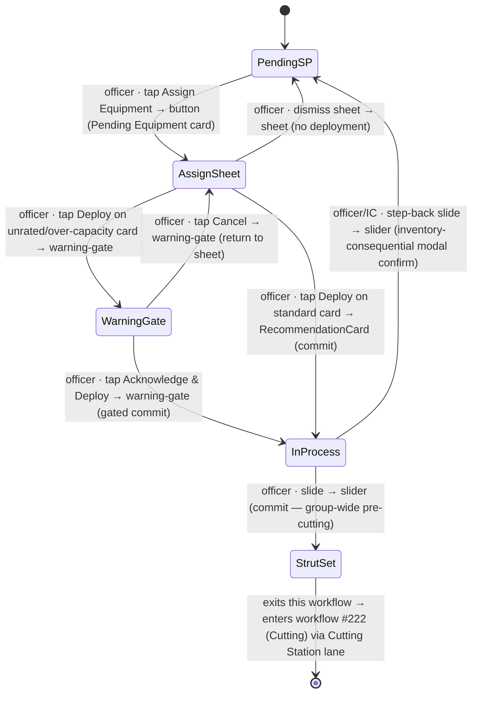

# Workflow: Deploying a strut

> Phase G workflow spec — [#221](https://github.com/Vergo402/paratech-struts/issues/221). Sub-issue of epic [#135](https://github.com/Vergo402/paratech-struts/issues/135).
> Cites [`00-workflow-foundation.md`](00-workflow-foundation.md) for all shared conventions.
> Source: [`20-operations.md`](../08-information-architecture/20-operations.md) (Assign Equipment as Pending Equipment's primary action, status lanes, role gates); [`card.md`](../03-primitives/card.md) (ShorePointCard — Pending Equipment state, deployed-strut cradle-to-grave, RecommendationCard, warning-gate); [`sheet.md`](../03-primitives/sheet.md) (picker-sheet variant; iOS hardening); [`slider.md`](../03-primitives/slider.md) (step-back from Equipment Assigned); [`10-quick-find.md`](../08-information-architecture/10-quick-find.md) (Quick Find shares the recommendation engine — no deploy action there); [ADR-010](../11-decisions/ADR-010-status-commit-model.md) (reversibility); [ADR-016](../11-decisions/ADR-016-modal-vs-sheet-rules.md) (Assign Equipment = picker sheet; step-back from Equipment Assigned = inventory-consequential modal).
> **Precondition:** SP in Pending Equipment state (see workflow [#220 — Adding a shore point](11-adding-a-shore-point.md)).

---

## Purpose and goal

Get the right strut into the right opening — committed in the app so inventory reflects reality and the shore point card tracks the equipment from this moment through the lifecycle.

**Goal:** team officer opens the Assign Equipment sheet on a Pending Equipment card, selects a RecommendationCard, and taps Deploy. The SP advances to Equipment Assigned; inventory decrements; the card now carries the deployed strut identity (model + apparatus source) through every subsequent state.

---

## Actors and surfaces

| Actor | Surface | When |
|---|---|---|
| **Team officer** (Entry / Rescue / Shoring Supervisor) | Phone (primary) | In or near the structure; selecting the strut that physically fits |
| **Incident Commander** | Tablet (CP) or phone | May assign equipment remotely when directing by measurement |

No role gate on Assign Equipment — any authenticated user can deploy during an active operation. Role gates begin at the Cutting Station state (see workflow [#222](13-cutting.md)).

---

## State diagram



`[InProcess]` is the committed state this workflow produces. The strut is now deployed; the card carries its identity. The lifecycle continues through workflows [#222](13-cutting.md)–[#224](15-secured-returned.md).

---

## Step-by-step

### Step 1 — Tap Assign Equipment (Pending Equipment card)

```
┌─────────────────────────────────────┐
│  Cascade Building Fire  [sync ●]    │
│─────────────────────────────────────│
│  Pending Equipment              (3) │
│  ┌─────────────────────────────┐    │
│  │ ⚡ Div 1 · Area A           │    │
│  │ T-Shore · 48-1/2"           │    │
│  │ ⏳ No equipment assigned    │    │
│  │                             │    │
│  │ [ Assign Equipment ]        │    │  ← primary button; full-width, process-blue
│  └─────────────────────────────┘    │
└─────────────────────────────────────┘
```

**Element acted on:** the **Assign Equipment** full-width button on the Pending Equipment ShorePointCard.
This is the Pending Equipment state's primary action — **not a slide** (the strut is not yet present; there
is nothing to commit with a directional gesture). Cites [`card.md`](../03-primitives/card.md)
§Pending state anatomy.

The card may show a `pendingReason` below the button when the app knows why no equipment is
assigned yet:
- `no-match` → "No matching strut — nothing fits 48-1/2″ at this load"
- `no-inventory` → "Waiting for inventory — no apparatus stock to pull from"

Tapping Assign Equipment opens the picker sheet (Step 2) regardless of reason — the officer may
still want to try different deductions or check alternate apparatus.

---

### Step 2 — Select a strut (Assign Equipment sheet)

```
┌─────────────────────────────────────┐
│  Cascade Building Fire  [sync ●]    │  ← parent stays visible (sheet, not modal)
│─────────────────────────────────────│
│                                     │
│                                     │
│  ━━━━━━━━━━━━━━━━━━━━━━━━━━━━━━━   │  ← drag handle
│  Assign Equipment                   │
│  Div 1 · Area A · T-Shore · 48-1/2" │  ← SP context header
│  ─────────────────────────────────  │
│  ┌─────────────────────────────┐    │
│  │ GOLD — LONGSHORE            │    │
│  │ LS 203          55″ – 91″   │    │
│  │ Effective: 48-1/2″ ↓        │    │  ← deduction ledger (cites card.md)
│  │ from Rescue 2               │    │
│  │ [ Deploy ]                  │    │  ← tapping this commits
│  └─────────────────────────────┘    │
│  ┌─────────────────────────────┐    │
│  │ GOLD — ACME                 │    │
│  │ AT 37-58        37″ – 58″   │    │
│  │ Effective: 47-7/8″ ↓        │    │
│  │ from Engine 1               │    │
│  │ [ Deploy ]                  │    │
│  └─────────────────────────────┘    │
│  ┌─────────────────────────────┐    │
│  │ ⚠ GREY — LOCKSTROKE         │    │  ← warning-gate: over-capacity
│  │ LS 93           72″ – 93″   │    │
│  │ Effective: 48-3/8″ ↓        │    │
│  │ ⚠ Estimated load exceeds…   │    │
│  │ [ Deploy ]                  │    │  ← triggers warning-gate step (Step 2-W)
│  └─────────────────────────────┘    │
└─────────────────────────────────────┘
```

**Picker sheet** per [`sheet.md`](../03-primitives/sheet.md) — bottom-anchored, max-height 60vh,
parent board remains visible above. Cites `sheet.md` for all sheet mechanics (drag handle,
dismiss paths, scrim, iOS hardening, focus trap, Power Select fallback) — not restated here.

Each result is a `RecommendationCard` per [`card.md`](../03-primitives/card.md) §RecommendationCard
anatomy (COLOR–SYSTEM label, model, range, extension block, deduction ledger, apparatus source,
Deploy button). Cards are ranked by fit quality. Capacity is demoted (computed but not on the card
face per [ADR-012](../11-decisions/ADR-012-measurement-precision-eighth-inch.md) / synthesis §capacity-demoted).

**Standard Deploy (Step 3):** tapping Deploy on a card with no active warnings commits immediately.

**Gated Deploy (Step 2-W):** tapping Deploy on a card bearing a `warning-gate` (unrated-zone,
over-capacity, or disclaimer acknowledgment) raises the warning-gate inline — the sheet does not
dismiss. The officer must acknowledge before proceeding. Cites
[`warning-gate.md`](../03-primitives/warning-gate.md) — not re-specced here.

**Dismiss sheet (no deploy):** tap the scrim · drag handle down · Esc · system back → sheet
dismisses, SP remains in Pending Equipment, no state change.

---

### Step 3 — App response: strut deployed, SP in Equipment Assigned

```
┌─────────────────────────────────────┐
│  Cascade Building Fire  [sync ●]    │
│─────────────────────────────────────│
│  Pending Equipment              (2) │  ← count decremented
│  Equipment Assigned             (1) │  ← count incremented; SP moved here
│  ┌─────────────────────────────┐    │
│  │ Div 1 · Area A              │    │
│  │ T-Shore · 48-1/2"           │    │
│  │ LS 203 · from Rescue 2      │    │  ← deployed strut identity (model + source)
│  │ ●───────────────────○       │    │  ← advance slide (→ Strut Set)
│  │      ○──────────────●       │    │  ← step-back slide (→ Pending Equipment)
│  └─────────────────────────────┘    │
└─────────────────────────────────────┘
```

The sheet dismisses. The SP card moves from the Pending Equipment lane to the Equipment Assigned lane:

- Lane counts update: Pending Equipment decrements, Equipment Assigned increments.
- The card now carries the **deployed strut identity** — model (`LS 203`) and apparatus source
  (`from Rescue 2`) — on every subsequent state until Strut Equipment Returned. Cites
  [`card.md`](../03-primitives/card.md) §Deployed-strut cradle-to-grave.
- The Assign Equipment button is gone; the card now shows the advance slide (→ Strut Set) and
  step-back slide (→ Pending Equipment).
- **Inventory:** the deployed strut's available count decrements on the submitting device instantly
  (local-first); propagates to other devices on next sync.
- ⇩ commits → `[InProcess]`

**For grouped SPs (T-Shore ×3):** deploying one member does **not** advance the others. Each
grouped card has its own Assign Equipment button; each deploys and advances to Equipment Assigned
independently. The group badge (`N/total`) persists; the pre-cutting group-advance behavior (all
members advance together via slide) begins once all members have left Pending Equipment.

---

### Step 3-R — Step back to Pending Equipment (un-deploy)

Triggered by the step-back slide on the Equipment Assigned card. Because this reverses a strut
deployment, it is **inventory-consequential** and follows the confirm-modal rule
([ADR-016](../11-decisions/ADR-016-modal-vs-sheet-rules.md)):

```
┌─────────────────────────────────────┐
│  Return LS 203 to inventory?        │  ← modal confirm
│─────────────────────────────────────│
│  Stepping back will un-deploy this  │
│  strut and return it to Rescue 2's  │
│  available count.                   │
│                                     │
│  [ Cancel ]  [ Return & Step Back ] │
└─────────────────────────────────────┘
```

Confirmed → SP returns to Pending Equipment; strut returns to apparatus available count; card reverts to
Assign Equipment button. No timed undo ([ADR-010](../11-decisions/ADR-010-status-commit-model.md)).

---

## Cross-surface story

| Device | Step | What it sees |
|---|---|---|
| Officer's **phone** | 1–3 | Drives the flow; opens sheet, selects, deploys |
| IC's **tablet** (CP) | — | On next sync: Pending Equipment lane decrements; Equipment Assigned lane shows new card with strut identity |
| Any connected device | — | On next sync: inventory available count for the deployed strut decrements |
| **Broadcast** | — | On next sync: Equipment Assigned lane card count updates; card is read-only |

No push (Principle 10). Inventory is local-first; decrement is instant on the submitting device,
sync-propagated to others.

---

## Reversibility

| Action | Reversible? | Mechanism |
|---|---|---|
| Assign Equipment (deploy) | Yes — step-back | Step-back slide from Equipment Assigned → inventory-consequential confirm modal |
| Equipment Assigned → Strut Set | Yes — step-back | Step-back slide, no confirm (no inventory change) |
| Warning-gate acknowledgment | Yes | Cancel in warning-gate returns to the sheet; Deploy is not yet committed |

---

## Composed screens and primitives

- [`20-operations.md`](../08-information-architecture/20-operations.md) — the board hosting
  the Pending Equipment lane + Equipment Assigned lane; Assign Equipment as Pending Equipment's primary action.
- [`card.md`](../03-primitives/card.md) — ShorePointCard (Pending Equipment anatomy, deployed-strut
  cradle-to-grave, RecommendationCard, warning-gate placement).
- [`sheet.md`](../03-primitives/sheet.md) — Assign Equipment picker sheet (bottom-anchored,
  60vh, iOS hardening, Power Select fallback).
- [`slider.md`](../03-primitives/slider.md) — step-back slide from Equipment Assigned (and the advance
  slide continuing the lifecycle).
- [`modal.md`](../03-primitives/modal.md) — inventory-consequential confirm on step-back.
- [`warning-gate.md`](../03-primitives/warning-gate.md) — unrated-zone / over-capacity gate
  inline in the sheet; never auto-dismisses.

---

## Empty / error / loading states

- **No struts fit the measurement:** `no-match` reason on the card; sheet opens but shows an
  `empty-state` "No matching struts" with a would-fit escalation link to Quick Find
  (cites `10-quick-find.md`). The officer can still dismiss and try adjusting deductions.
- **No apparatus in inventory:** `no-inventory` reason; sheet shows an `empty-state` "No
  apparatus stock available." Does not block the Pending Equipment state.
- **Offline at deploy:** local-first — the SP advances and inventory decrements locally; queued
  for sync. The sync dot shows queued state. Other devices see it on next sync.
- **Loading:** no loading state on the deploy path — local-first renders instantly.

---

## Accessibility

Cite [`accessibility.md`](../07-design-system/accessibility.md) §Focus & keyboard and
[`sheet.md`](../03-primitives/sheet.md) for focus trap and Power Select fallback.

Screen-reader behavior particular to this workflow:

- **Sheet opens:** focus enters sheet; VoiceOver / TalkBack announces **"Assign Equipment sheet,
  Div 1, Area A, T-Shore, 48 and a half inches"** (sheet title + SP context).
- **RecommendationCard Deploy button:** **"Deploy LS 203, Gold LongShore, effective 48 and a
  half inches, from Rescue 2."** Full strut identity in the button label (no separate announce
  needed on commit).
- **Warning-gate intercept:** **"Warning: estimated load exceeds safe capacity. Acknowledge and
  Deploy, or Cancel."** (`aria-live="assertive"` in-sheet announcement).
- **Successful deploy:** sheet dismisses; focus returns to the Equipment Assigned card; VoiceOver reads:
  **"Shore point Equipment Assigned. Div 1, Area A, T-Shore, LS 203, Rescue 2."**
- **Inventory decrement:** no announcement — background state, not an action the user needs
  confirmed audibly.
- No new SR script row in [`accessibility.md`](../07-design-system/accessibility.md).

---

## Open questions

1. **Step-back from Equipment Assigned — inventory decrement confirm wording:** the modal copy above
   names the strut and apparatus source ("Return LS 203 to Rescue 2's available count") but
   external equipment (from a visiting department) needs slightly different copy ("Return to
   External · Dept 14"). Finalized in Phase H copy pass.
2. **Grouped SP deploy — what triggers the group's pre-cutting-advance behavior:** once all N
   group members have left Pending Equipment (each independently), the group's slides advance group-wide.
   The trigger is checked client-side: `getGroupMembers().every(sp => sp.status !== 'pending')`.
   Phase H owns the implementation; this spec names the rule.
3. **No-match + no-inventory: is the Assign Equipment button disabled or still tappable?** The
   spec says tappable (officer may adjust deductions), but the v3 behavior was to show the button
   regardless. Finalized in Phase H.
