# Workflow: Hazard log

> Phase G workflow spec — [#226](https://github.com/Vergo402/paratech-struts/issues/226). Sub-issue of epic [#135](https://github.com/Vergo402/paratech-struts/issues/135).
> Cites [`00-workflow-foundation.md`](00-workflow-foundation.md) for all shared conventions.
> Source: [`32-hazard-log.md`](../08-information-architecture/32-hazard-log.md) (the ICS-208 hazard register — Add Hazard, severity sort, mitigate/reopen, SP-card hazard badges, ICS-208 export, no safety-hold); [`sheet.md`](../03-primitives/sheet.md) (Add Hazard + detail/mitigate sheet); [`badge.md`](../03-primitives/badge.md) (severity, type, mitigated state, the SP-card hazard badge); [`button.md`](../03-primitives/button.md) (Add, export, mitigate/reopen); [`input.md`](../03-primitives/input.md) (Add-Hazard fields); [ADR-016](../11-decisions/ADR-016-modal-vs-sheet-rules.md) (Add Hazard = sheet).
> **Precondition:** an active operation exists (workflow [#219](10-starting-an-operation.md)). The Hazard Log is reachable one tap from SitStat and from the Safety Officer in the persistent header.

---

## Purpose and goal

Make hazards **visible to everyone, blocking to no one.** A hazard recorded here surfaces on the Hazard
Log, in the persistent header, and as a badge on any shore-point card in the affected area — but it never
gates a status advance.

**Goal:** any team member adds a hazard via a sheet; it appears in the register sorted by severity; the
Safety Officer (or any role) mitigates it later; the record exports as an ICS-208. **There is no
`safety-hold` status** (Principle 10) — the hazard *informs* the slide-to-advance decision, it does not
prevent it.

---

## Actors and surfaces

| Actor | Surface | When |
|---|---|---|
| **Any team member** | Phone (floor) | Spots a hazard; adds it from the field |
| **Safety Officer** | Phone or tablet (CP) | Owns the register; mitigates, reopens, exports ICS-208 |
| **Anyone reading a shore-point card** | Any | Sees the hazard badge when an SP sits in a hazarded area |

**Role gates:**
- **Add a hazard** — any authenticated role (the Safety Officer owns the log, but hazard reporting is open
  to everyone in the field).
- **Mitigate / reopen** — not explicitly gated (implied Operations / Safety).
- **ICS-208 export** — Safety Officer / IC (records action).

Phone is the floor (Principle 2) — the person who sees the hazard is usually in the structure, gloved.

---

## State diagram

```mermaid
stateDiagram-v2
    [*] --> HazardLog

    HazardLog --> AddHazardSheet : any role · tap Add Hazard → sheet
    AddHazardSheet --> HazardLog : member · dismiss sheet → sheet (no hazard created)
    AddHazardSheet --> OpenHazard : member · tap Add → sheet (commit; sorts by severity)

    OpenHazard --> HazardDetailSheet : any role · tap the hazard → sheet
    HazardDetailSheet --> MitigatedHazard : Safety/Ops · tap Mitigate → button (records who + when)
    MitigatedHazard --> OpenHazard : Safety/Ops · tap Reopen → button (reversible)

    OpenHazard --> ICS208 : Safety/IC · tap Export ICS-208 → button (records export)
    MitigatedHazard --> ICS208 : Safety/IC · tap Export ICS-208 → button
```



There is **no terminal state** and **no destructive path** in the common flow — a hazard is opened, then
mitigated, and a mitigated hazard can always be reopened. The record persists for the after-action ICS-208.
Critically: **no transition gates any operation status** — the Hazard Log never blocks the Operations board.

---

## Step-by-step

### Step 1 — Add a hazard (any role)

```
┌─────────────────────────────────────┐
│  ━━━━━━━━━━━━━━━━━━━━━━━━━━━━━━━   │  ← drag handle
│  Add Hazard                         │
│  ─────────────────────────────────  │
│  Type                               │
│  [Structural Instability ▾]         │  ← Structural Instability · Utility · Atmospheric · Fall · Other
│  Location *                         │
│  [ NE corner, Div 2 ____________ ]  │  ← required free text
│  Severity                           │
│  ( Low )  ( Medium )  ● High        │  ← badge with text, never color alone (Principle 9)
│  Notes (optional)                   │
│  [ ______________________________ ] │
│  ─────────────────────────────────  │
│  [ Add Hazard ]                     │
└─────────────────────────────────────┘
```

**Add Hazard** opens a **sheet** (cites [`sheet.md`](../03-primitives/sheet.md); the v3 modal re-homes to a
sheet per [ADR-016](../11-decisions/ADR-016-modal-vs-sheet-rules.md)). Fields (cites
[`input.md`](../03-primitives/input.md) for the field primitives):

- **Type** — Structural Instability · Utility · Atmospheric · Fall · Other.
- **Location** — required free text (the v3 behavior; structured area binding is an open question below).
- **Severity** — Low / Medium / High, rendered as a [`badge.md`](../03-primitives/badge.md) with the word,
  never color alone (Principle 9).
- **Notes** — optional.
- **Reported by + at** — captured automatically (role + timestamp).

Commit on **Add Hazard**; dismiss (scrim / drag-down / Esc) creates nothing.

⇩ commits → `[OpenHazard]`

---

### Step 2 — The register (open-first by severity)

```
┌─────────────────────────────────────┐
│  Hazard Log  [sync ●]   [ICS-208 ⤓] │  ← export action
│─────────────────────────────────────│
│  Open (2)                           │
│  ┌─────────────────────────────┐    │
│  │ ⚠ HIGH · Structural Instab.  │    │  ← severity badge + type
│  │ NE corner, Div 2             │    │
│  │ Reported 13:22 · Rescue 2    │    │
│  └─────────────────────────────┘    │
│  ┌─────────────────────────────┐    │
│  │ MED · Utility                │    │
│  │ Basement panel               │    │
│  └─────────────────────────────┘    │
│  ─────────────────────────────────  │
│  Mitigated (1)                      │  ← drops to the bottom
│  ┌─────────────────────────────┐    │
│  │ ✓ LOW · Fall (mitigated)     │    │
│  └─────────────────────────────┘    │
└─────────────────────────────────────┘
```

The register is a [`list.md`](../03-primitives/list.md): **open hazards sort by severity then recency;
mitigated hazards drop to the bottom**. Cites [`32-hazard-log.md`](../08-information-architecture/32-hazard-log.md)
for layout — not redrawn.

---

### Step 3 — Mitigate (Safety Officer / Operations)

Tapping a hazard opens its detail **sheet** with a **Mitigate** action. Mitigating records **who + when**
(role spelled out + timestamp) and drops the hazard to the bottom of the register with a mitigated badge.

**Mitigate is reversible — Reopen** ([`32-hazard-log.md`](../08-information-architecture/32-hazard-log.md)
§Primary action). No destructive confirm; no timed undo. Reopening returns the hazard to the open list at
its severity sort position.

---

### Step 4 — The shore-point hazard badge (new in v4)

A hazard's **location ties it to an area**, so a shore point sitting in a hazarded area shows a hazard
[`badge.md`](../03-primitives/badge.md) on its `ShorePointCard`:

```
┌─────────────────────────────┐
│ Div 2 · Area NE · T-Shore   │
│ ⚠ HIGH hazard in area       │  ← hazard badge fed from the Hazard Log (new in v4)
│ ●───────────────────────○   │  ← the advance slide STILL works — badge informs, never blocks
└─────────────────────────────┘
```

This is the **no-safety-hold rule made concrete** (Principle 10): the badge surfaces the hazard so the
team officer factors it into the slide-to-advance decision, but the app **never gates the advance** on it.
There is no `safety-hold` status. The badge clears when the hazard is mitigated (the immediate-vs-on-confirm
timing is an open question below).

---

### Step 5 — Export ICS-208 (new in v4)

A [`button.md`](../03-primitives/button.md) action on the register. Assembles the open + mitigated hazards
into the ICS-208 form. The export mechanism is shared with the after-action / audit export work and is
finalized in Phase H (the format converges with workflow [#238](16-end-of-operation.md)'s after-action
packet). Exporting records an export event; it changes no hazard state.

---

## Cross-surface story

| Device | Step | What it sees |
|---|---|---|
| Field member's **phone** | 1 | Adds the hazard from the structure |
| Safety Officer's **tablet** (CP) | 2–3, 5 | Reads the full register with severity columns; mitigates; exports ICS-208 |
| Team officer's **phone** (Operations) | 4 | On next sync: the hazard badge appears on shore-point cards in the affected area — the advance slide still works |
| Any connected device | — | On next sync: the register and SP-card badges reflect the hazard |
| **Broadcast** | — | On next sync: the read-only hazard board shows open hazards by severity, ≥ 32pt, no Add |

No push (Principle 10). The hazard propagates via the event log on sync — it appears, it does not page.

---

## Reversibility

| Action | Reversible? | Mechanism |
|---|---|---|
| Add a hazard | Yes (edit / mitigate) | Edit fields; or mitigate when handled |
| Mitigate | Yes | **Reopen** returns it to the open list (no confirm) |
| Export ICS-208 | n/a | Read/export action; changes no state |
| (No destructive path in the common flow) | — | The record persists for the after-action ICS-208 |

No timed undo (ADR-010). A hazard is never silently removed — mitigated hazards stay visible at the bottom.

---

## Composed screens and primitives

- [`32-hazard-log.md`](../08-information-architecture/32-hazard-log.md) — the register, severity sort,
  mitigate/reopen, ICS-208 export, the SP-card badge feed.
- [`sheet.md`](../03-primitives/sheet.md) — Add Hazard + hazard-detail/mitigate sheet.
- [`input.md`](../03-primitives/input.md) — the Add-Hazard fields (type picker, location text, severity
  segmented, notes).
- [`badge.md`](../03-primitives/badge.md) — severity / type / mitigated badges + the SP-card hazard badge.
- [`list.md`](../03-primitives/list.md) — the hazard register.
- [`button.md`](../03-primitives/button.md) — Add, Mitigate / Reopen, Export ICS-208.

No new primitives.

---

## Accessibility

Cite [`accessibility.md`](../07-design-system/accessibility.md) §Focus & keyboard and
[`sheet.md`](../03-primitives/sheet.md) for sheet focus management.

Screen-reader behavior particular to this workflow:

- **Add Hazard sheet opens:** **"Add Hazard. Type, location, severity, notes."** Focus enters the sheet.
- **Severity segmented:** each option reads its word — **"Low", "Medium", "High"** — never color alone.
- **Add commit:** **"Hazard added. High, Structural Instability, NE corner Division 2."** (`aria-live="polite"`).
- **Mitigate commit:** **"Hazard mitigated. Marked by Safety Officer, 13:40."** (`aria-live="polite"`).
- **SP-card hazard badge:** read as part of the card — **"High hazard in area."** — *informational*, never
  an error; the advance control announces normally (the badge does not disable it).
- **Reopen:** **"Hazard reopened."**
- No new SR script row needed (sheet + list + badge patterns already registered).

---

## Open questions

1. **Hazard ↔ area binding precision** ([`32-hazard-log.md`](../08-information-architecture/32-hazard-log.md)
   OQ1): the Add-Hazard location is free text (v3 behavior). For the SP-card badge to map precisely, the
   location may need a structured building → division → area drilldown. Free text ships v4.0; structured
   binding is a Phase H refinement.
2. **Per-area badge clearing** (OQ3): when a hazard is mitigated, does the SP-card badge clear immediately
   or on a confirm? Working assumption: immediately on the mitigate commit (sync-propagated). Phase H.
3. **ICS-208 export format** (OQ2): the export mechanism is shared with the after-action / audit export
   (workflow [#238](16-end-of-operation.md)) and finalized in Phase H ([`99-open-questions.md`](../99-open-questions.md) #35).
4. **Mitigate / reopen role gate:** the screen spec leaves mitigate/reopen un-gated (implied Ops/Safety).
   Whether to gate it to Safety Officer / Operations explicitly is a Phase H decision against ADR-017's
   role model — but note hazards live on the fireground axis, not the back-office axis.
