# Workflow: IC Command Checklist progression

> Phase G workflow spec — [#227](https://github.com/Vergo402/paratech-struts/issues/227). Sub-issue of epic [#135](https://github.com/Vergo402/paratech-struts/issues/135).
> Cites [`00-workflow-foundation.md`](00-workflow-foundation.md) for all shared conventions.
> Source: [`33-ic-command-checklist.md`](../08-information-architecture/33-ic-command-checklist.md) (the deep phase tree, the ICS-201 briefing card, attestation, auto-collapse, the four surfaces); [`nested-checklist.md`](../03-primitives/nested-checklist.md) (leaf-vs-section rule, signed checks, tap-to-toggle, derived section state); [`side-drawer.md`](../03-primitives/side-drawer.md) (the companion container — the checklist side-tab, ADR-019); [ADR-010](../11-decisions/ADR-010-status-commit-model.md) (tap-to-attest is *not* the safety slide; un-checking is reversible, never confirmed); [ADR-019](../11-decisions/ADR-019-side-drawer-primitive.md) (the side-drawer carries the checklist).
> **Precondition:** an active operation exists (workflow [#219](10-starting-an-operation.md)) and this device holds the **Incident Commander** position (workflow [#225](20-role-assignment-command-transfer.md)).

---

## Purpose and goal

Walk the IC through command doctrine without taking over the screen. The IC Command Checklist is a deep,
multi-phase attestation tree that lives in a **summonable side-drawer companion** under the Command tab —
open it, attest the next step, leave it open beside SitStat on a tablet or slide it away on a phone.

**Goal:** the IC opens the checklist side-drawer, **taps a leaf row to attest** a doctrine step (signed
with role + time), and the active phase progresses. Completed phases auto-collapse; the active branch
never hides the next undone step.

**This is a tap, never a slide.** The slide-to-advance gesture is reserved for safety-consequential
shore-point status ([ADR-010](../11-decisions/ADR-010-status-commit-model.md)); a reversible doctrine
attestation uses the lightest gesture — a tap on the whole 56pt row.

---

## Actors and surfaces

| Actor | Surface | When |
|---|---|---|
| **Incident Commander** | Phone (floor) or tablet (CP, canonical) | Works the checklist through the incident's command phases |
| **Operations Section Chief / Group Supervisors** | Any | Read-access — can see progress, cannot attest |
| **Broadcast** | Wall board | Phase headers + counts at ≥ 32pt; no toggle affordance renders |

**Role gate:** **Incident Commander attests.** Read-access for Operations Section Chief and Group
Supervisors. Phone is the floor — a solo IC must work the full checklist phone-only; **tablet (command
post) is the canonical surface** where multiple phases are visible at once.

---

## State diagram

```mermaid
stateDiagram-v2
    [*] --> DrawerClosed

    DrawerClosed --> DrawerOpen : IC · tap the side-tab → side-drawer (companion; scrim on phone only)
    DrawerOpen --> DrawerClosed : IC · tap tab / swipe to edge / Esc → side-drawer (commits nothing)

    state DrawerOpen {
        [*] --> LeafUnchecked
        LeafUnchecked --> LeafChecked : IC · tap leaf row → nested-checklist (signs role + mono time)
        LeafChecked --> LeafUnchecked : IC · tap leaf row → nested-checklist (un-check; reversible + audited)
        note right of LeafChecked : section state is DERIVED — no one-tap "complete the phase"
    }

    DrawerOpen --> ICS201Brief : IC · tap ICS-201 briefing → card (assembled, no extra entry)
    ICS201Brief --> DrawerOpen : IC · dismiss → card
```



The **side-drawer commits nothing** — it is a container. The attestation happens inside it, on the
`nested-checklist`: tap toggles a leaf, re-tap un-checks. Every toggle is reversible and audited; **never
an "Are you sure?"** (Principle 6).

---

## Step-by-step

### Step 1 — Open the checklist side-drawer

```
┌─────────────────────────────────────┐──┐
│  Command · SitStat        [sync ●]  │☑ │  ← persistent edge tab (checkmark-box + label)
│─────────────────────────────────────│  │
│  Incident Commander · Capt. Reyes   │  │  ← the canvas stays live behind/beside the drawer
│  Personnel 14 · OP 1 · 02:41        │  │
└─────────────────────────────────────┘──┘
```

The IC taps the **persistent edge tab** (checkmark-box affordance + label, ≥ 56pt) per
[`side-drawer.md`](../03-primitives/side-drawer.md). The drawer slides in from the anchored edge over
`--motion-transition` (200ms):
- **Phone** → near-full-width with a scrim dimming the sliver behind.
- **Tablet / laptop** → a companion column (~360–420pt) **with no scrim** — SitStat stays live beside it,
  so the IC reads the board and the checklist at once.

The drawer is closed by default; it carries a label, never a bare nub (Principle 9).

---

### Step 2 — Attest the next step (tap the leaf)

```
┌──────────────────────────────────┐
│  ☑ IC Command Checklist      ✕   │  ← drawer title + close
│──────────────────────────────────│
│  ✓ Phase I — Initial (complete)  │  ← auto-collapsed: one-line header + checkmark
│  ▾ Phase II — Ongoing command 4/9│  ← active phase; never auto-collapses
│     ✓ Establish command post      │
│       Incident Commander · 14:02  │  ← every check is SIGNED (role spelled out + mono time)
│     ✓ Assign Safety Officer       │
│       Incident Commander · 14:05  │
│     ☐ Confirm accountability (PAR)│  ← next undone leaf — the whole 56pt row is the tap target
│     ☐ Brief Operations Section…   │
│  ▸ Phase III — Expansion (0/6)    │  ← not yet active; collapsed
└──────────────────────────────────┘
```

The IC **taps the leaf row** to attest. The whole 56pt row is the target (gloves, wet screens). On commit:
- The checkbox fills with a checkmark (`--accent`, 100ms `--motion-micro` cross-fade — commit only).
- The check is **signed**: role spelled out + mono time (e.g., **"Incident Commander · 14:32"** — never
  "IC"), visible on the row and written to the audit log (D7.5).
- The section count updates ("Phase II — 5/9"); the section state is **derived** from its leaves — there
  is **no one-tap "complete the phase"** (each doctrine step is attested individually,
  [`nested-checklist.md`](../03-primitives/nested-checklist.md) §leaf-vs-section).

**Auto-collapse is ON** for this deep tree: completed phases collapse to a one-line "complete" header +
checkmark. **The active (incomplete) branch never auto-collapses** — hiding the next undone step would
violate visible safety (Principle 7).

Progress is a **count, not a bar** ("4 / 9") — no animated progress line. **No celebration on completion**
— finishing the last phase swaps in a complete count + checkmark, no confetti, no chime (Principle 3/11).

---

### Step 2-R — Un-check (reversible, audited)

The IC re-taps a checked leaf — mis-attested, or the condition changed. The checkmark clears; the log
records the un-check, its actor, and time (D7.5). **No confirm** (Principle 6) — un-checking is the
reverse of a reversible attestation, not a destructive act.

---

### Step 3 — ICS-201 briefing card

```
┌──────────────────────────────────┐
│  ICS-201 Briefing                 │
│──────────────────────────────────│
│  Current objectives · …           │  ← assembled from role history + operation
│  Resource summary · 14 personnel  │  ← NO extra entry at transfer time
│  Safety Officer · Lt. Cho         │
│  Hazard-log summary · 2 open      │
└──────────────────────────────────┘
```

The **ICS-201 briefing structure** ships v4.0 — a [`card.md`](../03-primitives/card.md) assembled from the
role history + the operation (current objectives, resource summary, Safety Officer identity, hazard-log
summary) with **no extra entry at transfer time**. The **doctrine content ships v4.1** behind a feature
flag. This card is the briefing payload the command-transfer workflow ([#225](20-role-assignment-command-transfer.md))
attaches.

---

## Cross-surface story

| Device | Step | What it sees |
|---|---|---|
| IC's **phone** (floor) | 1–2 | Opens the scrimmed drawer; active phase focused, completed phases collapsed; attests by tap |
| IC's **tablet** (CP, canonical) | 1–3 | Drawer as a companion beside live SitStat; multiple phases visible; full attribution captions; ICS-201 readable alongside |
| IC's **laptop** (Toughbook) | 1–3 | Keyboard-first (arrows move, Space/Enter toggles the focused leaf); dense audit/after-action; ICS-201 auto-populate |
| Operations Section Chief's **device** | — | On next sync: read-only progress; cannot attest |
| **Broadcast** | — | On next sync: phase headers + completion counts + checkboxes at `--icon-size-xl`; zero motion; **no toggle affordance renders** |

No push (Principle 10). Attestations propagate via the event log on sync; the board snapshots on its poll
and cannot attest.

---

## Reversibility

| Action | Reversible? | Mechanism |
|---|---|---|
| Open / close the drawer | Yes | The drawer commits nothing; tab / swipe / Esc closes it |
| Attest a leaf | Yes | Re-tap to un-check (reversible + audited; **no confirm**) |
| Section "completion" | n/a | Derived from leaves — never directly toggled |
| ICS-201 briefing | n/a | Read-only assembled card; no entry |

No timed undo (ADR-010). Reversibility is the re-tap; the audit log is append-only (the un-check is itself
a logged event, not an erasure).

---

## Composed screens and primitives

- [`33-ic-command-checklist.md`](../08-information-architecture/33-ic-command-checklist.md) — the phase
  tree, ICS-201 card, attestation, auto-collapse, four-surface rendering.
- [`nested-checklist.md`](../03-primitives/nested-checklist.md) — the spine (deep 3–4-level tree, signed
  checks, leaf-vs-section, tap-to-toggle, derived section state, count-not-bar).
- [`side-drawer.md`](../03-primitives/side-drawer.md) — the companion container (the checklist side-tab,
  ADR-019; phone scrim / tablet companion).
- [`card.md`](../03-primitives/card.md) — the ICS-201 briefing card.
- [`badge.md`](../03-primitives/badge.md) — section count + completion checkmark.

No new primitives.

---

## Accessibility

Cite [`accessibility.md`](../07-design-system/accessibility.md) §Focus & keyboard,
[`nested-checklist.md`](../03-primitives/nested-checklist.md), and [`side-drawer.md`](../03-primitives/side-drawer.md).

Screen-reader behavior particular to this workflow:

- **Side-tab:** **"IC Command Checklist. Closed. Button."** Tapping announces **"IC Command Checklist
  drawer open."** Focus enters the drawer; closing returns focus to the tab.
- **Leaf row:** *Role · Name · State · Action-hint* grammar — **"Confirm accountability PAR. Unchecked.
  Double-tap to attest."**
- **Attest commit:** **"Confirm accountability checked. Incident Commander, 14:32."** (`aria-live="polite"`).
- **Un-check:** **"Confirm accountability unchecked."** (audited; no confirm dialog).
- **Section header:** **"Phase II, Ongoing command. 4 of 9 complete."** (count, not a percentage bar).
- **Broadcast:** no toggle affordance renders; headers + counts are read-only text.
- The tap-to-attest target is the full 56pt row; keyboard parity = Space/Enter on the focused leaf
  (`nested-checklist` registered these scripts).
- No new SR script row needed.

---

## Open questions

1. **ICS-201 auto-populate** ([`nested-checklist.md`](../03-primitives/nested-checklist.md) OQ3): driving
   the ICS-201 form fields from checklist + role-history state (the laptop after-action expansion) is a D6
   v4 feature and a Phase G/H workflow concern. Structure v4.0; content v4.1.
2. **Doctrine content authorship:** the actual phase/step text is sourced doctrine — verbatim or
   paraphrase-then-approved by Alex before ship (Principle 1, [`nested-checklist.md`](../03-primitives/nested-checklist.md)
   rule 6). v4.1.
3. **Drawer handedness:** right-anchored by default; left-anchored mirror (handedness preference) is a
   Phase H setting ([`side-drawer.md`](../03-primitives/side-drawer.md)).
4. **Interrupt over companion:** a sheet/modal (e.g., a confirm from another surface) may layer above the
   open drawer without dismissing it ([`side-drawer.md`](../03-primitives/side-drawer.md) §companion vs.
   interrupt). The exact stacking choreography is a Phase H detail.
