# Workflow: Task Level Checklist progression

> Phase G workflow spec — [#228](https://github.com/Vergo402/paratech-struts/issues/228). Sub-issue of epic [#135](https://github.com/Vergo402/paratech-struts/issues/135).
> Cites [`00-workflow-foundation.md`](00-workflow-foundation.md) for all shared conventions.
> Source: [`22-task-level-checklist.md`](../08-information-architecture/22-task-level-checklist.md) (the shallow 2-level tree, one-section-open, tap-to-attest, the attach-target question, the four surfaces); [`nested-checklist.md`](../03-primitives/nested-checklist.md) (leaf-vs-section rule, signed checks, tap-to-toggle, derived section state); [`side-drawer.md`](../03-primitives/side-drawer.md) (the companion container — the checklist side-tab on the active-operation screen, ADR-019); [ADR-010](../11-decisions/ADR-010-status-commit-model.md) (tap-to-attest is the deliberate contrast with the shore-point status slide); [ADR-019](../11-decisions/ADR-019-side-drawer-primitive.md) (the side-drawer carries the checklist).
> **Precondition:** an active operation exists (workflow [#219](10-starting-an-operation.md)). The team officer is working a task in or near the structure.

---

## Purpose and goal

Give the team officer a per-task doctrine list that rides alongside the Operations board without blocking
it. The Task Level Checklist is a **shallow 2-level attestation tree** in a **summonable side-drawer
companion** on the active-operation screen — open it, attest the next step, slide it away.

**Goal:** the officer opens the checklist side-drawer, **taps a leaf row to attest** a task step (signed
with role + time), working one section at a time. The contrast with the Operations board is deliberate:
**a Task Level Checklist step is a tap (reversible attestation); a shore-point status change is a slide
(safety-consequential)** ([ADR-010](../11-decisions/ADR-010-status-commit-model.md) / [`card.md`](../03-primitives/card.md)).

---

## Actors and surfaces

| Actor | Surface | When |
|---|---|---|
| **Team officer working the task** | Phone (floor) | Gloved, one-handed, in/near the structure; attests as the task progresses |
| **Operations Section Chief** | Tablet (CP) | Read-access — reads the task tree beside the Operations resource board |
| **Broadcast** | Wall board | Section headers + counts at ≥ 32pt; no toggle affordance renders |

**Role gate:** **the team officer working the task attests.** Read-access for the Operations Section Chief
at the CP. Phone is the floor (Principle 2) — genuinely: the officer is gloved, one-handed, in the void.

---

## State diagram

```mermaid
stateDiagram-v2
    [*] --> DrawerClosed

    DrawerClosed --> DrawerOpen : officer · tap the side-tab → side-drawer (companion; scrim on phone only)
    DrawerOpen --> DrawerClosed : officer · tap tab / swipe to edge / Esc → side-drawer (commits nothing)

    state DrawerOpen {
        [*] --> SectionOpen
        SectionOpen --> SectionOpen : officer · tap another section header → nested-checklist (one section open at a time)
        SectionOpen --> LeafChecked : officer · tap leaf row → nested-checklist (signs role + mono time)
        LeafChecked --> SectionOpen : officer · tap leaf row → nested-checklist (un-check; reversible + audited)
        note right of LeafChecked : section state DERIVED — no one-tap "complete the section"
    }
```



The **side-drawer commits nothing** — the attestation happens inside it on the `nested-checklist`: tap
toggles a leaf, re-tap un-checks. Reversible and audited, **never an "Are you sure?"** (Principle 6).
**One section open at a time** is the shallow-tree default on phone.

---

## Step-by-step

### Step 1 — Open the checklist side-drawer (active-operation screen)

```
┌─────────────────────────────────────┐──┐
│  Operations · Cascade…    [sync ●]  │☑ │  ← persistent edge tab (checkmark-box + label)
│─────────────────────────────────────│  │
│  Pending Equipment (2) · …          │  │  ← the Operations board stays live behind/beside
└─────────────────────────────────────┘──┘
```

The officer taps the **persistent edge tab** ([`side-drawer.md`](../03-primitives/side-drawer.md), ≥ 56pt,
checkmark-box + label). The drawer slides in over `--motion-transition` (200ms):
- **Phone** → near-full-width with a scrim.
- **Tablet** → a companion column **with no scrim** — the Operations Section Chief reads the task tree
  beside the Operations resource board, two panes at once.

Closed by default; carries a label, never a bare nub (Principle 9).

---

### Step 2 — Attest the next step (tap the leaf; one section open)

```
┌──────────────────────────────────┐
│  ☑ Task Level Checklist      ✕   │  ← drawer title + close
│──────────────────────────────────│
│  ▾ Search                   2/3   │  ← the one open section
│     ✓ Primary search complete     │
│       Rescue Group Supervisor·13:1│  ← signed (role spelled out + mono time)
│     ✓ Mark searched               │
│       Rescue Group Supervisor·13:2│
│     ☐ Secondary search            │  ← next undone leaf — whole 56pt row is the target
│  ▸ Access                   0/4   │  ← collapsed (one section open at a time)
│  ▸ Extricate                0/2   │
│  ▸ All-clear                0/1   │
└──────────────────────────────────┘
```

The officer **taps the leaf row** to attest. The whole 56pt row is the target. On commit:
- The checkbox fills with a checkmark (`--accent`, 100ms `--motion-micro` cross-fade — commit only).
- The check is **signed**: role spelled out + mono time, visible + audited (D7.5).
- The section count updates ("Search 3/3"); section state is **derived** — **no one-tap "complete the
  section"** ([`nested-checklist.md`](../03-primitives/nested-checklist.md) §leaf-vs-section).

**One section open at a time** is the phone default for this shallow tree; tapping another section header
collapses the current one and opens the new. **Auto-collapse-completed is off by default** — at two levels
the benefit is small, and the active branch never auto-collapses (Principle 7).

Progress is a **count, not a bar**. **No celebration on completion** (Principle 3/11).

---

### Step 2-R — Un-check (reversible, audited)

The officer re-taps a checked leaf. The checkmark clears; the log records the un-check + actor + time
(D7.5). **No confirm** (Principle 6).

---

### The deliberate contrast — tap here, slide there

This workflow and the shore-point status workflows (#221–#224) live on the same Operations screen, so the
distinction is load-bearing:

| Gesture | Where | Why |
|---|---|---|
| **Tap a leaf row** | Task Level Checklist (this workflow) | A reversible doctrine attestation — lightest gesture |
| **Slide the card** | Shore-point status (workflow #221–#224) | A safety-consequential status commit — deliberate, directional, snap-back |

The officer never confuses "I attest this task step" (tap) with "I advance this shore point's status"
(slide). ADR-010 keeps the slide reserved for the consequential act.

---

## Cross-surface story

| Device | Step | What it sees |
|---|---|---|
| Team officer's **phone** (floor) | 1–2 | Opens the scrimmed drawer; one section open; attests by tap; the Operations board waits behind |
| Operations Section Chief's **tablet** (CP) | — | Drawer as a companion column beside the Operations resource board — reads the task tree without leaving the board |
| Laptop (Toughbook) | — | Keyboard-first (arrows, Space/Enter; Enter on a section expands/collapses); denser, attribution columns for review |
| **Broadcast** | — | On next sync: section headers + completion counts, ≥ 32pt; no toggle affordance; zero motion (task-level detail is rarely the room board) |

No push (Principle 10). Attestations propagate via the event log on sync.

---

## Reversibility

| Action | Reversible? | Mechanism |
|---|---|---|
| Open / close the drawer | Yes | The drawer commits nothing; tab / swipe / Esc closes it |
| Open a different section | Yes | Tap another section header (the open one collapses) |
| Attest a leaf | Yes | Re-tap to un-check (reversible + audited; **no confirm**) |
| Section "completion" | n/a | Derived from leaves — never directly toggled |

No timed undo (ADR-010). Reversibility is the re-tap; the audit log is append-only.

---

## Composed screens and primitives

- [`22-task-level-checklist.md`](../08-information-architecture/22-task-level-checklist.md) — the 2-level
  tree, one-section-open default, attestation, four-surface rendering.
- [`nested-checklist.md`](../03-primitives/nested-checklist.md) — the spine (2-level tree, signed checks,
  leaf-vs-section, tap-to-toggle, derived section state, count-not-bar).
- [`side-drawer.md`](../03-primitives/side-drawer.md) — the companion container on the active-operation
  screen (ADR-019; phone scrim / tablet companion).
- [`badge.md`](../03-primitives/badge.md) — section count + completion checkmark.

No new primitives.

---

## Accessibility

Cite [`accessibility.md`](../07-design-system/accessibility.md) §Focus & keyboard,
[`nested-checklist.md`](../03-primitives/nested-checklist.md), and [`side-drawer.md`](../03-primitives/side-drawer.md).

Screen-reader behavior particular to this workflow:

- **Side-tab:** **"Task Level Checklist. Closed. Button."** Tapping announces **"Task Level Checklist
  drawer open."** Focus enters the drawer; closing returns focus to the tab.
- **Leaf row:** **"Secondary search. Unchecked. Double-tap to attest."**
- **Attest commit:** **"Secondary search checked. Rescue Group Supervisor, 13:24."** (`aria-live="polite"`).
- **Un-check:** **"Secondary search unchecked."** (audited; no confirm).
- **Section header:** **"Search section. 2 of 3 complete. Double-tap to collapse."** Opening another
  section announces the previous one collapsing.
- **Broadcast:** no toggle affordance renders.
- Tap target = the full 56pt row; keyboard parity = Space/Enter on the focused leaf, Enter on a section
  header to expand/collapse (`nested-checklist` registered these scripts).
- No new SR script row needed.

---

## Open questions

1. **Attach-target — DIRECTION DECIDED (gate review M13):** a Task Level Checklist binds to **a
   task/assignment under a Group — a per-Group/per-task instance, NOT one operation-wide shared tree.** This
   is the deciding point: an op-wide shared instance would have two Group Supervisors attesting the *same*
   tree, collapsing multi-Group visibility. With per-task/per-Group instances, each crew's checklist is its
   own, and the side-drawer scopes to "my task." The full data-model binding (exactly how a task/assignment
   is represented, and the Operations drilldown that surfaces it) remains a Phase H/I decision — but the
   *direction* is no longer a working assumption.
2. **Multiple concurrent task checklists — follows from OQ1:** with per-task/per-Group instances, two
   officers each get their own checklist and the side-drawer shows the one for their task. The exact
   selection UI when a device could see more than one is a Phase H detail.
3. **Doctrine content authorship:** the section/step text is sourced doctrine — verbatim or
   paraphrase-then-approved by Alex before ship (Principle 1). v4.1.
4. **Drawer handedness:** right-anchored default; left-anchored mirror is a Phase H setting
   ([`side-drawer.md`](../03-primitives/side-drawer.md)).
