# Workflow: User management (roles & members)

> Phase G workflow spec — [#233](https://github.com/Vergo402/paratech-struts/issues/233). Sub-issue of epic [#135](https://github.com/Vergo402/paratech-struts/issues/135).
> Cites [`00-workflow-foundation.md`](00-workflow-foundation.md) for all shared conventions.
> Source: [`51-user-manager.md`](../08-information-architecture/51-user-manager.md) (the Admin surface — Roles + Members segmented, role editor, member assignment, anti-lockout, back-office-only); [`list.md`](../03-primitives/list.md) (Members + Roles lists); [`segmented.md`](../03-primitives/segmented.md) (Roles ↔ Members scope); [`toggle.md`](../03-primitives/toggle.md) (the per-permission switches); [`sheet.md`](../03-primitives/sheet.md) (assign / create-role / promote); [`modal.md`](../03-primitives/modal.md) (revoke / delete-role — destructive); [`badge.md`](../03-primitives/badge.md) (role per member, built-in tag); [ADR-017](../11-decisions/ADR-017-custom-department-roles.md) (the whole RBAC model — Admin + Default + custom roles, ~8 back-office toggles, ≥1-Admin anti-lockout, back-office only, data-driven rules).
> **Precondition:** a department exists and the acting user holds **Admin** (or a custom role granted "Manage users & roles"). Reached via Settings → Administration → User Manager.

---

## Purpose and goal

Let an Admin decide who can do what in the back office — without ever touching who commands the fireground.

**Goal:** an Admin manages two things — **Roles** (what permission sets exist) and **Members** (which role
each person holds). Assigning a role or promoting to Admin is a reversible sheet; revoking a member or
deleting a custom role is a destructive modal. **The last Admin can never be demoted or revoked**
(anti-lockout). None of it touches ICS positions — back-office roles and fireground command are orthogonal
axes (ADR-017 / ADR-008).

**Net-new in v4.** **Model + data-driven security rules ship v4.0; the management UI is flagged**
([`99-open-questions.md`](../99-open-questions.md) #32) — this spec defines that UI's behavior regardless of
which release renders it.

---

## Actors and surfaces

| Actor | Surface | When |
|---|---|---|
| **Admin** (or custom role with "Manage users & roles") | Phone (floor) / tablet / laptop | Setting up roles, assigning members, promoting/revoking |

**Role gate:** **Admin / "Manage users & roles"** only — the screen is hidden for everyone else
(hide-not-grey). **48pt non-operational targets. No broadcast render.**

**The orthogonal-axes rule (load-bearing):** a department role gates **back-office permissions only** —
read, run field work, manage inventory, manage settings, manage users, export data. It is **distinct from**
the ICS position (Incident Commander, Group Supervisor, Cutting) assigned on the Org Chart
([#225](20-role-assignment-command-transfer.md)). A read-only-role member can be IC of an operation; an
Admin has no special command authority at a fireground. This screen **never touches the org chart and never
gates a fireground action** (v3 `canPerformShoreAction` stays ICS-position-gated).

---

## State diagram

```mermaid
stateDiagram-v2
    [*] --> UserManager

    UserManager --> MembersView : Admin · segmented → Members → segmented
    UserManager --> RolesView : Admin · segmented → Roles → segmented

    MembersView --> AssignRoleSheet : Admin · tap a member → sheet
    AssignRoleSheet --> MembersView : Admin · pick role / cancel → sheet (reversible)
    MembersView --> PromoteSheet : Admin · tap Promote to Admin → sheet
    PromoteSheet --> MembersView : Admin · confirm / cancel → sheet (reversible)
    MembersView --> RevokeModal : Admin · tap Revoke access → button (destructive)
    RevokeModal --> MembersView : Admin · Cancel / Revoke → modal (blocked if last Admin)

    RolesView --> RoleEditorSheet : Admin · tap a role / Create role → sheet (name + ~8 toggles)
    RoleEditorSheet --> RolesView : Admin · save / cancel → sheet (reversible)
    RolesView --> DeleteRoleModal : Admin · tap Delete role → button (custom roles only; destructive)
    DeleteRoleModal --> RolesView : Admin · Cancel / Delete → modal (members reassigned to Default first)

    note right of RevokeModal : ANTI-LOCKOUT — the last Admin\ncannot be demoted or revoked (disabled with reason)
```



Two scopes share the screen. **Assign / edit-role / promote = reversible sheets.** **Revoke / delete-role =
destructive modals** (default-Cancel). The **anti-lockout invariant** sits across both: ≥1 Admin always.

---

## Step-by-step

### Step 1 — Members or Roles (segmented scope)

```
┌─────────────────────────────────────┐
│  ‹ Settings   User Manager          │
│  ┌───────────────────────────────┐  │
│  │  Members   │      Roles        │  │  ← segmented scope
│  └───────────────────────────────┘  │
│  Members (8)                        │
│  ┌─────────────────────────────┐    │
│  │ Capt. Reyes      [ Admin ]   │    │  ← role badge per member
│  │ Lt. Cho          [ Default ] │    │
│  │ FF Okafor        [ Read only]│    │  ← a custom role
│  └─────────────────────────────┘    │
└─────────────────────────────────────┘
```

A [`segmented.md`](../03-primitives/segmented.md) toggles between **Members** (people + their role badge)
and **Roles** (the department's role definitions). Phone defaults to Members; tablet/laptop show both side
by side. Cites [`51-user-manager.md`](../08-information-architecture/51-user-manager.md) — not redrawn.

---

### Step 2 — Assign a member's role / promote to Admin (sheet; reversible)

Tapping a member opens an assignment **sheet** ([`sheet.md`](../03-primitives/sheet.md)) — pick from the
department's roles. **Promote to Admin** is its own sheet action. Both are **reversible** (re-assign anytime)
and non-destructive — no confirm modal.

---

### Step 3 — Create / edit a role (sheet; the ~8 toggles)

```
┌─────────────────────────────────────┐
│  ━━━━━━━━━━━━━━━━━━━━━━━━━━━━━━━   │
│  Edit role · "Crew Lead"            │
│  Name [ Crew Lead ______________ ]  │
│  ─────────────────────────────────  │
│  Read department data         [⏻on] │  ← the ~8 back-office permission toggles (ADR-017)
│  Run field work               [⏻on] │
│  Create & end operations      [⏻on] │
│  Manage inventory & apparatus [⏻off]│
│  Manage roster / accountability[⏻off]│
│  Manage department settings   [⏻off]│
│  Manage users & roles         [⏻off]│  ← granting this = an admin-capable role
│  Export / delete dept data    [⏻off]│
│  ─────────────────────────────────  │
│  [ Save role ]                      │
└─────────────────────────────────────┘
```

A role = a name + a subset of the **~8 back-office permission toggles** (cites
[ADR-017](../11-decisions/ADR-017-custom-department-roles.md) and [`toggle.md`](../03-primitives/toggle.md)):

1. **Read** department data
2. **Run field work** (Default = 1 + 2)
3. **Create & end operations**
4. **Manage inventory & apparatus**
5. **Manage roster / accountability**
6. **Manage department settings**
7. **Manage users & roles** (the admin-capable permission)
8. **Export / delete department data**

**Admin** is built-in (all eight, can't delete, can't drop below one). **Default** is built-in but editable
(what new members get on join, [#232](08-joining-by-invite-code.md)). Custom roles are unlimited. Every
toggle is `aria`-labeled and state-by-thumb-position, never color alone (Principle 9). Editing a role is
reversible; the change is audited (attributed to the acting Admin) and propagates on sync.

---

### Step 4 — Revoke a member / delete a custom role (destructive modal)

```
┌─────────────────────────────────────┐
│  Revoke Lt. Cho's access?           │
│─────────────────────────────────────│
│  Lt. Cho will lose access to         │
│  Hamden Fire Rescue. Their actions    │
│  remain in the audit log.            │
│                                     │
│  [ Cancel ]          [ Revoke ]     │
└─────────────────────────────────────┘
```

**Revoke access** and **Delete custom role** are destructive — each raises a confirm
[`modal.md`](../03-primitives/modal.md) (default-Cancel). Deleting a custom role **reassigns its members to
Default first** (no one is left role-less). Revoking a member does not erase their audit trail (the Audit
Log is immutable, [#236](31-audit-log-review.md)).

**Anti-lockout:** if the target is the **last Admin**, Revoke and "demote from Admin" are **disabled with a
reason** ("This is the only Admin — promote someone else first"), never a dead end. The invariant ≥1 Admin
is enforced in the data-driven security rules, not just the UI.

---

## Cross-surface story

| Device | Step | What it sees |
|---|---|---|
| Admin's **device** | 1–4 | Drives all role + member changes |
| The affected member's **device** | — | On next sync: their permissions change silently — a permission change, **not a notification** (Principle 10) |
| Other Admins' **devices** | — | On next sync: the Members / Roles lists reflect the change; every change is in the Audit Log attributed to the acting Admin |
| **Broadcast** | — | Never renders user management |

No push (Principle 10) — a role change is a permission change, not an operational alert. The member simply
finds their access changed on next sync.

---

## Reversibility

| Action | Reversible? | Mechanism |
|---|---|---|
| Assign a member's role | Yes | Re-assign (sheet, no confirm) |
| Promote to Admin | Yes (demote) | Demote via re-assign — **unless they are the last Admin** (blocked) |
| Create / edit a role | Yes | Re-edit the toggles (sheet) |
| Revoke member access | Terminal (destructive modal) | Re-invite to restore; the audit trail survives regardless |
| Delete a custom role | Terminal (destructive modal) | Members reassigned to Default first; recreate the role if needed |

No timed undo (ADR-010). The anti-lockout invariant (≥1 Admin) is never reversible into a locked-out state.

---

## Composed screens and primitives

- [`51-user-manager.md`](../08-information-architecture/51-user-manager.md) — the screen, Roles/Members
  scope, role editor, anti-lockout.
- [`list.md`](../03-primitives/list.md) — Members + Roles lists.
- [`segmented.md`](../03-primitives/segmented.md) — Members ↔ Roles scope.
- [`toggle.md`](../03-primitives/toggle.md) — the ~8 permission switches.
- [`sheet.md`](../03-primitives/sheet.md) — assign / create-role / promote.
- [`modal.md`](../03-primitives/modal.md) — revoke / delete-role (destructive).
- [`badge.md`](../03-primitives/badge.md) — role per member, built-in tag.

No new primitives.

---

## Accessibility

Cite [`accessibility.md`](../07-design-system/accessibility.md) §Focus & keyboard,
[`toggle.md`](../03-primitives/toggle.md), [`sheet.md`](../03-primitives/sheet.md), and
[`modal.md`](../03-primitives/modal.md).

Screen-reader behavior particular to this workflow:

- **Scope segmented:** **"Members, selected"** / **"Roles, selected."**
- **Member row:** **"Lieutenant Cho. Role, Default. Double-tap to manage."**
- **Permission toggle:** **"Manage inventory and apparatus. Off. Double-tap to turn on."** (thumb position +
  word).
- **Promote:** **"Promote Lieutenant Cho to Admin."**
- **Revoke modal:** title trapped, default on Cancel — **"Revoke Lieutenant Cho's access? Their actions
  remain in the audit log."**
- **Anti-lockout block:** **"This is the only Admin. Promote someone else before changing this role."**
  (`aria-live="assertive"`; the control is disabled, not silently inert).
- No new SR script row needed.

---

## Open questions

1. **Revoke semantics** ([`51-user-manager.md`](../08-information-architecture/51-user-manager.md) OQ):
   does revoke delete the member's UID or mark it inactive? Either way the **audit trail must survive**
   (the Audit Log is immutable). Finalized with the Phase H data-layer work.
2. **Permission keys + schema shape:** the exact permission keys and the role→permission lookup that the
   data-driven Firebase rules read are finalized in Phase H ([ADR-017](../11-decisions/ADR-017-custom-department-roles.md)).
3. **Management-UI ship version** ([`99-open-questions.md`](../99-open-questions.md) #32): the role/permission
   *model* + data-driven rules ship v4.0; whether this management UI renders in v4.0 or v4.1 is flagged.
   The behavior in this spec holds either way.
4. **Member export (CSV):** exporting the member list is a Phase I concern.
5. **2FA org policy** ([`99-open-questions.md`](../99-open-questions.md) #33): a forward hook for a
   department-level two-factor requirement — noted, not built in v4.0.
