# Workflow: Audit log review

> Phase G workflow spec — [#236](https://github.com/Vergo402/paratech-struts/issues/236). Sub-issue of epic [#135](https://github.com/Vergo402/paratech-struts/issues/135).
> Cites [`00-workflow-foundation.md`](00-workflow-foundation.md) for all shared conventions.
> Source: [`53-audit-log.md`](../08-information-architecture/53-audit-log.md) (the event-log read projection — scope segmented + filter, before→after detail, the export convergence point, immutability, IC/Ops gate, after-action laptop surface); [`list.md`](../03-primitives/list.md) (the virtualized event list, K-15 scale); [`segmented.md`](../03-primitives/segmented.md) (scope); [`input.md`](../03-primitives/input.md) (filter / date-range); [`badge.md`](../03-primitives/badge.md) (action type + role-at-time); [`button.md`](../03-primitives/button.md) (export CSV / PDF); [`empty-state.md`](../03-primitives/empty-state.md) (no events yet); [ADR-009](../11-decisions/ADR-009-database-firebase-rtdb.md) (event-sourced — **the audit log IS the event log**, immutable append-only); [ADR-018](../11-decisions/ADR-018-after-action-auto-email.md) (after-action auto-email on incident-complete).
> **Precondition:** a department exists with an event history, and the acting user holds the **Incident Commander** or **Operations Section Chief** ICS position (the #217 gate — position-gated, not role-gated). Reached via Settings → Administration → Audit Log, or filtered from a User Manager member row.

---

## Purpose and goal

Read the incident record — every state change, who made it, when — and export it as the after-action
paperwork. **Nothing here writes; everything here is immutable.**

**Goal:** the IC (or Operations Section Chief) scopes and filters the event log, reads any entry's
before→after detail, and exports the assembled record (ICS forms + PAR snapshot + Hazard ICS-208 + raw
CSV). The log cannot be edited or deleted — correcting state happens by a new action on the source screen,
which itself logs.

**This is the event log made readable** (ADR-009) — not a parallel record. The same event stream that
drives the app's persistence is what you review here.

---

## Actors and surfaces

| Actor | Surface | When |
|---|---|---|
| **Incident Commander** | Phone (floor) / tablet / **laptop (after-action)** | During or after an incident; reviewing what happened, assembling forms |
| **Operations Section Chief** | Same | Same — the other position with read+export access |

**Role gate:** **read + export = Incident Commander / Operations Section Chief only** — this is **ICS-position-gated**,
not back-office-role-gated (the #217 decision). The audit log is a **command record, not a field-safety
surface** (operational visible-safety — hazards, deductions — lives on the operational screens, not here).
Per the Settings doctrine, this entry is **visible but its content is position-checked at entry** (the one
documented exception to hide-not-grey).

**48pt non-operational targets. No broadcast render.** The **laptop is the after-action surface** —
filters + list + detail + ICS assembly + export, "filters and formatting, not data collection."

---

## State diagram

```mermaid
stateDiagram-v2
    [*] --> AuditLog

    AuditLog --> ScopeFiltered : IC/Ops · segmented scope (All / by-user / by-action / by-time) → segmented
    ScopeFiltered --> AuditLog : reflected in the list (newest-first)
    AuditLog --> Filtered : IC/Ops · enter filter / date-range → input
    Filtered --> AuditLog : reflected in the list

    AuditLog --> EntryDetail : IC/Ops · tap an entry → inline panel (before → after; NOT a sheet)
    EntryDetail --> AuditLog : dismiss → inline panel

    AuditLog --> Export : IC/Ops · tap Export → button (CSV raw / PDF assembled forms)
    Export --> AuditLog : export delivered (records an export event; changes nothing)

    note right of AuditLog : IMMUTABLE — no edit, no delete.\nCorrect state by a NEW action on the source screen (which logs).
```



There is **no write transition** and **no destructive overlay** — the log is fully immutable. Reviewing,
filtering, and exporting are read-only; an export is itself a logged event but changes no record.

---

## Step-by-step

### Step 1 — Scope and filter (read-only)

```
┌─────────────────────────────────────┐
│  ‹ Settings   Audit Log             │
│  ┌─────────────────────────────┐    │
│  │ All │ User │ Action │ Time   │    │  ← scope segmented
│  └─────────────────────────────┘    │
│  [ Filter / date range _________ ]  │
│─────────────────────────────────────│
│  14:43  Capt. Reyes (IC)            │  ← timestamp · actor (role-at-time) · action
│         Ended operation             │
│  14:31  Lt. Cho (Rescue Grp Sup)    │
│         Deployed LS 203 → Div 1 A   │
│  13:22  FF Okafor (Runner)          │
│         Shore secured · Div 2 NE    │
│  … (virtualized; 1000+ events)      │
└─────────────────────────────────────┘
```

A virtualized [`list.md`](../03-primitives/list.md) (K-15 scale — 1000+ events without lag), **newest-first**.
Each row: **timestamp · actor (role-at-time) · action**. The **scope** [`segmented.md`](../03-primitives/segmented.md)
filters All / by-user / by-action / by-time; the **filter** [`input.md`](../03-primitives/input.md) does
search / date-range. Action type + role-at-time render as [`badge.md`](../03-primitives/badge.md)s, never
color alone. Cites [`53-audit-log.md`](../08-information-architecture/53-audit-log.md) — not redrawn.

The event-log record shape (D7.5): `{ at, byUid, role (at-time), deviceId, action, before, after }`.

---

### Step 2 — Read an entry's before → after detail

Tapping an entry reveals its **before → after** state change in an **inline panel** (a side panel on
tablet/laptop; an inline expansion on phone — **not a sheet**, because this is reading detail in place, not
a decision surface). Read-only. This is how you see exactly what a deploy / step-back / role change altered.

---

### Step 3 — Export (the convergence point)

```
┌─────────────────────────────────────┐
│  [ Export CSV ]   [ Export PDF ]    │
└─────────────────────────────────────┘
```

A [`button.md`](../03-primitives/button.md) action. The audit log is the **export convergence point** — the
one place the incident's records assemble:
- **Raw CSV** — the event log itself.
- **Assembled PDF** — **ICS-201 / 203 / 207 / 208 / 209** built from the event log + role history; the
  **ICS-208** Safety Message from the Hazard Log register ([#226](21-hazard-log.md)); the **PAR snapshot**
  from Accountability.

Exporting records an export event; it changes no record. Which exact ICS forms are in scope for v4.0
(201 at minimum; 203/207/208/209 likely later) is an open question below.

---

### Step 4 — After-action auto-email (the same packet, automatic)

The export packet is also what the **after-action auto-email** delivers on **End Operation** (workflow
[#238](16-end-of-operation.md), per [ADR-018](../11-decisions/ADR-018-after-action-auto-email.md)):
records-only, to the IC + Operations Section Chief at close, on-by-default + department-disableable, never
during an active op, never a push. The Audit Log review screen and the auto-email draw from the **same
assembled packet** — one is pulled (here), one is pushed-as-records (on close). Both honor Principle 10
(the email is documentation read later, outside the radio rule's scope).

---

## Cross-surface story

| Device | Step | What it sees |
|---|---|---|
| IC's **laptop** (after-action) | 1–3 | The richest surface — filter rail + list + detail panel + ICS assembly + export |
| IC's **tablet** | 1–3 | Left filter rail + list + side detail panel |
| IC's **phone** | 1–3 | Scroll + filter the log; inline detail expansion; export |
| Non-IC/Ops device | — | The entry is visible in Settings but its content is **position-checked at entry** — opening without the position shows a locked state, not the log |
| **Broadcast** | — | Never renders the audit log |

No push for the review itself (Principle 10). The after-action *email* (Step 4) is records delivery on
incident-complete, not an operational alert.

---

## Reversibility

| Action | Reversible? | Mechanism |
|---|---|---|
| Scope / filter | Yes (read-only) | Change the segmented / filter; nothing is committed |
| Read an entry | Yes (read-only) | Dismiss the detail panel |
| Export | n/a | Read/export action; records an export event, changes no record |
| **Edit / delete a log entry** | **Impossible — fully immutable** | Correct state by a **new action on the source screen**, which itself logs |

No destructive path exists by design. Immutability is the point — the audit trail is the one thing the app
guarantees it cannot rewrite.

---

## Composed screens and primitives

- [`53-audit-log.md`](../08-information-architecture/53-audit-log.md) — the screen, scope/filter, detail
  panel, export convergence, immutability, IC/Ops gate.
- [`list.md`](../03-primitives/list.md) — the virtualized event list (K-15).
- [`segmented.md`](../03-primitives/segmented.md) — scope (All / user / action / time).
- [`input.md`](../03-primitives/input.md) — filter / date-range.
- [`badge.md`](../03-primitives/badge.md) — action type + role-at-time.
- [`button.md`](../03-primitives/button.md) — Export CSV / PDF.
- [`empty-state.md`](../03-primitives/empty-state.md) — no events yet.

**No destructive overlay; no new primitives.**

---

## Accessibility

Cite [`accessibility.md`](../07-design-system/accessibility.md) §Focus & keyboard,
[`list.md`](../03-primitives/list.md), and [`segmented.md`](../03-primitives/segmented.md).

Screen-reader behavior particular to this workflow:

- **Audit Log opens:** **"Audit Log. Read only. Scope and filter the incident record."**
- **Scope segmented:** **"All, selected"** / **"By user, selected"** etc.
- **Event row:** **"14:31. Lieutenant Cho, Rescue Group Supervisor. Deployed LS 203 to Division 1 Area A."**
  (role-at-time spelled out).
- **Entry detail:** **"Before and after. Status was Pending, now In Process."** (inline panel; read-only).
- **Export:** **"Export CSV"** / **"Export PDF. Assembled ICS forms."**
- **Position-gate (non-IC/Ops):** **"Audit Log. Incident Commander or Operations Section Chief access
  required."** (the entry is visible; content is locked — `aria-live="polite"`).
- No new SR script row needed.

---

## Open questions

1. **Review-UI ship version** ([`99-open-questions.md`](../99-open-questions.md) #32): **event-log
   persistence is firmly v4.0** (it IS the app's persistence path, ADR-009); whether the *review/after-action
   UI* renders in v4.0 or v4.1 is flagged. The IA is identical either way.
2. **ICS forms in scope:** 201 at minimum for v4.0; 203 / 207 / 208 / 209 likely later. The export format
   is shared with the Hazard Log ([#226](21-hazard-log.md)) and Accountability. Phase H.
3. **Pagination at scale:** 1000+ events — infinite scroll vs. mandatory date-range windowing. Phase H
   performance decision (the K-15 virtualization rule sets the ceiling).
4. **Immutability enforcement:** the backend guarantee that no client can delete/rewrite an event (a
   security-rule + event-sourcing concern). Phase H.
5. **Merged multi-agency roll-up — now v4.0** ([ADR-022](../11-decisions/ADR-022-mutual-aid-v40-qr-guest.md);
   was a v4.5 deferral). For a mutual-aid incident ([#235](32-mutual-aid-invite-accept.md)), every contributing
   unit's events merge into **one reviewable, exportable record** — the unified after-action. Guest
   contributors are attributed **"Guest · \<unit tag\>"** until claimed. The IA is set (same scope segmented +
   filter + export); the merged-export format rides the shared export-convergence work. Only the export
   *format* detail remains a Phase H item — the capability is v4.0.
