# Workflow: Mutual-aid invite + accept (v4.5)

> Phase G workflow spec — [#235](https://github.com/Vergo402/paratech-struts/issues/235). Sub-issue of epic [#135](https://github.com/Vergo402/paratech-struts/issues/135).
> **Ships v4.5, shown-but-disabled in v4.0** (the same honest-roadmap pattern as the Build-C toggle). This spec designs the flow now (parity with the Phase F screen spec, which was likewise authored ahead of ship); the mechanics build in v4.5.
> Cites [`00-workflow-foundation.md`](00-workflow-foundation.md) for all shared conventions.
> Source: [`52-cross-dept-invite.md`](../08-information-architecture/52-cross-dept-invite.md) (the cross-dept incident-sharing screen — generate/enter sheets, incident-scoped access, joined-departments list, revocation, read-only-on-close); [`30-command-sitstat.md`](../08-information-architecture/30-command-sitstat.md) (the host IC's "Invite assisting department" entry from the incident menu); [`72-invite-code.md`](../08-information-architecture/72-invite-code.md) (the **distinct** dept-level join); [`sheet.md`](../03-primitives/sheet.md) / [`input.md`](../03-primitives/input.md) / [`button.md`](../03-primitives/button.md) / [`badge.md`](../03-primitives/badge.md) / [`list.md`](../03-primitives/list.md); [ADR-003](../11-decisions/ADR-003-scope-everyday-expandable.md) (local 2–5 depts, not federal/IST), [ADR-009](../11-decisions/ADR-009-database-firebase-rtdb.md) (per-device UID + scoped rules + event log), [ADR-016](../11-decisions/ADR-016-modal-vs-sheet-rules.md), [ADR-017](../11-decisions/ADR-017-custom-department-roles.md).
> **Precondition:** an active operation exists at the **host** department (workflow [#219](10-starting-an-operation.md)); the **assisting** department's user is signed in (workflow [#234](06-signing-in-and-out.md)).

---

## v4.0 vs. v4.5 — read this first

This is the **multi-agency** capability the Phase G gate review flagged must be **named plainly** so a
deputy chief running an MCI isn't surprised (gate review B3). To be explicit:

- **In v4.0:** the generate/enter gateways are **visible but disabled** ("Coming in a later release") on
  Command and in Settings. **No cross-department incident sharing happens in v4.0.** A visiting department's
  equipment is still handled the v3 way — tagged as "External · Dept N" for return on the
  [Accountability](../08-information-architecture/41-accountability.md) screen — which grants **no** access
  to the incident.
- **In v4.5:** this workflow goes live — a host invites 2–5 neighboring departments to **work one specific
  incident** with access scoped to that incident only.

Everything below is the **v4.5 flow**, designed now so Phase H/I can build toward it without surprises.

---

## Purpose and goal

Let a host department pull in neighboring departments on **one incident** — they add their apparatus, deploy
struts, advance shore points, and set their own command positions on that incident — with access **scoped to
that incident only** and **no ability to administer the host department.**

**Goal:** the host IC/Admin generates a **per-incident** code; an assisting-department user enters it and
joins **scoped to that one incident** (a Member-equivalent role limited to the incident). On close, the
assisting department keeps a **read-only record**. It is a **permission grant, not a message** (Principle 10).

**Distinct from** the dept-level [Invite Code](08-joining-by-invite-code.md) (#232), which joins a *person*
to a *department* — different code, different scope, different ship.

---

## Actors and surfaces

| Actor | Surface | When |
|---|---|---|
| **Host Incident Commander / Admin** | Phone (floor) or tablet (CP) | Generates the per-incident code; manages joined departments; can revoke |
| **Assisting-department user** | Phone (floor) / tablet / laptop | Enters the code; joins scoped to the incident; works it under their own org positions |

**Role gates:**
- **Generate / revoke** — host **Incident Commander / Admin** (ADR-017 back-office axis at the host dept).
- **Enter / join** — any signed-in user of an assisting department (they land as an **incident-scoped
  Member** at the host incident; the host IC may later grant a specific assisting user elevated rights —
  see open questions).

**48pt non-operational targets** for the generate/enter gateways. **No broadcast render** of the
invite mechanics (the *incident* still casts normally; the codes never do).

---

## State diagram

```mermaid
stateDiagram-v2
    [*] --> Disabled_v40

    Disabled_v40 --> HostGenerate : v4.5 · host IC/Admin · Invite assisting department → sheet (disabled "coming later" in v4.0)

    HostGenerate --> CodeLive : host · Generate incident code → sheet (one-time, incident-scoped)
    CodeLive --> HostGenerate : host · Copy / share the code → button

    CodeLive --> AssistingJoined : assisting user · enter/paste code + Join → sheet (scoped Member on THIS incident)
    AssistingJoined --> CodeLive : reflected in the joined-departments list (visible, not a push)

    AssistingJoined --> Revoked : host IC/Admin · Revoke access → modal (destructive; removes scoped access)
    AssistingJoined --> ReadOnlyOnClose : host · End Operation (#238) → incident closes (assisting keeps read-only record)
    Revoked --> [*]
    ReadOnlyOnClose --> [*]
```



Joining is **reversible** (the host revokes; non-destructive grant) until **End Operation** ([#238](16-end-of-operation.md)),
after which the assisting department holds a **read-only record** of what it worked. Revocation is the one
destructive path (a confirm modal). No push at any step (Principle 10).

---

## Step-by-step

### Step 1 — Host generates the per-incident code

```
┌─────────────────────────────────────┐
│  ━━━━━━━━━━━━━━━━━━━━━━━━━━━━━━━   │  ← sheet (from Command incident menu / Settings)
│  Invite assisting department        │
│  Incident: Cascade Building Fire    │  ← which incident this scopes
│  ─────────────────────────────────  │
│  ┌───────────────────────────┐      │
│  │   CASC-9X3T               │ [Copy]│  ← one-time, incident-scoped code
│  └───────────────────────────┘      │
│  Share this with the assisting       │
│  department's officer.              │
└─────────────────────────────────────┘
```

From the **"Invite assisting department"** action on the host's [Command](../08-information-architecture/30-command-sitstat.md)
incident menu (or the Settings Administration gateway). A [`sheet.md`](../03-primitives/sheet.md) shows the
**per-incident** code (cites [`52-cross-dept-invite.md`](../08-information-architecture/52-cross-dept-invite.md)
— not redrawn). The code scopes access to **this incident only**.

---

### Step 2 — Assisting user enters the code

```
┌─────────────────────────────────────┐
│  ━━━━━━━━━━━━━━━━━━━━━━━━━━━━━━━   │  ← sheet
│  Join an incident                   │
│  [ CASC-9X3T __________ ] [ Paste ] │  ← constrained code field (paste convenience)
│  ─────────────────────────────────  │
│  [ Join incident ]                  │
└─────────────────────────────────────┘
```

Same constrained code entry as the dept-level join, with calm inline invalid/expired/used errors (never an
`alert()`). On a valid code, the user joins **scoped to the host's incident** as an incident-Member: they can
add their apparatus, deploy, advance shore points, and set their own org positions **on this incident** — but
**cannot administer the host department**.

⇩ commits → `[AssistingJoined]` — incident-scoped access

---

### Step 3 — The join surfaces visibly (no push)

```
┌─────────────────────────────────────┐
│  Assisting departments (2)          │
│  ┌─────────────────────────────┐    │
│  │ Westfield FD   [ Member · this op ]│ ← scoped role badge
│  │ Dept 14        [ Member · this op ]│
│  └─────────────────────────────┘    │
└─────────────────────────────────────┘
```

The host is **not paged** when a department joins (Principle 10 — this is a permission grant, not a message).
The join appears in the **joined-departments list** and as an **Audit Log** event ([#236](31-audit-log-review.md)),
both on next sync. The assisting department's apparatus simply begin appearing on the host's board and
[Accountability](../08-information-architecture/41-accountability.md) screen.

---

### Step 3-R — Host revokes access (destructive)

The host IC/Admin can **revoke** an assisting department's access before close — a confirm
[`modal.md`](../03-primitives/modal.md) (the one destructive path). Revoking removes the scoped access; what
the assisting department already contributed remains in the immutable event log (revocation doesn't erase
history). No push to the revoked department; it loses access on next sync.

---

### Step 4 — Incident closes → read-only record

When the host ends the operation ([#238](16-end-of-operation.md)), the assisting department's active access
ends and it retains a **read-only record** of what it worked (its apparatus, its deployments, its people) for
its own after-action. The merged event log is the host's incident record; how a mutual-aid incident's merged
log reads in the host's Audit Log is the multi-agency roll-up question (open, below).

---

## Cross-surface story

Two departments, two actors:

| Device | Step | What it sees |
|---|---|---|
| Host IC's **tablet** (CP) | 1, 3, 3-R | Generates the code; sees assisting depts appear in the joined list on sync; can revoke |
| Assisting officer's **phone** | 2 | Enters the code; gains scoped access to the host incident |
| Host's board / Accountability | — | On next sync: the assisting dept's apparatus + people appear, tagged to their department |
| Host's **Audit Log** | — | On next sync: the join (which dept, when, scope) is an immutable event |
| **Broadcast** | — | The incident casts normally; the invite mechanics never render |

No push (Principle 10) — the entire mutual-aid handshake propagates via the event log on sync, surfaced
visibly, never as an alert.

---

## Reversibility

| Action | Reversible? | Mechanism |
|---|---|---|
| Generate a code | Yes | Codes are one-time; an unused code can be regenerated/expired |
| Assisting dept joins | Yes (host revokes) | Revoke access (destructive modal); contributed history stays in the event log |
| Incident closes | Terminal for active access | Assisting dept keeps a read-only record; no re-open (mirrors #238) |

No timed undo (ADR-010). Revocation never erases the immutable event-log history of what was contributed.

---

## Composed screens and primitives

- [`52-cross-dept-invite.md`](../08-information-architecture/52-cross-dept-invite.md) — the generate/enter
  screen, joined-departments list, scoped-role badge, disabled-in-v4.0 state.
- [`30-command-sitstat.md`](../08-information-architecture/30-command-sitstat.md) — the host's "Invite
  assisting department" entry from the incident menu.
- [`sheet.md`](../03-primitives/sheet.md) — generate + enter sheets.
- [`input.md`](../03-primitives/input.md) — the incident-code field (+ paste, calm errors).
- [`button.md`](../03-primitives/button.md) — Generate / Copy / Paste / Join / Revoke.
- [`badge.md`](../03-primitives/badge.md) — the scoped-role badge + the v4.0 "coming later" disabled indicator.
- [`list.md`](../03-primitives/list.md) — the joined-departments list.
- [`modal.md`](../03-primitives/modal.md) — the host's revoke-access destructive confirm.

No new primitives.

---

## Accessibility

Cite [`accessibility.md`](../07-design-system/accessibility.md) §Focus & keyboard and
[`sheet.md`](../03-primitives/sheet.md) / [`modal.md`](../03-primitives/modal.md).

Screen-reader behavior particular to this workflow:

- **Generate sheet:** the code reads as discrete characters with a labeled **Copy** — **"Incident invite
  code. C, A, S, C, dash, 9, X, 3, T. Copy."**
- **Enter sheet:** the code field announces its expected format; errors via `aria-invalid`.
- **Disabled in v4.0:** the gateway announces its disabled state **and reason** — **"Invite assisting
  department. Coming in a later release."** (not just greyed — Principle 9).
- **Join (assisting):** **"Joined Cascade Building Fire as a Member on this incident."** (`aria-live="polite"`).
- **Revoke (destructive):** modal traps focus, default Cancel — **"Revoke Westfield FD's access to this
  incident?"**
- No new SR script row needed.

---

## Open questions

*(These are the five Phase-G mutual-aid questions [`52-cross-dept-invite.md`](../08-information-architecture/52-cross-dept-invite.md)
flagged — addressed here with working assumptions, finalized in the v4.5 build.)*

1. **Code revocation / expiry** (screen OQ1): the host can revoke before close (Step 3-R, working assumption);
   the unused-code expiry window mirrors the dept-level code (a short, bounded window). v4.5.
2. **Host-granted role escalation** (screen OQ2): the host IC may grant a specific assisting user elevated
   rights on the incident (e.g., a visiting Group Supervisor) — the mechanism rides the ADR-017 role model
   scoped to the incident. v4.5.
3. **Read-only-on-close retention** (screen OQ3): the assisting department keeps a read-only record of what
   **it** worked (its apparatus/deployments/people). Exact data + retention duration is a v4.5/J policy call.
4. **Code format** (screen OQ4): shared with the dept-level invite + department-setup first code — the same
   glove-and-radio-safe, ambiguous-glyph-avoiding format (this connects to the gate review's onboarding
   code-format gap). v4.5/H.
5. **Multi-incident / multi-agency audit roll-up** (screen OQ5; gate review B3 / M12): how a mutual-aid
   incident's **merged** event log reads and exports in the host's [Audit Log](31-audit-log-review.md) — the
   unified multi-agency after-action the MCI commander wants. This is the single biggest v4.5 design item and
   is explicitly **not** delivered in v4.0. v4.5.
