# Workflow: Mutual-aid invite + accept (QR join + guest participation)

> Phase G workflow spec — [#235](https://github.com/Vergo402/paratech-struts/issues/235). Sub-issue of epic [#135](https://github.com/Vergo402/paratech-struts/issues/135).
> **Ships v4.0** ([ADR-022](../11-decisions/ADR-022-mutual-aid-v40-qr-guest.md) — mutual aid pulled forward from the earlier v4.5 deferral; QR-everywhere join; guest participation for un-provisioned departments).
> Cites [`00-workflow-foundation.md`](00-workflow-foundation.md) for all shared conventions.
> Source: [`52-cross-dept-invite.md`](../08-information-architecture/52-cross-dept-invite.md) (the cross-dept incident-sharing screen — generate/enter, QR + code, joined-units list, scoped access, revocation, read-only-on-close, guest path); [`30-command-sitstat.md`](../08-information-architecture/30-command-sitstat.md) (the host IC's "Invite assisting unit" entry); [`60-broadcast-view.md`](../08-information-architecture/60-broadcast-view.md) (casting the join QR to the C-13 board); [`06-signing-in-and-out.md`](06-signing-in-and-out.md) (guest identity + claim-later); [`41-accountability.md`](../08-information-architecture/41-accountability.md) (guest external equipment + return-to-source); [`sheet.md`](../03-primitives/sheet.md) / [`input.md`](../03-primitives/input.md) / [`button.md`](../03-primitives/button.md) / [`badge.md`](../03-primitives/badge.md) / [`list.md`](../03-primitives/list.md) / [`modal.md`](../03-primitives/modal.md); [ADR-022](../11-decisions/ADR-022-mutual-aid-v40-qr-guest.md) (the governing decision), [ADR-003](../11-decisions/ADR-003-scope-everyday-expandable.md) (local 2–5 depts, not federal/IST), [ADR-009](../11-decisions/ADR-009-database-firebase-rtdb.md) (per-device UID + scoped rules + event log + external equipment), [ADR-015](../11-decisions/ADR-015-navigation-pattern.md) (guest-first), [ADR-017](../11-decisions/ADR-017-custom-department-roles.md) (scoped roles), [ADR-021](../11-decisions/ADR-021-command-transfer-handshake.md) (cross-dept command transfer rides the same handshake).
> **Precondition:** an active operation exists at the **host** department (workflow [#219](10-starting-an-operation.md)). The joiner may be a **provisioned FieldShore department** or a **walk-up guest with no account and no inventory**.

---

## Purpose and goal

Bring neighboring units onto **one incident** in seconds — including the company that just rolled up, has
never seen the app, and has no account. They work the incident under the host, scoped to it, for its
duration; on close they keep a read-only record.

**Goal:** the host generates **one incident join code** (a QR + a human-readable fallback, multi-use and
revocable). Arriving officers **scan it** (or type/radio the code) and land in the incident — as a
**provisioned-department member** or a **guest** (a typed unit tag). It is a **permission grant, not a
message** (Principle 10).

**Distinct from** the dept-level [Invite Code](08-joining-by-invite-code.md) (#232), which joins a *person*
to a *department*. This grants a *unit* scoped access to *one incident*.

---

## What ships v4.0

Per [ADR-022](../11-decisions/ADR-022-mutual-aid-v40-qr-guest.md): the full flow below ships **v4.0** — cross-dept
incident sharing, the **QR-primary + code-fallback** join (multi-use · time-boxed · revocable · auto-expires
at close), **guest participation** for un-provisioned units, and the **merged multi-agency audit roll-up**.
Local scope (2–5 departments; not federal/IST) is unchanged. The only Phase-H deferral is the **native camera
scanner implementation** (permission flow, the install/deep-link path for a brand-new device) — this spec
defines the QR *flow*, not the scanner internals.

---

## Actors and surfaces

| Actor | Surface | When |
|---|---|---|
| **Host Incident Commander / Admin** | Phone (floor) or tablet (CP) | Generates the join QR + code; casts it; manages joined units; can revoke |
| **Assisting officer (provisioned dept)** | Phone (floor) / tablet | Scans/types the code; joins scoped to the incident under their own department |
| **Walk-up guest officer (no account)** | Phone (floor) | Scans/types the code; enters a unit tag; works the incident as a guest |

**Role gates:**
- **Generate / cast / revoke** — host **Incident Commander / Admin** (ADR-017 back-office axis at the host).
- **Join** — anyone with the code: a provisioned-dept user lands as an **incident-scoped Member**; a **guest**
  lands as an **incident-scoped guest** (typed unit tag, per-device anonymous UID).

**Phone is the floor** for both generating (the host can run it phone-only) and joining (the arriving officer
scans with their phone). **48pt non-operational targets** for the generate/enter gateways. The **join QR can
be cast to the C-13 broadcast board** (a rendered image — broadcast renders no interactive control; the tap
is on the joiner's phone).

---

## State diagram

```mermaid
stateDiagram-v2
    [*] --> HostGenerate

    HostGenerate --> CodeLive : host IC/Admin · Invite assisting unit → sheet (QR + human-readable code)
    CodeLive --> CodeLive : host · Copy code / Cast QR to board → button (multi-use; one code admits many)

    CodeLive --> MemberJoined : provisioned-dept user · scan QR / type code → joins as incident-scoped Member
    CodeLive --> GuestJoined : walk-up user (no account) · scan/type + enter unit tag → joins as incident-scoped Guest

    MemberJoined --> Revoked : host IC/Admin · Revoke access → modal (destructive)
    GuestJoined --> Revoked : host IC/Admin · Revoke access → modal (destructive)
    MemberJoined --> ReadOnlyOnClose : host · End Operation (#238) → unit keeps read-only record
    GuestJoined --> ReadOnlyOnClose : host · End Operation (#238) → guest keeps read-only record (claimable later)

    Revoked --> [*]
    ReadOnlyOnClose --> [*]
```



Joining is **reversible** (the host revokes — a non-destructive grant) until **End Operation**
([#238](16-end-of-operation.md)), after which each unit holds a **read-only record**. A **guest's** record is
**claimable later** by creating an account. No push at any step (Principle 10).

---

## Step-by-step

### Step 1 — Host generates the incident join code (QR + code)

```
┌─────────────────────────────────────┐
│  ━━━━━━━━━━━━━━━━━━━━━━━━━━━━━━━   │  ← sheet (from Command incident menu / Settings)
│  Invite assisting unit              │
│  Incident: Cascade Building Fire    │
│  ─────────────────────────────────  │
│   ┌─────────────┐                   │
│   │ █▀█▀█  █▀█   │   CASC-9X3T       │  ← QR (primary) + human-readable code (fallback)
│   │ █ ██  ██ █   │   [ Copy ]        │
│   │ █▄█▄█  █▄█   │   [ Cast to board ]│  ← throw the QR on the C-13 wall board
│   └─────────────┘                   │
│  Multi-use · expires when the op     │  ← one code admits many; revocable; auto-expires at close
│  ends. Scan it, or read the code     │
│  over the radio.                     │
└─────────────────────────────────────┘
```

From the **"Invite assisting unit"** action on the host's [Command](../08-information-architecture/30-command-sitstat.md)
incident menu (or the Settings Administration gateway). A [`sheet.md`](../03-primitives/sheet.md) shows the
**QR** (primary) and the **human-readable code** beneath it (fallback). The code is **incident-scoped,
multi-use, revocable, and auto-expires at incident close** ([ADR-022](../11-decisions/ADR-022-mutual-aid-v40-qr-guest.md)) —
**one code admits every arriving unit**, so the host generates once and stops being the bottleneck. The code
uses **unambiguous glyphs** (no `0`/`O`, `1`/`l`) so it survives the radio and gloved typing.

**Cast to board:** the host can throw the join QR onto the **C-13 broadcast board** — arriving officers scan
it from the big screen as they walk up to the CP. The board renders the QR as an image only (no interactive
control — [ADR-016](../11-decisions/ADR-016-modal-vs-sheet-rules.md)); the tap is on each joiner's phone.

---

### Step 2 — Assisting officer joins (scan or type)

```
┌─────────────────────────────────────┐
│  ━━━━━━━━━━━━━━━━━━━━━━━━━━━━━━━   │  ← sheet
│  Join an incident                   │
│  [ Scan QR ]                        │  ← primary (camera)
│  ── or ──                           │
│  [ CASC-9X3T __________ ] [ Paste ] │  ← fallback: type / paste the code
│  ─────────────────────────────────  │
│  [ Join incident ]                  │
└─────────────────────────────────────┘
```

**Scan QR** is the primary path; **type/paste the code** is the fallback (remote, no camera, radio-passed).
Calm inline invalid/expired/used errors (never an `alert()`). Two kinds of joiner off the same code:

- **Provisioned-department user** → joins **scoped to the host's incident** as an incident-Member: adds their
  apparatus, deploys, advances shore points, sets their own org positions **on this incident** — but cannot
  administer the host department.
- **Walk-up guest (no account, no department)** → see Step 2-G.

⇩ commits → `[MemberJoined]` (provisioned) or `[GuestJoined]` (guest)

---

### Step 2-G — Walk-up guest participation (no account, no inventory)

```
┌─────────────────────────────────────┐
│  ━━━━━━━━━━━━━━━━━━━━━━━━━━━━━━━   │  ← sheet (after scan/enter, no account)
│  Join as a guest                    │
│  Your unit                          │
│  [ Engine 7, Westfield FD _______ ] │  ← typed unit tag (attribution; no account needed)
│  ─────────────────────────────────  │
│  You'll work this incident as a      │
│  guest. Equipment you bring is       │
│  tracked for return. You can claim   │
│  a record later with an account.     │
│  [ Join incident ]                  │
└─────────────────────────────────────┘
```

A device with **no account and no department** joins as a **guest** (per-device anonymous UID — already in v4,
[ADR-009](../11-decisions/ADR-009-database-firebase-rtdb.md); no sign-up, guest-first per [ADR-015](../11-decisions/ADR-015-navigation-pattern.md)).
The guest enters a **typed unit tag** ("Engine 7, Westfield FD") for attribution. They then **work the
incident** — advance shore points, take an org position — under the host's incident.

**Equipment a guest brings is tracked the v3 external-equipment way** (return-tracked against the unit tag),
**not** as a deployable apparatus inventory — **there is no on-the-fly inventory build** (a walk-up crew
doesn't stop to provision a rig; [ADR-022](../11-decisions/ADR-022-mutual-aid-v40-qr-guest.md)). Their struts
appear on [Accountability](../08-information-architecture/41-accountability.md) as "External · Engine 7,
Westfield FD" for return. In the [Audit Log](31-audit-log-review.md), their actions read **"Guest · Engine 7,
Westfield FD"** until claimed.

---

### Step 3 — The join surfaces visibly (no push)

```
┌─────────────────────────────────────┐
│  Assisting units (3)                │
│  ┌─────────────────────────────┐    │
│  │ Westfield FD   [ Member · this op ]│ ← provisioned dept, scoped role
│  │ Engine 7, Westfield FD [ Guest ]   │ ← walk-up guest, unit tag
│  │ Dept 14        [ Member · this op ]│
│  └─────────────────────────────┘    │
└─────────────────────────────────────┘
```

The host is **not paged** when a unit joins (Principle 10 — a permission grant, not a message). Joins appear
in the **joined-units list** and as **[Audit Log](31-audit-log-review.md)** events on next sync; the assisting
units' apparatus/people simply begin appearing on the host's board and
[Accountability](../08-information-architecture/41-accountability.md) screen, tagged to their unit.

---

### Step 3-R — Host revokes access (destructive)

The host IC/Admin can **revoke** an assisting unit's access before close — a confirm
[`modal.md`](../03-primitives/modal.md) (the one destructive path). Revoking removes scoped access; what the
unit already contributed remains in the immutable event log (revocation doesn't erase history). No push; the
revoked unit loses access on next sync.

---

### Step 4 — Incident closes → read-only record + merged after-action

When the host ends the operation ([#238](16-end-of-operation.md)), each assisting unit's active access ends and
it retains a **read-only record** of what it worked. A **guest's** record is **claimable later** by creating an
account (the guest-claim path, [`06-signing-in-and-out.md`](06-signing-in-and-out.md)). The host's
[Audit Log](31-audit-log-review.md) holds the **merged multi-agency record** — every contributing unit's
events in one defensible after-action (v4.0, [ADR-022](../11-decisions/ADR-022-mutual-aid-v40-qr-guest.md)).

---

## Cross-surface story

Multiple units, multiple actors:

| Device | Step | What it sees |
|---|---|---|
| Host IC's **tablet** (CP) | 1, 3, 3-R | Generates the QR + code; casts it; sees units appear in the joined list on sync; can revoke |
| **C-13 broadcast board** | 1 | Displays the join QR (image only) when cast — officers scan from the wall |
| Assisting officer's **phone** | 2 | Scans the QR (or types the code); joins scoped to the incident |
| Walk-up guest's **phone** | 2-G | Scans/types; enters a unit tag; works the incident as a guest |
| Host's board / Accountability | — | On next sync: assisting apparatus + people appear, tagged to their unit; guest equipment shows External · \<unit\> |
| Host's **Audit Log** | — | On next sync: each join (which unit, when, scope) is an immutable event; merged multi-agency record |

No push (Principle 10) — the entire mutual-aid handshake propagates via the event log on sync, surfaced
visibly, never as an alert.

---

## Reversibility

| Action | Reversible? | Mechanism |
|---|---|---|
| Generate a code | Yes | Multi-use + revocable; regenerate/expire; auto-expires at incident close |
| Unit joins (member or guest) | Yes (host revokes) | Revoke access (destructive modal); contributed history stays in the event log |
| Incident closes | Terminal for active access | Each unit keeps a read-only record; a guest's is claimable later; no re-open (mirrors #238) |

No timed undo (ADR-010). Revocation never erases the immutable event-log history of what was contributed.

---

## Composed screens and primitives

- [`52-cross-dept-invite.md`](../08-information-architecture/52-cross-dept-invite.md) — the generate/enter
  screen, QR + code, joined-units list, scoped-role + guest badges, revocation.
- [`30-command-sitstat.md`](../08-information-architecture/30-command-sitstat.md) — the host's "Invite
  assisting unit" entry.
- [`60-broadcast-view.md`](../08-information-architecture/60-broadcast-view.md) — casting the join QR to the board.
- [`sheet.md`](../03-primitives/sheet.md) — generate + enter + guest-tag sheets.
- [`input.md`](../03-primitives/input.md) — the code field (+ paste), the **QR-scan affordance**, the guest
  unit-tag field; calm errors.
- [`button.md`](../03-primitives/button.md) — Generate / Copy / Cast / Scan / Join / Revoke.
- [`badge.md`](../03-primitives/badge.md) — the scoped-role badge + the **Guest** badge.
- [`list.md`](../03-primitives/list.md) — the joined-units list.
- [`modal.md`](../03-primitives/modal.md) — the host's revoke-access destructive confirm.

**QR display + scan** (B3 design-system question): the QR **display** is a rendered image inside a sheet (and
on broadcast); the QR **scan** is a camera affordance on the join input (the pattern of v3's feedback-photo
camera picker). These **compose existing primitives** — `sheet` + image (display) and an `input` camera-scan
affordance (scan) — **not** a 16th primitive. The native camera-permission + scanner flow is flagged for the
Phase H slice.

---

## Accessibility

Cite [`accessibility.md`](../07-design-system/accessibility.md) §Focus & keyboard and
[`sheet.md`](../03-primitives/sheet.md) / [`modal.md`](../03-primitives/modal.md).

Screen-reader behavior particular to this workflow:

- **Generate sheet:** the human-readable code reads as discrete characters with a labeled **Copy** and
  **Cast to board** — **"Incident invite. QR code shown. Code C, A, S, C, dash, 9, X, 3, T. Copy. Cast to
  board."** (the QR image has the code as its accessible fallback — a sighted-only QR is never the sole path).
- **Join sheet:** **"Join an incident. Scan QR, or type the code."** The Scan affordance announces the camera;
  the code field announces its expected format; errors via `aria-invalid`.
- **Guest join:** **"Join as a guest. Enter your unit."** On commit: **"Joined Cascade Building Fire as a
  guest, Engine 7 Westfield FD."** (`aria-live="polite"`).
- **Member join:** **"Joined Cascade Building Fire as a Member on this incident."** (`aria-live="polite"`).
- **Revoke (destructive):** modal traps focus, default Cancel.
- No new SR script row needed (sheet + input + modal + badge patterns already registered; the QR-scan
  affordance registers under `input.md` in Phase H).

---

## Open questions

1. **Code revocation / expiry** (resolved direction): the host revokes before close (Step 3-R); the code is
   multi-use and **auto-expires at incident close**; an unused code's idle-expiry window is a short bounded
   value finalized in the build.
2. **Host-granted role escalation:** the host IC may grant a specific assisting user elevated rights on the
   incident (e.g., a visiting Group Supervisor) — rides the ADR-017 role model scoped to the incident.
3. **Read-only-on-close retention:** each unit keeps a read-only record of what **it** worked; a guest's is
   claimable later by account creation. Exact data + retention duration is a build/J policy call.
4. **QR / code format + the brand-new-device path:** unambiguous-glyph code format is decided; the QR's
   deep-link/install path for a device that doesn't yet have the app installed is Phase H slice work.
5. **Merged multi-agency audit roll-up** (now v4.0): how contributing units' events merge + export in the
   host's [Audit Log](31-audit-log-review.md) — the unified after-action record. The IA is set; the export
   format rides the shared export-convergence work. **This is no longer a v4.5 deferral** ([ADR-022](../11-decisions/ADR-022-mutual-aid-v40-qr-guest.md)).
