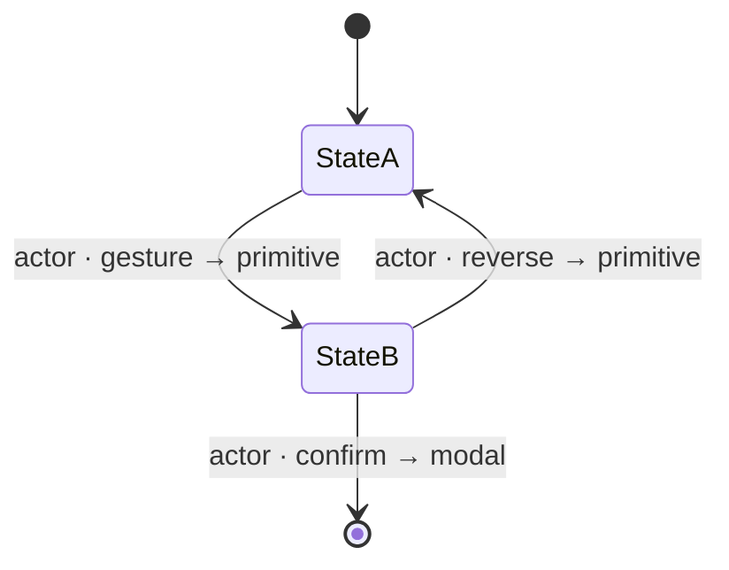

<!--
  Per-workflow spec template — Phase G.
  Copy this file to `NN-workflow-name.md` (operational-arc order — see 00-workflow-foundation §File naming), delete this comment, and fill every section.
  Authored at the depth of `00-workflow-foundation.md` / `../03-primitives/picker.md`.
  CITE `00-workflow-foundation.md` for the state-diagram notation, the wireframe convention,
  the cross-surface-story structure, the reversibility doctrine (ADR-010), and the
  accessibility-reuse rule — do NOT re-derive them here.
  CITE the Phase F screen specs (../08-information-architecture/) for layout and the Phase E
  primitives (../03-primitives/) for controls — a workflow is the verb; it never redraws a
  screen or re-specs a primitive (the litmus test in 00-workflow-foundation).
  Composing a control not among the 15 primitives is a GATE escalation, not a spec decision.
-->

# Workflow: [Workflow Name]

> Phase G workflow spec. Cites [`00-workflow-foundation.md`](00-workflow-foundation.md) for all cross-cutting conventions.
> Source: [GitHub issue #; the screen spec(s) it spans; synthesis §, rec IDs; dependent ADRs].

---

## Purpose & goal

One or two sentences: the goal the operator accomplishes end-to-end, and the condition that means "done."

## Actors & surfaces

- **Actor(s):** the role(s) who drive this workflow and any **hand-off between them** (NIMS titles spelled out — [ADR-008](../11-decisions/ADR-008-nims-org-structure.md)). Note if single-actor.
- **Floor surface:** phone unless justified. Enhancement surfaces named.
- **Precondition / entry:** what must be true to start (e.g. "an operation is active"); how the operator reaches step 1.
- **Screens spanned:** the Phase F specs this workflow moves through (cite, don't redraw).

## State diagram

A Mermaid `stateDiagram-v2` per [`00-workflow-foundation.md`](00-workflow-foundation.md#state-diagram-notation). States = v4 display labels; transitions = `actor · gesture → primitive`; every non-terminal reversible transition draws its reverse (ADR-010); terminal/destructive transitions are forward-only with the consequence in prose.



## Step-by-step

For each step: a phone text wireframe (the locked frame — [`00-workflow-foundation.md`](00-workflow-foundation.md#wireframe-convention)), the interaction note, and the reversal.

### Step 1 — [name]

```
┌─────────────────────────────┐
│ ‹ Back        Screen   ⋮     │
├─────────────────────────────┤
│   [ the one thing this step  │
│     asks for ]               │
├─────────────────────────────┤
│  ▓ primary action ▓          │
└─────────────────────────────┘
   ⇩ commits → [next state]
```

- **Commits via:** [primitive + gesture], citing [`../03-primitives/…`].
- **On the screen:** [which Phase F screen, cited].
- **Reverses via:** [Step-back / dismiss / not reversible because terminal — name the consequence].
- **App response:** what changes in state / the event log.

### Step 2 — …

## Cross-surface story

The actor-surface matrix per [`00-workflow-foundation.md`](00-workflow-foundation.md#the-cross-surface-story). The "acts" column names the one device the commit happens on; every other column is reflection (broadcast always read-only); propagation is via the event log on sync (Principle 10), never a push.

| Step | Actor · surface (acts) | Phone | Tablet (CP) | Laptop | Broadcast |
|---|---|---|---|---|---|
| 1 |  |  |  |  | read-only |

Note the phone-equivalent path for any step that can only commit above the phone (Principle 2).

## Composed screens & primitives

- **Screens (Phase F):** [#NNN cited specs].
- **Primitives (Phase E):** tick those the workflow exercises — [card](../03-primitives/card.md) · [list](../03-primitives/list.md) · [picker](../03-primitives/picker.md) · [sheet](../03-primitives/sheet.md) · [modal](../03-primitives/modal.md) · [badge](../03-primitives/badge.md) · [button](../03-primitives/button.md) · [input](../03-primitives/input.md) · [toggle](../03-primitives/toggle.md) · [segmented](../03-primitives/segmented.md) · [slider](../03-primitives/slider.md) · [toast](../03-primitives/toast.md) · [empty-state](../03-primitives/empty-state.md) · [loading-state](../03-primitives/loading-state.md) · [nested-checklist](../03-primitives/nested-checklist.md) · [warning-gate](../03-primitives/warning-gate.md) · [side-drawer](../03-primitives/side-drawer.md). (A 16th is a gate escalation.)

## Locked rules this workflow honors

Tick + note the workflow-specific application. (Full statements in [`00-workflow-foundation.md`](00-workflow-foundation.md) and [`00-ia-foundation.md`](../08-information-architecture/00-ia-foundation.md).)

- [ ] **Phone is the floor** — every step usable phone-only; enhancements never assumed.
- [ ] **Status = slide-to-advance, always reversible** ([ADR-010](../11-decisions/ADR-010-status-commit-model.md)); Advance/Step-back equivalents for assistive tech.
- [ ] **No timed-undo toast** — reversibility is the card's permanent Step-back.
- [ ] **Heavy confirm reserved for destructive/terminal** (modal); everyday steps are sheets/slides.
- [ ] **No silent removal** — off-queue = red-slash, never a disappearance (Principle 10).
- [ ] **No push / no in-app comms** — surfaces reflect the event log on sync (Principle 10).
- [ ] **NIMS terminology** — titles spelled out ([ADR-008](../11-decisions/ADR-008-nims-org-structure.md)).
- [ ] **Measurements** — 1/8″ floored, spoken as fractions ([ADR-012](../11-decisions/ADR-012-measurement-precision-eighth-inch.md)).
- [ ] **Guest-first** — no auth wall mid-workflow ([ADR-015](../11-decisions/ADR-015-navigation-pattern.md)).

## Empty / error / loading within the flow

(Posture set in [`00-ia-foundation.md`](../08-information-architecture/00-ia-foundation.md#cross-cutting-empty--error--loading-posture); state only the moments particular to this *flow*, especially those arising between screens.)

- **Empty:** the variant + copy at any zero-state step ([`empty-state`](../03-primitives/empty-state.md)); settle-before-empty.
- **Error:** inline `aria-invalid` / [`warning-gate`](../03-primitives/warning-gate.md) / blocking-alert [`modal`](../03-primitives/modal.md) — never `alert()`.
- **Loading:** name a treatment only where a genuine wait exists ([`loading-state`](../03-primitives/loading-state.md)); local-first usually shows nothing.

## Accessibility script extensions

**Cite [`accessibility.md`](../07-design-system/accessibility.md), do not restate.**

- Confirm **Advance/Step-back** equivalents exist for every slide in this workflow → [`accessibility.md`](../07-design-system/accessibility.md) §Assistive tech cannot slide.
- Extend the **script registry only with this workflow's genuinely new, step-level announcement** (e.g. a multi-step step-indicator) → [`accessibility.md`](../07-design-system/accessibility.md) §Screen-reader scripts. If every step composes existing primitives, say so and cite the rows — nothing new to register.
- Focus order across the step sequence; focus-trap on any overlay; Power Select applicability.

## Open questions (per-workflow)

Numbered. Affordance geometry → flag for Phase H. Genuine workflow/IA gaps → resolve at the Phase G gate or carry to [`99-open-questions.md`](../99-open-questions.md).

1. …
